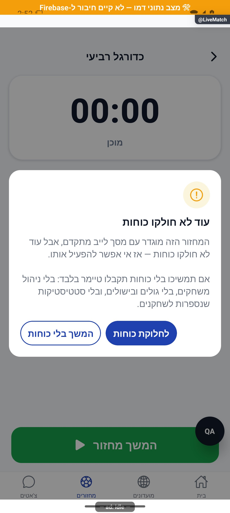
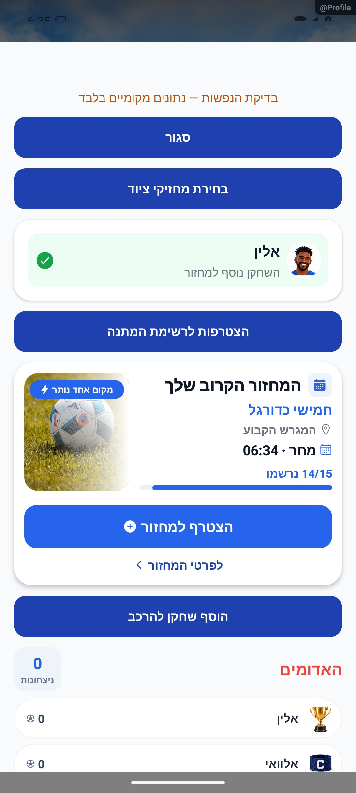

# ממלאים, השאלה ורוטציה

עודכן: 7.10.2026. מקור הקוד: `8e8fde5`, גרסה `1.1.35`. מסמך זה מתאר את הקוד; מצב חנות ופריסת שרת דורשים ראיה נפרדת.

## כניסה ותפקידים

לייב מתקדם → בקשת מילוי; ניהול מחזור → זמינים/פעימת השלמה

מנהל מאשר ממלא; פנייה לשחקן חיצוני ורישום חבר מועדון הם מסלולים שונים.

## רכיבים ומצבים

| רכיב / מצב | התנהגות וחוזה |
|---|---|
| בחירת ממלא | שחקן וקבוצת יעד; request/confirm/cancel אינם אותה פעולה |
| זמני / קבוע | השאלה זמנית מחזירה לפי כללי הרוטציה; מילוי קבוע משנה סגל |
| ביטול | מתאים את התור ואת מילוי הקבוצה; לא למחוק קבוצה בטעות |
| קבוצה ריקה | retireEmptyTeam ו־prepareRefillPlaying; צורך בהרכב לעומת סגל רשום |
| פניות חיצוניות | FillerInterestsSection מופיע למנהל במחזור acceptsFillers; אמינות, אישור ודחייה |
| פעימת הזמנה | AvailablePlayers startFillerPulse וסיבות חסימה; הזמנה אינה כבר השתתפות |

## מסלול נתונים ומקומות שינוי

[`src/components/match/FillerPickerModal.tsx`](../../../src/components/match/FillerPickerModal.tsx); [`src/services/rotationEngine.ts`](../../../src/services/rotationEngine.ts); [`src/screens/AdvancedLiveMatchScreen.tsx`](../../../src/screens/AdvancedLiveMatchScreen.tsx)

gameService ו־rotationEngine: snapshots, ספירות וצדי משחק; pending פניות טעון מאגר משתמש/אמינות. ממיר המשחק חייב לקרוא תוספות למודל; ממלא אורח נושא מזהה אורח ולא uid מומצא.

ממיר המחזור: [`src/firebase/firestore.ts`](../../../src/firebase/firestore.ts), `gameDocConverter.fromFirestore`; סוגים: [`src/types`](../../../src/types). שינוי שדה דורש מעקב כתיבה → ממיר → שירות/חנות → רכיב. ניווט: [`GameStack.tsx`](../../../src/navigation/GameStack.tsx), ובמסכים משותפים גם המחסניות שמארחות אותם.

## בדיקות וראיות

rotationFill/rotationDeep/rotationCounts, fillerGuest, rotationQueueReorder; בדיקת תור לאחר ביטול והחזרת מושאל.

צילומי המיפוי מהאמולטור נעשו במצב נתוני דמו, המסומן בפס כתום. הם מוכיחים את הרכיב והמצב המוצגים בלבד, ולא ממירי Firebase, נתוני ייצור או כתיבה. צילומי תיקונים קודמים מסומנים בנפרד. שגיאת מזהה, מצב טעינה או שער הגנה אינם הוכחת הפעולה המלאה.

## גבולות והערות תחזוקה

ממצא קוד לסקירה: FillerInterestsSection נטען גם באפקט וגם במיקוד, ובכשל מסוים מחזיר רשימה ריקה. לא שוחזר; אין לומר שאין פניות כאשר הקריאה נכשלה.

לפני שינוי פתח את הקוד המקושר ואת [כללי הפרויקט](../../../AGENTS.md). לאחר שינוי עדכן במסמך זה את התאריך, נקודת הקוד, המצבים שהתעדכנו, הבדיקות והצילום. אין לטעון שכל מצב/תפקיד נבדק רק משום שקיים צילום אחד.

## פירוט טכני ממוקד: זרימה, חישוב ונקודות שינוי

[הסבר פשוט למשתמש](fillers.simple.md)

העמקה: 07.10.2026, מול קוד המקור שב־`8e8fde5`. בעת הכתיבה HEAD הוא `50d508f`; בדיקת ההפרש בין הנקודות ב־`src` וב־`functions` לא מצאה שינוי קוד. הסעיפים וההסתייגויות הקיימים נשמרו. זו קריאת קוד ותיעוד, בלי הרצת תרחישי כתיבה חדשים.

המכנה כאן הוא גודל ההרכב האפקטיבי, לא מספר הרשומים למחזור. `rosterOf` מחשב סגל ביתי פחות מושאלים החוצה ועוד מושאלים פנימה. `nextFillNeeded` מחשב `deficit=perTeam-rosterOf(...).length` ועובר על הקבוצות שאינן משחקות, עם קדימות לקבוצה שיצאה; שחקן שכבר הושאל אינו תורם פנוי.

לדוגמה יעד של 5 מול הרכב אפקטיבי של 3 דורש 2 ממלאים. אם יש רק תורם פנוי אחד, אין להמציא שחקן שני או לחסום בהכרח ערב חסר. `applyChosenFill` במצב זמני יוצר `RotationLoan`; במצב קבוע מסיר מהסגל הביתי של המקור ומוסיף ליעד. כשהמקור נכנס במשחקון הבא, השאלה זמנית חוזרת לפי חוקי המעבר.

המסך אוסף בחירה לפני `commitFilledRotation`; ביטול מחייב שיקום התור/מפתח אותו משחקון, ולא זקיפת סטטיסטיקה שנייה. פניות חיצוניות ב־`FillerInterestsSection` ו־`startFillerPulse` שייכות לרישום למחזור ולסמכות אישור, ולא ללולאת המילוי על המגרש.

בדוק תורם שנעלם, אורח, קבוצה ריקה, זמני/קבוע וביטול אחרי שכבר בוצעה זקיפה. שינוי `rosterOf` משפיע גם על היסטוריית מי שיחק ועל הפנדלים; חובה להצליב את שלושתם ולא רק את מראה ההרכב.

## השלמת הנפשות — 8.10.2026

FillerInterestsSection שומרת approved={row,at} אחרי await approveFiller ורק אם activeGame עדיין תואם. שורת האישור היא ArrivalMotion עם תמונה, שם וסימון הצלחה; אין כותרת מועמדים ריקה אחרי אישור האחרון. שינוי מחזור או חזרה למיקוד מנקים אישור ישן. כשל משאיר את המועמד בלי שורת הצלחה. TeamScore variant=list עוקבת אחרי מזהי roster בתחום teamIdx: שחקן חדש מקבל כניסת תמונה 300 אלפיות שנייה, בלי לשנות סגל או RotationLoan. grid לא שונה. שורת פנייה חיצונית ושחקן מושאל על המגרש הם מסלולים שונים: אין תנועה פיזית רציפה בין שתי רשימות שאינן באותו מסך. החישוב perTeam-rosterOf(...).length, שמירת commitFilledRotation והאישור בשרת נשארו ללא שינוי. בתרחיש המקומי הורץ כשל ואחריו הצלחה; לא בוצעה קריאת אישור אמיתית. ממצא כשל load שמחזיר [] נותר מגבלה קיימת ולא תוקן במסגרת התנועה.

[פרטי האימות והמגבלות](../../changes/2026-10-08-motion-completion.md). מקור: `9ec0dfd` עם שינויים מקומיים; טרם פורסמה גרסה.
