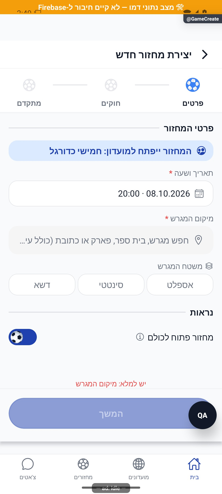

# יצירת מחזור והאשף

עודכן: 7.10.2026. מקור הקוד: `8e8fde5`, גרסה `1.1.35`. מסמך זה מתאר את הקוד; מצב חנות ופריסת שרת דורשים ראיה נפרדת.

## כניסה ותפקידים

מחזורים → פלוס; מועדון → יצירת מחזור; מחזור חד־פעמי דרך quick

מנהל יוצר במועדון; יצירה חד־פעמית משתמשת בקבוצה אישית נסתרת. אורח משלים התחברות תוך שמירת טיוטה.

## רכיבים ומצבים

| רכיב / מצב | התנהגות וחוזה |
|---|---|
| שלב 1: זמן ומקום | תאריך, שעה, עיר, כתובת, מגרש וקואורדינטות; חיפוש ומפה; יצירה מהירה מחייבת מקום |
| שלב 2: משחק | 3 על 3 עד 11 על 11; 2–7 קבוצות; קיבולת, משך, מצב מתקדם, מילוי זמני/קבוע והכרעת תיקו |
| כללי משחק | ruleTags: עד 12 כללים, עד 30 תווים לכל כלל; אינם רשימת מתגים ישנה |
| שלב 3: הרשמה | ציבורי/מועדון, אישור מנהל, המתנה ואישור מקום עם זמן 2–120 דקות, ברירת מחדל 20 |
| פתיחת הרשמה | תזמון פתיחה עצמאי מחזרתיות; פתיחה לציבור ולאורחים; autoTeamsAt עם דירוג או אקראי |
| השלמות | acceptsFillers וסף אמינות; ערך חסר אינו אפס; מועד אחרון לביטול: ללא/2/6/12/24 שעות |
| סיום | הערות וציוד, הזמנת חברים בחד־פעמי, אישור יציאה עם שינויים, מצב שמירה ושגיאה |

## מסלול נתונים ומקומות שינוי

[`src/screens/games/GameCreateScreen.tsx`](../../../src/screens/games/GameCreateScreen.tsx); [`src/screens/games/GameWizardForm.tsx`](../../../src/screens/games/GameWizardForm.tsx)

src/services/gameCreation.ts: createGameFromValues → gameService.createGameV2; quick משתמש ensurePersonalGroupId. כותרת וקיבולת נגזרות מהטופס. שדות חייבים להיקרא גם ב־fromFirestoreGameDoc. הזמנות והתראות נלוות אינן הוכחה שהיצירה עצמה נכשלה.

ממיר המחזור: [`src/firebase/firestore.ts`](../../../src/firebase/firestore.ts), `fromFirestoreGameDoc`; סוגים: [`src/types`](../../../src/types). שינוי שדה דורש מעקב כתיבה → ממיר → שירות/חנות → רכיב. ניווט: [`GameStack.tsx`](../../../src/navigation/GameStack.tsx), ובמסכים משותפים גם המחסניות שמארחות אותם.

## בדיקות וראיות

tests/logic/gameCreation.test.ts; בדיקות שיקום טיוטה, תזמון והרשמה. צילום לא מחייב שמירת מחזור בחשבון אמיתי.

צילומי המיפוי מהאמולטור נעשו במצב נתוני דמו, המסומן בפס כתום. הם מוכיחים את הרכיב והמצב המוצגים בלבד, ולא ממירי Firebase, נתוני ייצור או כתיבה. צילומי תיקונים קודמים מסומנים בנפרד. שגיאת מזהה, מצב טעינה או שער הגנה אינם הוכחת הפעולה המלאה.

## גבולות והערות תחזוקה

ברירת מחדל למועד: חמישי הבא ב־20:00. בחירת זמן באשף אינה אישור שהמחזור התקיים; eveningPlayed קובע זאת בדיעבד.

לפני שינוי פתח את הקוד המקושר ואת [כללי הפרויקט](../../../AGENTS.md). לאחר שינוי עדכן במסמך זה את התאריך, נקודת הקוד, המצבים שהתעדכנו, הבדיקות והצילום. אין לטעון שכל מצב/תפקיד נבדק רק משום שקיים צילום אחד.
