# רשימת מחזורים וגילוי

עודכן: 7.10.2026. מקור הקוד: `8e8fde5`, גרסה `1.1.35`. מסמך זה מתאר את הקוד; מצב חנות ופריסת שרת דורשים ראיה נפרדת.

## כניסה ותפקידים

לשונית מחזורים → GamesList; מחזור → MatchDetails; יצירה → GameCreate. המסלול GamesMap עדיין רשום, אך כפתור הכניסה אליו הוסר מהרשימה ב־28.9 ואינו כניסה פעילה בממשק הנוכחי.

אורח יכול לגלות; פעולה המחייבת חשבון עוברת useAuthenticatedAction. המחזורים שלי מופיעים ראשונים, אחריהם מחזורים שהרשמתם תיפתח ולבסוף מחזורים נוספים.

## רכיבים ומצבים

| רכיב / מצב | התנהגות וחוזה |
|---|---|
| כותרת | כותרת כחולה קומפקטית, יצירת מחזור, מסננים מהירים ופעמון; ללא כפתור מפה; MatchCardSkeleton בזמן טעינה |
| פתוחים / שלי | רשימה אחת עם מקטעים; כרטיסי MatchListCard עם תמונת מועדון, תפוסה, מועד, מקום ופעולה נגזרת מצב |
| גילוי לפי צפיפות | מחזורים קודם, אחריהם ביקוש אזורי ומועדונים סמוכים כשיש מעט תוצאות; הגדרות gamesFeedDiscovery |
| אין תוצאות | היעדר מחזורים שונה ממסנן המסתיר מחזורים; האחרון מציע לנקות מסנן |
| הרשמה | בקשה, המתנה, הצעת מקום והתנגשות מועדים מפנות לחוזה הרשמה; לא כל לחיצה מייד מצרפת |
| זמינות ומיקום | AvailabilityNudgeModal, מיקום סמוך והרשאת מיקום; סירוב מצריך חלופה |
| יצירה | כפתור ״מחזור חדש״ בכותרת; openCreate יכול לפתוח את תהליך היצירה |

## מסלול נתונים ומקומות שינוי

[`src/screens/games/GamesListScreen.tsx`](../../../src/screens/games/GamesListScreen.tsx)

gameService ונתוני קבוצות/משתמש בחנויות; availabilityFeedService לביקוש ו־nearbyClubsService למועדונים. מסנן משתמש ב־GameFilterSheet; אין להסיק שרשימה ריקה מעידה על כשל או על אפס בלי להבחין במצב הטעינה.

ממיר המחזור: [`src/firebase/firestore.ts`](../../../src/firebase/firestore.ts), `gameDocConverter.fromFirestore`; סוגים: [`src/types`](../../../src/types). שינוי שדה דורש מעקב כתיבה → ממיר → שירות/חנות → רכיב. ניווט: [`GameStack.tsx`](../../../src/navigation/GameStack.tsx), ובמסכים משותפים גם המחסניות שמארחות אותם.

## בדיקות וראיות

בדיקות gamesFeedDiscovery, סינון והרשמה; לאשר תרחישי מעט/הרבה/אפס מחזורים ומסנן מסתיר.

צילומי המיפוי מהאמולטור נעשו במצב נתוני דמו, המסומן בפס כתום. הם מוכיחים את הרכיב והמצב המוצגים בלבד, ולא ממירי Firebase, נתוני ייצור או כתיבה. צילומי תיקונים קודמים מסומנים בנפרד. שגיאת מזהה, מצב טעינה או שער הגנה אינם הוכחת הפעולה המלאה.

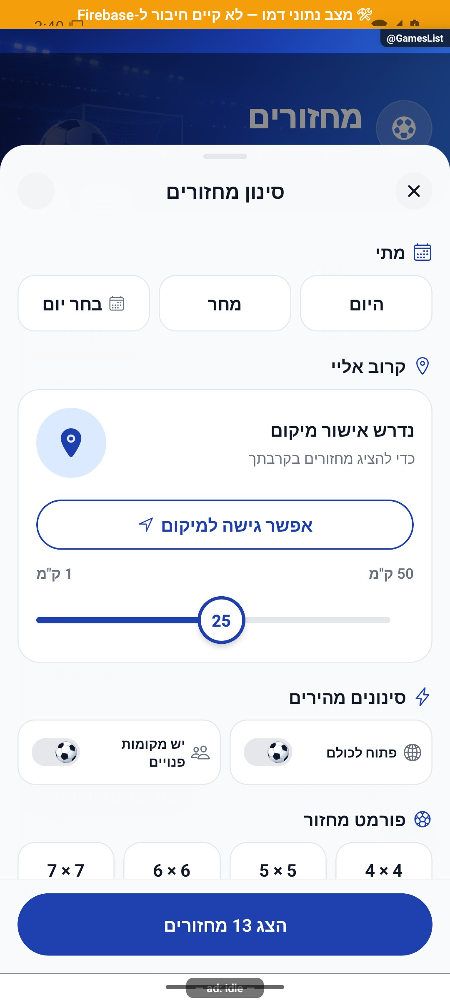
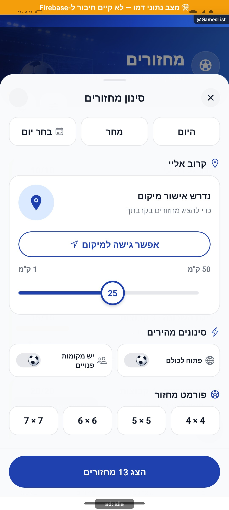
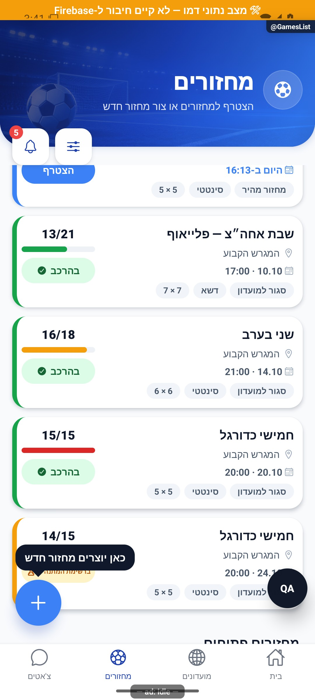
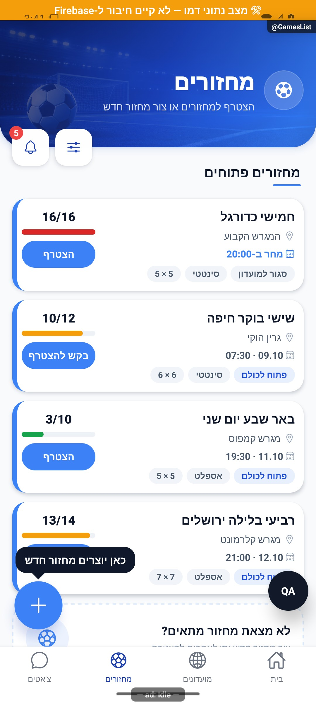

אלה צילומי גלילה ופתיחת חלון בלבד. לא הופעלו הרשאת מיקום, הרשמה או בקשת הצטרפות. ההבדל בין הרשמה מאושרת להמתנה מתועד לפי המצב בשירות; כפתור ״הצטרף״ בכרטיס מלא אינו הוכחה שהמשתמש יקבל מקום.

## גבולות והערות תחזוקה

התצוגה מותאמת לכמות אמיתית, ולכן מקור 094 שבו היה מחזור אחד אינו תיאור קבוע של ההיצע היום.

לפני שינוי פתח את הקוד המקושר ואת [כללי הפרויקט](../../../AGENTS.md). לאחר שינוי עדכן במסמך זה את התאריך, נקודת הקוד, המצבים שהתעדכנו, הבדיקות והצילום. אין לטעון שכל מצב/תפקיד נבדק רק משום שקיים צילום אחד.

## פירוט טכני ממוקד: זרימה, חישוב ונקודות שינוי

[הסבר פשוט למשתמש](games-list.simple.md)

העמקה: 07.10.2026, מול קוד המקור שב־`8e8fde5`. בעת הכתיבה HEAD הוא `50d508f`; בדיקת ההפרש בין הנקודות ב־`src` וב־`functions` לא מצאה שינוי קוד. הסעיפים וההסתייגויות הקיימים נשמרו. זו קריאת קוד ותיעוד, בלי הרצת תרחישי כתיבה חדשים.

המסך מפריד בין נתוני המשתמש לבין גילוי ציבורי; הסינון ופלט הגילוי אינם משנים רוסטר. `GamesListScreen` משתמש בחנויות המשתמש והמועדונים ובשירותי המחזורים, בעוד [הגדרות הגילוי](../../../src/config/gamesFeedDiscovery.ts) קובעות את שילוב הביקוש והמועדונים. שינוי סדר המקטעים שייך לתצוגה/הגדרות; שינוי מי רשאי להצטרף שייך לשירות ולשרת.

יש להבחין בשלושה מכנים: מספר מחזורים שהתקבלו, מספר הנותרים לאחר סינון ומספר המקומות בכל מחזור. לדוגמה, 5 מחזורים שהתקבלו ו־2 אחרי מסנן אינם 3 מחזורים חסרים במסד. תפוסת 8 משתמשים ושני אורחים פעילים במחזור שקיבולתו 10 היא 10/10; אורח בהמתנה אינו המקום ה־11. כפתור הצטרפות במחזור מלא עשוי לבקש המתנה, ולא מבטיח מקום.

`useAuthenticatedAction` חוצץ בין גלישה לבין פעולה המחייבת חשבון. הצלחת קריאת הפיד אינה הצלחת רישום; כשל רשימה חייב להיבדק בנפרד ממצב ריק וממסנן ללא תוצאות. בבדיקה ממוקדת יש לכסות סשן מתחלף, מעט/הרבה מחזורים וסירוב למיקום, בלי להצטרף בחשבון האמיתי.

## עיצוב המחזורים — 8.10.2026

מקור: `a348b9f` עם שינויים מקומיים, טרם שוחרר. העיצוב החדש מחליף את כרטיסי הרשימה הקודמים; הצילומים הישנים למעלה נשמרו כראיות היסטוריות.

- `MatchesHero` מציג כותרת כחולה עם קווי מגרש, כפתור יצירה מפורש במקום הפלוס הצף. שערי יצירה קיימים נשמרו.
- בכרטיס התמונה נמצאת בשמאל הפיזי, מהקצה העליון, עם פינות מעוגלות ומרווח לפני פס התפוסה. תגית אישית מונחת עליה: ״אתה רשום״, ״בהמתנה״ או המתנה לאישור. ללא קשר אישי מוצגת הרשאת ההצטרפות. המידע מימין כולל מועד, שם המחזור, מיקום ותפוסה. הרשאת הצטרפות, פורמט וסוג מגרש מוצגים כתגיות בתחתית.
- מקור התמונה: `groups` בחנות לחבר מועדון; למועדון שאינו בחנות `groupService.getPublic` לפי מזהים שהתקבלו מהפיד, פעם לכל מזהה בכל רענון. קריאות עצמאיות משתמשות ב־`Promise.allSettled`; כשל בתמונה אינו הופך את פיד המחזורים לריק. התוצאה מתבטלת בעת שינוי מקורות/חשבון או הסרת המסך.
- `coverPhotoUrl` קודם ל־`getCoverSource(coverImageId)`; מועדון בלי תמונה, מחזור ללא מועדון ושגיאת טעינת תמונה משתמשים בתמונת אצטדיון קבועה. אין שדות חדשים או שינוי ממירים.
- תפוסה = `players.length + activeGuestCount(guests) + pendingPromotion`. אורח לא פעיל אינו נספר; בקשת אישור אינה תופסת מקום. המכנה הוא `maxPlayers`. אורך הפס חסום ל־0–100%; בקיבולת שאינה חיובית הוא אפס. `alignItems: flex-start` תחת הכיווניות של האפליקציה מעגן אותו לימין החזותי, והוא מתמלא שמאלה.
- אין שינוי בחוזה ההרשמה. קודם בודקים קיבולת ואחר כך אישור: מחזור מלא מציע ״הצטרף לרשימת המתנה״; מחזור עם מקום ואישור מציע בקשה; אחרת הצטרפות. למי שרשום, ממתין או ממתין לאישור מוצגת פעולה לפתיחת פרטים. פעולת הכרטיס מונעת התפשטות לחיצה להורה. ביטול עדיין נמצא בפרטים.
- מסנן ״המועדונים שלי״ משתמש בחברות ב־`groups`, ולא בבעלות או בבקשה פתוחה לחברות. הוא חל על המקטעים כולל מחזורים שהרשמתם טרם נפתחה. ״באזור שלי״ משתמש במנגנון המיקום הקיים; המחזורים האישיים אינם מוסתרים בגלל מרחק. ״הכול״ מנקה את שני המסננים המהירים בלבד; שאר מסנני החלון נשמרים. ניקוי במצב ללא תוצאות מנקה הכול.
- מונה המסננים כולל בחירה במועדונים שלי. הרשמה, התנגשות מועדים, הצעת מקום, רענון וגילוי נשארים בזרימות הקיימות.

בדיקת הטיפוסים עברה. בריצה המלאה עברו 188 חבילות ו־2,795 בדיקות; בדיקת הביצועים של `balanceVariety` מדדה 155.2 מילישניות מול סף 150. בהרצה נפרדת עברו כל 24 הבדיקות, כולל ביצועים (108.5 מילישניות לחלוקה). הסף לא שונה. אין מכאן הוכחה לבדיקת אייפון או כתיבות ייצור.

### צילומים עדכניים של העיצוב הממומש

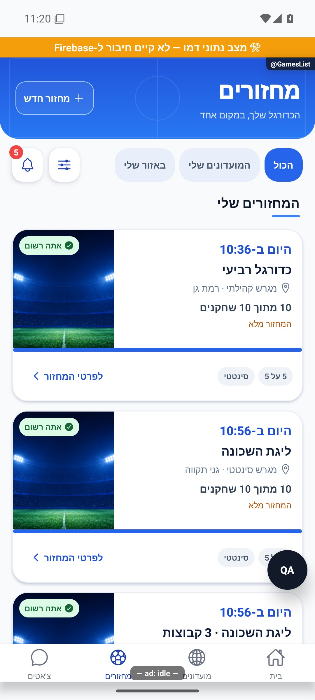
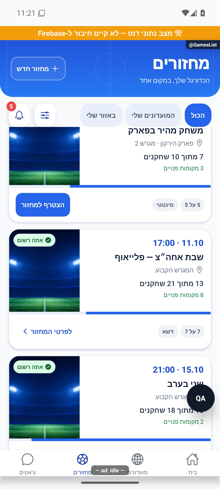
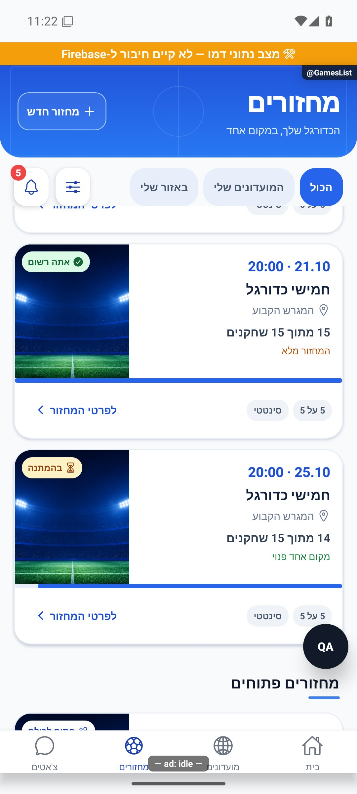
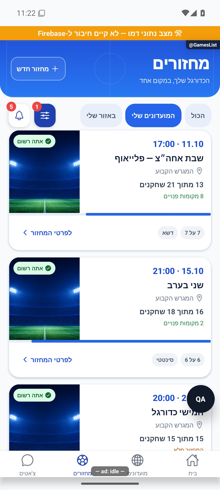

הצילומים נבדקו באמולטור אנדרואיד בדמו. בתפוסת 13 מתוך 21 הפס ממלא כ־62% מימין; בתפוסת 14 מתוך 15 הוא ממלא כ־93%. תמונה צמודה למעלה, תגית מעליה ואייקון המיקום מימין נצפו בפועל. סינון המועדונים מסתיר את המחזורים החד־פעמיים; ניקוי המסננים בחלון או במצב ריק מנקה גם את בחירת המועדונים. תמונות שהועלו מרחוק וכשל תמונה, סירוב מיקום, הרשמה בפועל, אישור ותצוגת אייפון לא הורצו בסבב זה. האצטדיון המוצג הוא תמונת הדמו/ברירת המחדל. כלי הפיתוח והפס הכתום אינם חלק מגרסת ההפצה.

הריצה המלאה החוזרת עברה: 189 חבילות, 2,796 בדיקות. בדיקת הטיפוסים נקייה. יומנים: `artifacts/rounds-redesign-jest-final.log`, `artifacts/rounds-redesign-tsc.log`.

חלון המסננים מקבל `hasAdditionalFilters` כדי להציג איפוס גם כשהמסנן היחיד הפעיל הוא בחירת המועדונים שבבעלות המסך. כך אפשר לנקות גם אותו מתוך החלון.

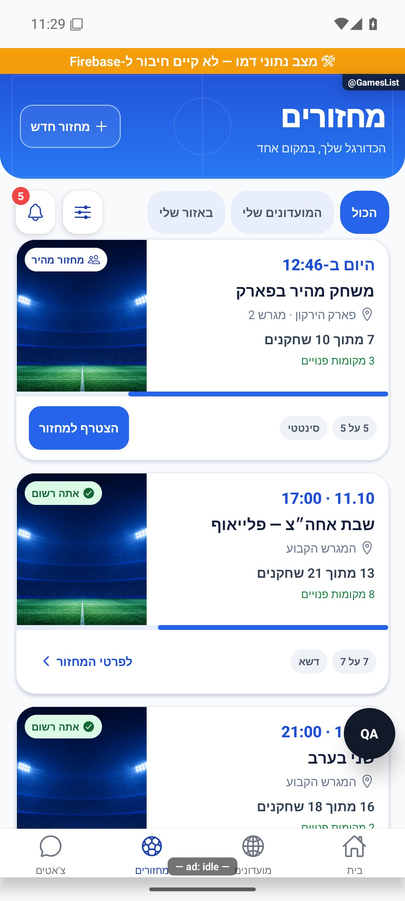

איפוס מסנן המועדונים מתוך חלון המסננים הורץ בדמו: ״הכול״ נבחר מחדש, מונה המסננים נוקה והמחזור החד־פעמי חזר לרשימה.

## עידון כרטיס המחזור — 8.10.2026

ב־`MatchListCard` התמונה נחתכת בתוך מסגרת עם רדיוס 18 בכל ארבע הפינות, כולל שתי הפינות הפנימיות בצד ימין הפיזי. היא נשארת צמודה למעלה ובשמאל הכרטיס. `marginBottom:8` בתמונה ו־`marginTop:2` בפס יוצרים הפרדה של 10 נקודות ביניהם. הפס הוזח 12 נקודות מכל צד ועיגולו 3; כיוון המילוי וחישוב התפוסה נשארו כפי שמתואר לעיל.

השורה התחתונה משתמשת בריווח אנכי 6 במקום 10, בכפתור בעל גובה מינימלי 36 במקום 44 וריווח אנכי 6 במקום 10. `hitSlop` מוסיף ארבע נקודות מעל ומתחת כדי לשמור על אזור לחיצה של לפחות 44. ריווח התגית הוא ארבע נקודות אנכיות ושבע אופקיות. תגיות יכולות להישבר לשורה נוספת ברוחב מצומצם; לא חותכים את המידע כדי לכפות שורה אחת.

`visibilityLabel` נפרד מהתגית האישית: `visibility === 'public'` מציג ״פתוח לכולם״; מחזור שאינו ציבורי ויש לו `groupId` מציג ״סגור למועדון״; ללא מועדון מוצג ״סגור״. התגית מוצגת תמיד בשורה התחתונה, גם במצב רשום, רשימת המתנה או בקשת אישור. פורמט וסוג מגרש נשארו מותנים בנתונים קיימים. מקור ההכרעה הוא הנתון הקיים במחזור; אין שדות חדשים, כתיבות מסד או שינוי הרשאות. אין שינוי בהחלטת כפתור ההצטרפות או בהבחנה בין פתיחות לציבור לבין צורך באישור.

בדיקת הטיפוסים וכל 2,796 הבדיקות ב־189 חבילות עברו. יומנים: `artifacts/rounds-card-polish-tsc.log`, `artifacts/rounds-card-polish-jest.log`. הצילומים הקודמים בסעיף העיצוב המקורי מתעדים את הנראות לפני עידון זה.

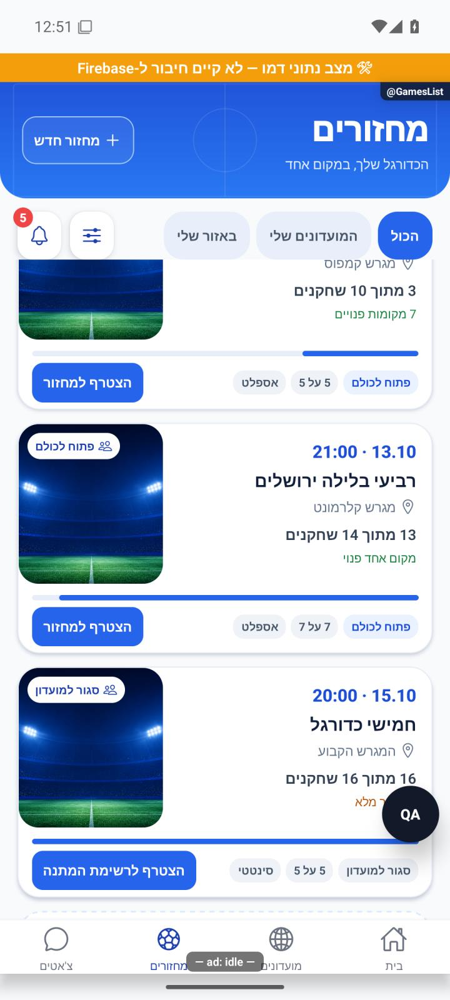

נבדק באימולטור אנדרואיד עם נתוני דמו: פינות פנימיות מעוגלות, רווח לפס, תגיות פתוח וסגור לצד פורמט ומגרש, וכפתורי הצטרפות והמתנה קומפקטיים. גם מצב רשום עם תגית סגור למועדון נצפה. לא הופעלו פעולות הרשמה; אייפון וגופנים מוגדלים לא הורצו.

## כרטיס קומפקטי — 8.10.2026

מקור: `a348b9f` עם שינויים מקומיים. ב־`MatchListCard` הגובה המינימלי של החלק העליון ירד מ־154 ל־126 נקודות; הריפוד ירד מ־14 ל־12 והרווח בין שורות מ־5 ל־4. מספר השחקנים והמקומות הפנויים מוצגים באותה שורת `occupancy`, עם גלישה לשורה נוספת ברוחב מצומצם. אין גובה קבוע: כותרת ומיקום ארוכים או גופן מוגדל יכולים להגביה את הכרטיס. גדלי הגופן בתפוסה הם 12 ובמקומות הפנויים 11. הסדר בתגית הוא טקסט ואז אייקון, ולכן תחת `forceRTL` האייקון נמצא בשמאל הפיזי. נשמרים התמונה, כל התגיות, התאריך, הכותרת, המיקום, הפס והפעולה; חישובים, מקורות נתונים וניווט לא השתנו.

בדיקת הטיפוסים עברה. בריצה המלאה עברו 2,795 בדיקות ו־188 חבילות; בדיקת זמן אחת ב־`balanceTeams` נכשלה תחת עומס טעינת האימולטור. בהרצה נפרדת עברו כל 16 הבדיקות באותה חבילה. סף הביצועים לא שונה. ראיות: `artifacts/rounds-compact-tsc.log`, `artifacts/rounds-compact-jest.log`, `artifacts/rounds-compact-performance.log`.

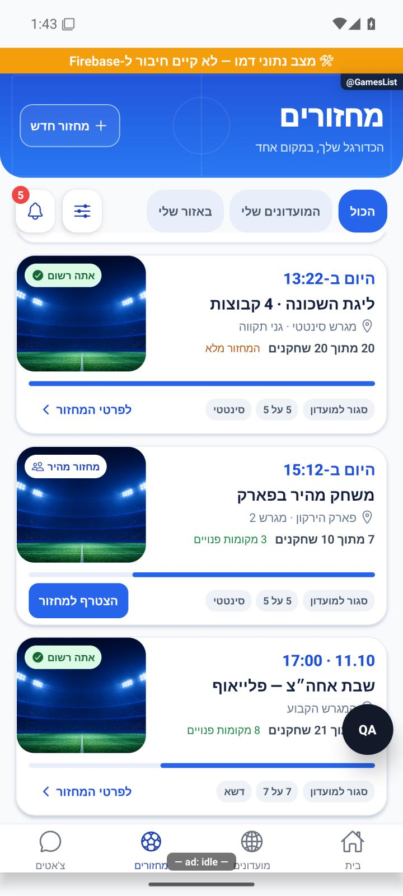

אומת באימולטור אנדרואיד בדמו: מחזור מלא ורשום, מחזור עם 7 מתוך 10 שחקנים ושלושה מקומות פנויים וכפתור הצטרפות; האייקון בתגית נמצא משמאל לטקסט. הפס מתמלא מימין לשמאל. בוצעה גלילה בלבד ללא הרשמה. סימוני הדמו והפיתוח בצילום אינם חלק מההפצה. אייפון וגופנים מוגדלים לא הורצו.

## מרווח מתחת למסננים — 8.10.2026

`controlsFloat.marginBottom` הוא 12 נקודות. המרווח נמצא מחוץ ל־`ScrollView`, ולכן נשאר קבוע גם אחרי גלילה ומפריד את גבול חיתוך הרשימה מהכפתורים. אין שינוי בנתונים, סינון, ניווט או גובה הכרטיס. מקור `a348b9f` עם שינויים מקומיים. בדיקות מתועדות ביומנים `artifacts/rounds-scroll-gap-tsc.log` ו־`artifacts/rounds-scroll-gap-jest.log`.

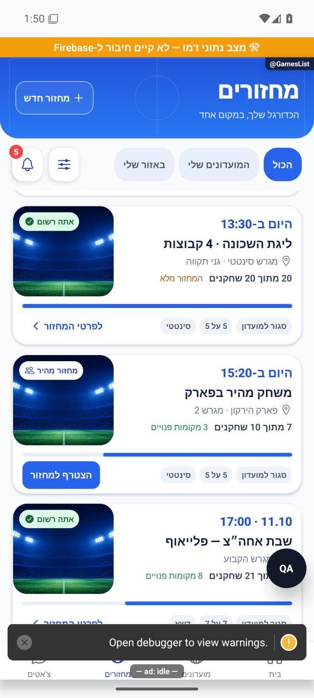

נצפה באנדרואיד בדמו לאחר גלילה: רווח קבוע בין הכפתורים לבין גבול אזור הגלילה. אין פעולות הרשמה. סימוני הפיתוח בצילום אינם חלק מההפצה. אייפון לא הורץ.

## כותרת אחידה עם מסך המועדונים — 8.10.2026

`MatchesHero` משתמש ב־`FeedHero`, בדומה לכותרת המועדונים. רקע המחזורים הוא `gamesTabBackground.png` עם מגרש וכדור; כותרת ותיאור מימין וכפתור ״מחזור חדש״ בשמאל. קווי המגרש הווקטוריים הוחלפו בתמונת הרקע הקיימת. הכפתור מפעיל את `handleCreate` הקיים, ורשימות, מסננים, תזמון וכרטיסים לא שונו בגלל הכותרת. המרווח הקבוע מתחת לכפתורי הסינון נשמר.

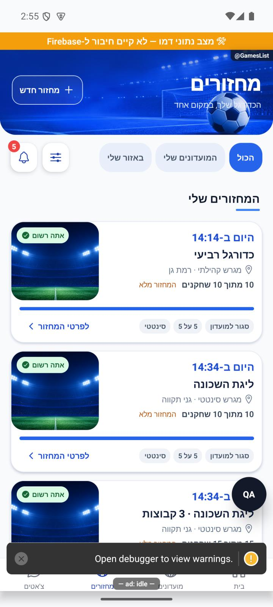

נצפה באימולטור אנדרואיד עם נתוני דמו. סימוני פיתוח והפס הכתום בצילום אינם חלק מההפצה. לא בוצעו פעולות הצטרפות או יצירה, קריאת מסד חי או בדיקת אייפון וגופן מוגדל. בדיקת הטיפוסים ו־2,801 הבדיקות ב־190 חבילות עברו; יומנים `artifacts/club-feed-redesign-tsc.log`, `artifacts/club-feed-redesign-jest.log`.

## הפלוס בכפתור יצירה — 8.10.2026

הפלוס מופיע משמאל לטקסט בכפתור היצירה. ברכיב FeedHero הטקסט קודם לאייקון add בתוך שורת הכפתור; תחת forceRTL הטקסט מימין והפלוס משמאל. לא השתנו הפעולה, גודל הכפתור או שער היצירה. אומת באימולטור אנדרואיד בנתוני דמו, ללא יצירת מועדון או מחזור. אייפון וגופן מוגדל לא נבדקו. בדיקת טיפוסים וכל 2,801 הבדיקות ב־190 חבילות עברו. יומנים artifacts/hero-plus-left-tsc.log ו־artifacts/hero-plus-left-jest.log.

## מניעת החלפת תמונות במהלך טעינה — 9.10.2026

מקור: שינויים מקומיים מעל `a348b9f`, ללא פריסה. לפני התיקון `coverForGame` החזירה `undefined` הן כשאין מועדון והן כאשר תשובת `getPublic` טרם הגיעה. `MatchListCard` הציגה בשני המקרים את `park-aerial.jpg`; תשובת המועדון החליפה אותה ברקע האמיתי. בנוסף אפקט טעינת הרקעים איפס את המפה בכל שינוי ברשימות או במועדונים, ולכן גם תמונה ידועה הוחלפה זמנית בברירת המחדל.

`src/utils/roundFeedCovers.ts` מגדירה שלושה מצבים: `undefined` — נתוני מועדון טרם התקבלו; `null` — התקבלה תשובה ללא רקע/מועדון, או כשל ראשון ללא תמונה שמורה; אובייקט — נתוני רקע ידועים, גם אם השדות עצמם ריקים. `resolveRoundCover` מעדיפה את נתוני המועדון מתוך `groupStore`, ואחריהם מטמון ציבורי השייך לאותו משתמש. ללא `groupId` מוחזר `null` מיד.

`GamesListScreen` מעבירה גם `coverLoading` במפורש לשני אזורי כרטיסי המחזור. בזמן המתנה לא מועבר מקור תמונה; נשמרים המידות, הצבע הניטרלי והתגית הקיימים. אין הצגת תמונת ברירת מחדל רגע לפני התמונה הנכונה. הקריאות הקיימות לכרטיס בבית האורח ובהזמנה האישית, שאינן מפעילות טעינת רקע מועדון, שומרות על ברירת המחדל הקודמת משום ש־`coverLoading` ברירתה `false`.

`mergeRoundCovers` ממזגת תשובות במפה במקום לאפס אותה בתחילת רענון. כשל זמני שומר תמונה ידועה; כשל ראשון מסיים את מצב ההמתנה עם חלופה, ורענון מאוחר יכול לנסות שוב. תשובה מוצלחת שמחזירה `null` מחליפה את הרשומה השמורה, כדי לא להציג לצמיתות רקע של מועדון שהוסר. החלפת משתמש מסתירה מיד מטמון של זהות אחרת, והכתיבה הבאה אינה ממזגת אותו. ניקוי האפקט הקיים ממשיך לפסול תגובות של טעינה שהוחלפה או מסך שפורק. המזהים נלקחים ממחזורי המקור ולא מוקלדים מחדש.

ב־`MatchListCard` כשל תמונה משויך לכתובת שנכשלה. שינוי כתובת יכול להיטען מיד, בלי פריים של דגל שגיאה מהכתובת הקודמת. הפניה לכתובת הפעילה מונעת מאירוע שגיאה מאוחר של תמונה קודמת לפסול את החדשה. מפתח רכיב התמונה כולל את המועדון והרקע, למניעת שימור מפת פיקסלים של מקור קודם בטעינת מקור אחר. `resizeMethod=resize` מתאימה פענוח באנדרואיד לגודל הכרטיס.

אין שינוי בהרשמה, בקיבולת, בסינון, בנתונים שמורים, בהחלפת רקעי מועדונים או בצילום שהעלה משתמש. לא נוספה אנימציית החלפה.

בדיקות `tests/logic/roundFeedCovers.test.ts` מכסות הבחנה בין המתנה לחלופה, פתרון לפי מזהה מועדון, רענון וכשל, ניסיון חוזר, שינוי/מחיקת רקע, קדימות נתוני חברות והחלפת חשבון. `tests/roundCoverRendering.test.ts` מפעילה את רכיב הכרטיס עם מארחים מדומים ומכסה מקור ריק בזמן המתנה, חלופות, תאימות לקריאות אחרות, שגיאה ישנה והעלאה חדשה לאחר שגיאה. בדיקות אלה אינן מדידת טעינת תמונה במכשיר.

אימות חזותי: דמו באימולטור אנדרואיד עם עיכוב זמני של 25 שניות בתשובת `getPublic` המדומה ורקע גלריה מדומה. צולמו המתנה ותשובה שהושלמה; קובץ השירות הוחזר במדויק לאחר הצילום. אין נתוני ייצור או שמירת בחירת תמונה בתהליך. אייפון, רשת אמיתית ותמונה שהועלתה לא נבדקו במכשיר; שגיאת כתובת נבדקה ברכיב המדומה.

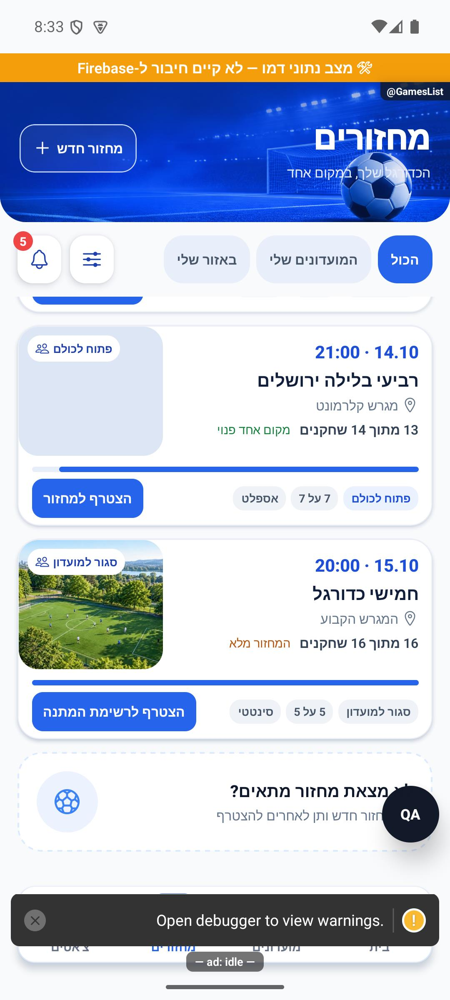
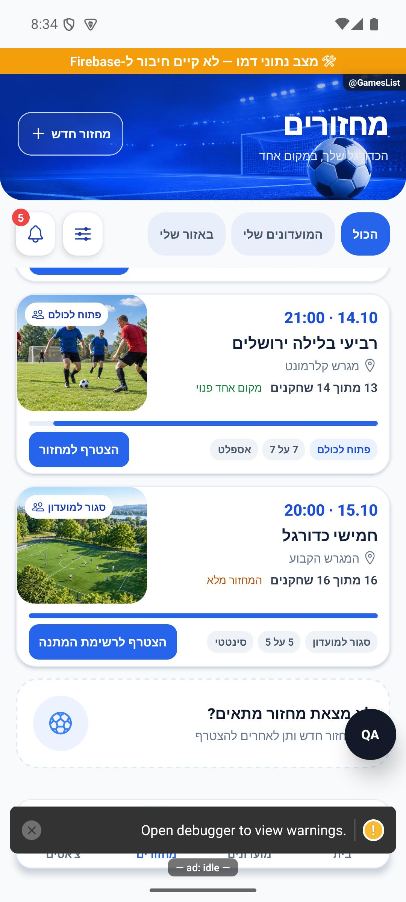

צילומי המקור והמגבלות מפורטים במניפסט וב־`artifacts/round-cover-fix`. השינוי טרם פורסם בחנות.

בדיקות הסיום עברו: בדיקת טיפוסים נקייה, 206 חבילות ו־2,998 בדיקות, כולל 12 בדיקות חדשות לטעינה ולרינדור תמונות. יומנים: `artifacts/round-cover-fix/tsc.log`, `jest.log`.

## תיקוני דיווחים — 9.10.2026

תגית התמונה נבנית רק כש-statusForUser שונה מ-none. תגית הסגירה תלויה גם ב-isOrphanContext ולא רק ב-groupId. resolveRoundCover אינה מקבלת מזהה מועדון במחזור יתום; גם coverLoading מתעלם ממנו. מועדון חסר רקע מקבל clubDefaultCoverId, ומחזור עצמאי מקבל c01 (park-aerial). נשמרו העלאות, קיבולת, קידומים והפעולות. tests/roundCoverRendering.test.ts בודקות טעינה ללא הבזק, בחירה, כשל העלאה מאוחר, תגית יחידה ומחזור יתום עם מזהה היסטורי.

מקור: שינויים מקומיים מעל a348b9f; טרם נבנתה גרסה. [ראיות ומגבלות](../../changes/2026-10-09-pulse-round2.md).

## תיקוני עיצוב ונגישות — 10.10.2026

מקור: `a348b9f235f1e1433497600555303231512a0834` עם שינויים מקומיים. אין בסעיף זה הוכחת גרסת חנות.

`GameFilterSheet` מספקת שמות למתגים; שורה שמופעלת כולה היא תחנה יחידה והמתג הפנימי מוסתר מקורא המסך. אין שינוי בתוצאות הסינון, סדר המחזורים או תמונות הכרטיסים. השינוי נקרא בקוד בלבד.
