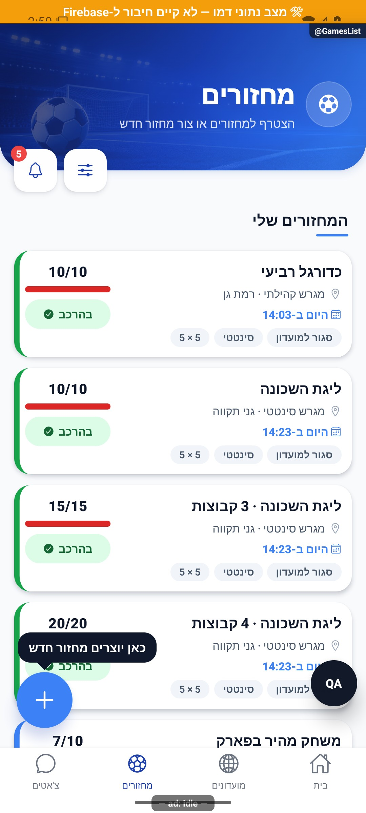

# רשימת מחזורים וגילוי

עודכן: 7.10.2026. מקור הקוד: `8e8fde5`, גרסה `1.1.35`. מסמך זה מתאר את הקוד; מצב חנות ופריסת שרת דורשים ראיה נפרדת.

## כניסה ותפקידים

לשונית מחזורים → GamesList; מחזור → MatchDetails; מפה → GamesMap; יצירה → GameCreate

אורח יכול לגלות; פעולה המחייבת חשבון עוברת useAuthenticatedAction. משתמש רואה פתוחים/שלי.

## רכיבים ומצבים

| רכיב / מצב | התנהגות וחוזה |
|---|---|
| כותרת | רקע אצטדיון, כותרת, חיפוש/מסננים ומפה; MatchCardSkeleton בזמן טעינה |
| פתוחים / שלי | רשימה נפרדת; כרטיסי MatchListCard עם תפוסה, מועד, מקום ופעולה נגזרת מצב |
| גילוי לפי צפיפות | מחזורים קודם, אחריהם ביקוש אזורי ומועדונים סמוכים כשיש מעט תוצאות; הגדרות gamesFeedDiscovery |
| אין תוצאות | היעדר מחזורים שונה ממסנן המסתיר מחזורים; האחרון מציע לנקות מסנן |
| הרשמה | בקשה, המתנה, הצעת מקום והתנגשות מועדים מפנות לחוזה הרשמה; לא כל לחיצה מייד מצרפת |
| זמינות ומיקום | AvailabilityNudgeModal, מיקום סמוך והרשאת מיקום; סירוב מצריך חלופה |
| יצירה | כפתור פלוס; openCreate יכול לפתוח את תהליך היצירה |

## מסלול נתונים ומקומות שינוי

[`src/screens/games/GamesListScreen.tsx`](../../../src/screens/games/GamesListScreen.tsx)

gameService ונתוני קבוצות/משתמש בחנויות; availabilityFeedService לביקוש ו־nearbyClubsService למועדונים. מסנן משתמש ב־GameFilterSheet; אין להסיק שרשימה ריקה מעידה על כשל או על אפס בלי להבחין במצב הטעינה.

ממיר המחזור: [`src/firebase/firestore.ts`](../../../src/firebase/firestore.ts), `fromFirestoreGameDoc`; סוגים: [`src/types`](../../../src/types). שינוי שדה דורש מעקב כתיבה → ממיר → שירות/חנות → רכיב. ניווט: [`GameStack.tsx`](../../../src/navigation/GameStack.tsx), ובמסכים משותפים גם המחסניות שמארחות אותם.

## בדיקות וראיות

בדיקות gamesFeedDiscovery, סינון והרשמה; לאשר תרחישי מעט/הרבה/אפס מחזורים ומסנן מסתיר.

צילומי המיפוי מהאמולטור נעשו במצב נתוני דמו, המסומן בפס כתום. הם מוכיחים את הרכיב והמצב המוצגים בלבד, ולא ממירי Firebase, נתוני ייצור או כתיבה. צילומי תיקונים קודמים מסומנים בנפרד. שגיאת מזהה, מצב טעינה או שער הגנה אינם הוכחת הפעולה המלאה.

## גבולות והערות תחזוקה

התצוגה מותאמת לכמות אמיתית, ולכן מקור 094 שבו היה מחזור אחד אינו תיאור קבוע של ההיצע היום.

לפני שינוי פתח את הקוד המקושר ואת [כללי הפרויקט](../../../AGENTS.md). לאחר שינוי עדכן במסמך זה את התאריך, נקודת הקוד, המצבים שהתעדכנו, הבדיקות והצילום. אין לטעון שכל מצב/תפקיד נבדק רק משום שקיים צילום אחד.
