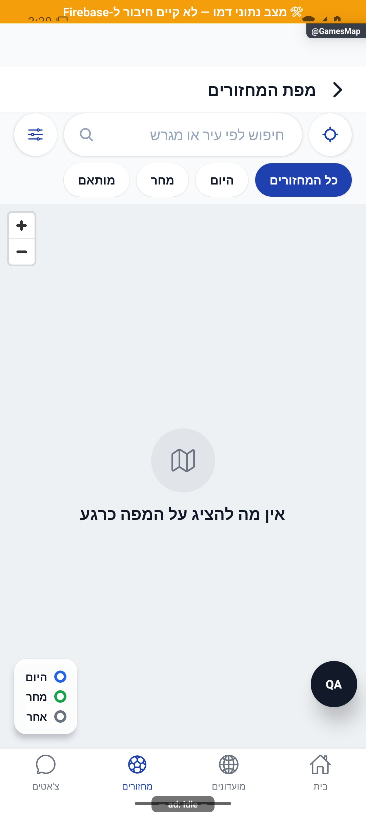

# מפת מחזורים ומועדונים

עודכן: 7.10.2026. מקור הקוד: `8e8fde5`, גרסה `1.1.35`. מסמך זה מתאר את הקוד; מצב חנות ופריסת שרת דורשים ראיה נפרדת.

## כניסה ותפקידים

GamesMap או CommunitiesMap עם MapScreenParams. המסלולים רשומים, אך כפתורי הכניסה הוסרו מרשימות הגילוי; כיום נפתחו במיפוי דרך כלי פיתוח בלבד.

צופה בנתונים שהועברו; הרשאת מיקום לצורך מצא אותי נפרדת מהרשאת צפייה.

## רכיבים ומצבים

| רכיב / מצב | התנהגות וחוזה |
|---|---|
| נתונים | MapItem[] מסודר וניתן לסריאליזציה מגיע בניווט; המסך אינו מבצע שאילתת מחזורים עצמאית |
| מסננים | כל המחזורים / היום / מחר / מותאם; חיפוש ומקרא בהתאם למחזור או מועדון. ההערה הישנה על מסנן סוף שבוע אינה מתארת את GameChip הפעיל |
| מיקום | מצא אותי, הרשאת מיקום, מצב ללא קואורדינטות; MapWebView מציג מפה |
| סמן | בחירה ופתיחת כרטיס תחתון; פרטי מחזור מול פרטי מועדון |
| מעבר | פתיחת MatchDetails או CommunityDetails לפי סוג הפריט |
| ריק ושגיאה | אין פריטים, מסנן ריק, טעינת מפה/רשת, גישה למיקום נדחית |

## מסלול נתונים ומקומות שינוי

[`src/screens/map/MapScreen.tsx`](../../../src/screens/map/MapScreen.tsx)

חוזה המסך מקבל MapItem[] דרך פרמטרי הניווט; `src/components/map/MapWebView.tsx`. כפתורי הכניסה וההרכבה של נתוני המפה הוסרו מהקוראים GamesList/Communities ב־28.9. המסלולים נותרו רשומים, אך אין לראות במסך זה פיצ׳ר גילוי נגיש כיום למשתמש דרך אותם קוראים. החזרה עתידית דורשת גם נתוני כניסה, לא רק כפתור.

ממיר המחזור: [`src/firebase/firestore.ts`](../../../src/firebase/firestore.ts), `gameDocConverter.fromFirestore`; סוגים: [`src/types`](../../../src/types). שינוי שדה דורש מעקב כתיבה → ממיר → שירות/חנות → רכיב. ניווט: [`GameStack.tsx`](../../../src/navigation/GameStack.tsx), ובמסכים משותפים גם המחסניות שמארחות אותם.

## בדיקות וראיות

בדיקות סינון/מיקום/ניווט ככל שקיימות; לבדוק GamesMap וגם CommunitiesMap, קואורדינטות חסרות ורשת חסומה.

צילומי המיפוי מהאמולטור נעשו במצב נתוני דמו, המסומן בפס כתום. הם מוכיחים את הרכיב והמצב המוצגים בלבד, ולא ממירי Firebase, נתוני ייצור או כתיבה. צילומי תיקונים קודמים מסומנים בנפרד. שגיאת מזהה, מצב טעינה או שער הגנה אינם הוכחת הפעולה המלאה.

המסך משותף גם למועדונים לפי הפרמטר mode. פתיחת GamesMap בכלי הבדיקה אינה מעבירה נתונים, ולכן צולמה הודעת ״אין מה להציג על המפה כרגע״. זה אינו צילום סמנים ולא בדיקה של שירות אריחי המפה. גם קיצור CommunitiesMap ללא פרמטרים מציג ברירת מחדל של מחזורים; אינו הוכחה למפת מועדונים.

## גבולות והערות תחזוקה

אין להעתיק מסך מפה לכל לשונית. ראיית קוד אינה הוכחה ששירות המפה עובד בסביבה או שכל סמן מייצג מיקום מדויק.

לפני שינוי פתח את הקוד המקושר ואת [כללי הפרויקט](../../../AGENTS.md). לאחר שינוי עדכן במסמך זה את התאריך, נקודת הקוד, המצבים שהתעדכנו, הבדיקות והצילום. אין לטעון שכל מצב/תפקיד נבדק רק משום שקיים צילום אחד.

## פירוט טכני ממוקד: זרימה, חישוב ונקודות שינוי

[הסבר פשוט למשתמש](games-map.simple.md)

העמקה: 07.10.2026, מול קוד המקור שב־`8e8fde5`. בעת הכתיבה HEAD הוא `50d508f`; בדיקת ההפרש בין הנקודות ב־`src` וב־`functions` לא מצאה שינוי קוד. הסעיפים וההסתייגויות הקיימים נשמרו. זו קריאת קוד ותיעוד, בלי הרצת תרחישי כתיבה חדשים.

המסך מקבל `MapScreenParams` עם `mode/items/overlay`; אינו טוען בעצמו רשימת מחזורים. `MapItem.kind` קובע יעד גם בשכבה נוספת; בהיעדרו משתמשים במצב המסך. `dateMs` מזין התאמת יום לפי שנה/חודש/יום מקומיים, לא הפרש קטן מ־24 שעות.

לדוגמה מחזור היום ב־23:00 ומחזור מחר ב־01:00 נמצאים ביומיים שונים למרות הפרש שעתיים. `GameChip` בפועל הוא הכול/היום/מחר/מותאם; ההערה בראש הקובץ על סוף שבוע אינה רשימת הפקדים הנוכחית. `open` חסר לא מסמן סגור; חוזה הפריט מציין ברירת הצגה.

`focusOnMe` חוסם ריצה חוזרת, מבקש הרשאת מיקום ומבצע מרוץ לקבלת מיקום מול 5 שניות. סירוב/timeout אינם מוחקים את נתוני הסמנים. בהיעדר פרמטרים ברירת המחדל מחזורים ורשימה ריקה; לכן קיצור מועדונים ללא נתונים אינו הוכחת שכבת מועדונים.

נקודות שינוי: בוני נתונים אצל הקוראים, הסינון במסך ו־`MapWebView` לרינדור/סמנים. החזרת הכפתור מחייבת גם אספקת נתונים. אין כאן כתיבת רוסטר או מנגנון זקיפה. בדוק מעבר יום, פריט ללא מיקום, שכבה נוספת, רשת חסומה וקישור פרטים.
