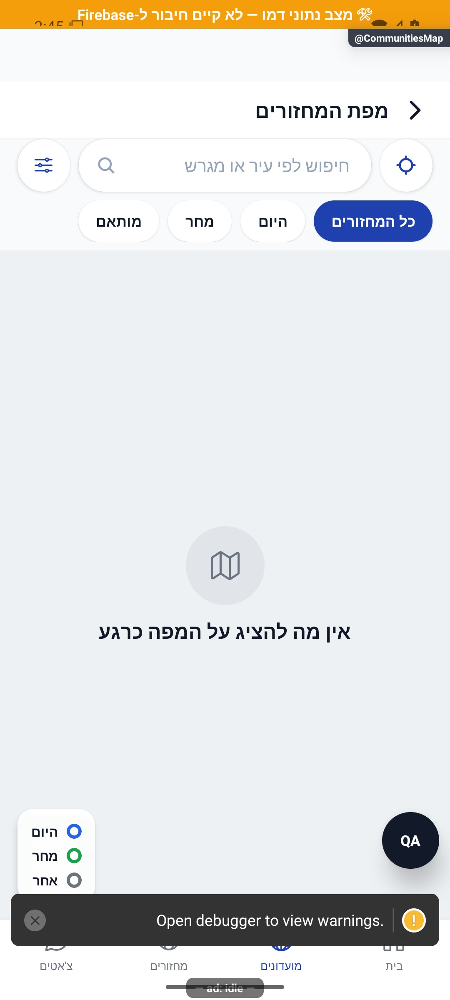

# מפת מחזורים ומועדונים

עודכן: 7.10.2026. מקור הקוד: `8e8fde5`, גרסה `1.1.35`. מסמך זה מתאר את הקוד; מצב חנות ופריסת שרת דורשים ראיה נפרדת.

## כניסה ותפקידים

GamesMap או CommunitiesMap עם MapScreenParams

צופה בנתונים שהועברו; הרשאת מיקום לצורך מצא אותי נפרדת מהרשאת צפייה.

## רכיבים ומצבים

| רכיב / מצב | התנהגות וחוזה |
|---|---|
| נתונים | MapItem[] מסודר וניתן לסריאליזציה מגיע בניווט; המסך אינו מבצע שאילתת מחזורים עצמאית |
| מסננים | הכול / היום / סוף שבוע / מותאם; חיפוש ומקרא בהתאם למחזור או מועדון |
| מיקום | מצא אותי, הרשאת מיקום, מצב ללא קואורדינטות; MapWebView מציג מפה |
| סמן | בחירה ופתיחת כרטיס תחתון; פרטי מחזור מול פרטי מועדון |
| מעבר | פתיחת MatchDetails או CommunityDetails לפי סוג הפריט |
| ריק ושגיאה | אין פריטים, מסנן ריק, טעינת מפה/רשת, גישה למיקום נדחית |

## מסלול נתונים ומקומות שינוי

[`src/screens/map/MapScreen.tsx`](../../../src/screens/map/MapScreen.tsx)

נתונים מסופקים מהקורא GamesList/Communities; `src/components/map/MapWebView.tsx`. שינוי שדות של MapItem מחייב עדכון שני המעבירים והמסך המשותף.

ממיר המחזור: [`src/firebase/firestore.ts`](../../../src/firebase/firestore.ts), `fromFirestoreGameDoc`; סוגים: [`src/types`](../../../src/types). שינוי שדה דורש מעקב כתיבה → ממיר → שירות/חנות → רכיב. ניווט: [`GameStack.tsx`](../../../src/navigation/GameStack.tsx), ובמסכים משותפים גם המחסניות שמארחות אותם.

## בדיקות וראיות

בדיקות סינון/מיקום/ניווט ככל שקיימות; לבדוק GamesMap וגם CommunitiesMap, קואורדינטות חסרות ורשת חסומה.

צילומי המיפוי מהאמולטור נעשו במצב נתוני דמו, המסומן בפס כתום. הם מוכיחים את הרכיב והמצב המוצגים בלבד, ולא ממירי Firebase, נתוני ייצור או כתיבה. צילומי תיקונים קודמים מסומנים בנפרד. שגיאת מזהה, מצב טעינה או שער הגנה אינם הוכחת הפעולה המלאה.

המסך משותף גם למועדונים. צילום המיפוי המצורף הוא CommunitiesMap, ואינו הוכחה למסנני מחזורים או לנתוני GamesMap.

## גבולות והערות תחזוקה

אין להעתיק מסך מפה לכל לשונית. ראיית קוד אינה הוכחה ששירות המפה עובד בסביבה או שכל סמן מייצג מיקום מדויק.

לפני שינוי פתח את הקוד המקושר ואת [כללי הפרויקט](../../../AGENTS.md). לאחר שינוי עדכן במסמך זה את התאריך, נקודת הקוד, המצבים שהתעדכנו, הבדיקות והצילום. אין לטעון שכל מצב/תפקיד נבדק רק משום שקיים צילום אחד.
