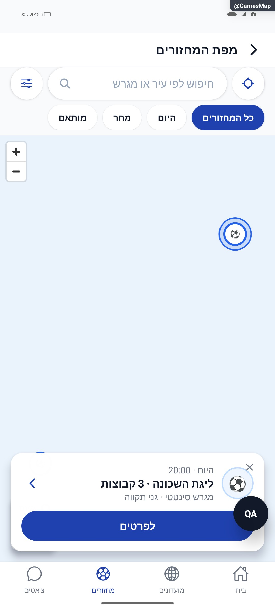

# מפת מחזורים ומועדונים — הסבר פשוט

מסך המפה יכול להציג מחזורים או מועדונים שקיבל בכניסה אליו. אפשר לסנן וללחוץ על סמן כדי לפתוח פרטים. כרגע הכפתורים שמובילים אליו מרשימות הגילוי הוסרו, ולכן הוא אינו דרך פעילה רגילה לחיפוש.

[להסבר המעמיק ולמפת הקוד](games-map.md)

## צילום והיקף ההוכחה

הצילומים מציגים רק את המצבים המתועדים במסמך המעמיק. חלקם נתוני דמו, חלקם הוכחות מתיקון קודם, ובכמה מהם טעינה או הודעת הגנה; הם אינם אישור שכל התהליך או השרת נבדקו.

## השלמת הנפשות — 8.10.2026

בחירת סמן מדגישה אותו ומעלה את כרטיס הפרטים בתנועה קצרה. מסך המפה נשאר מוסתר מהכניסה הרגילה כפי שהיה.

[פרטי האימות והמגבלות](../../changes/2026-10-08-motion-completion.md). מקור: `9ec0dfd` עם שינויים מקומיים; טרם פורסמה גרסה.

## תיקוני עיצוב ונגישות — 10.10.2026

מקור: `a348b9f235f1e1433497600555303231512a0834` עם שינויים מקומיים. אין בסעיף זה הוכחת גרסת חנות.

אפשרויות המפה מקבלות שם ברור בקורא מסך.
