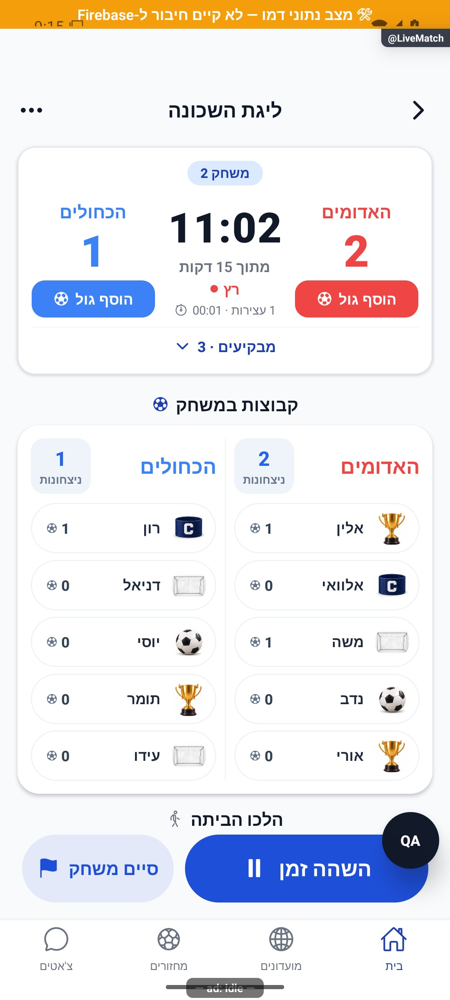
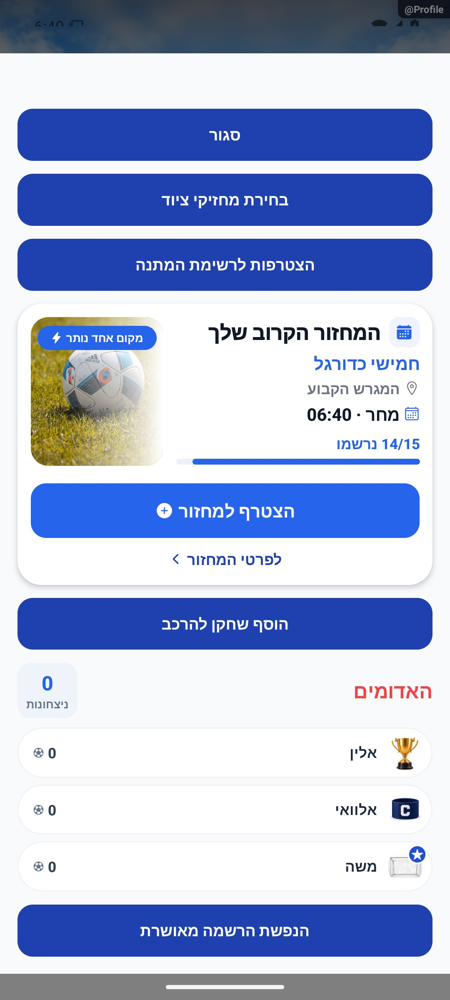

# לייב מתקדם ורוטציה

עודכן: 7.10.2026. מקור הקוד: `8e8fde5`, גרסה `1.1.35`. מסמך זה מתאר את הקוד; מצב חנות ופריסת שרת דורשים ראיה נפרדת.

## כניסה ותפקידים

LiveMatch של מחזור advancedMode

מנהל מנהל תוצאה/תור/שחקנים; השינויים נשמרים דרך פרוטוקול השירות והשרת.

## רכיבים ומצבים

| רכיב / מצב | התנהגות וחוזה |
|---|---|
| מצב חי | subscribeLiveGame: liveMatch, rotation, draftTeams; שתי קבוצות על מגרש ותור ממתינים |
| תחילת משחק | prepareStartRotation / markGameStarted וטיימר; מצב לפני התחלה שונה ממשחק פעיל |
| תוצאה | WinnerPickerModal; prepareRoundResult → commitFilledRotation; תוצאות נשמרות פעם אחת |
| תיקו | TieDecisionModal: ידני, פנדלים, או שתיהן יוצאות רק אם waiting[1] קיים |
| תור | reorderWaiting, מילוי חסר, nudgeRotationAfterFillCancel; אינדקסי תור אינם צבעי קבוצות |
| שחקנים | הלך הביתה/חזר, החלפה/העברה, פרישת קבוצה ריקה, מילוי קבוצות פעילות |
| תפריט | משחקים, איפוס, סיום; אישורים ולא מחיקה לצילום |
| סיום מחזור | endEvening, סטטיסטיקה, equipment; אינו סיום המשחק הבודד |

## מסלול נתונים ומקומות שינוי

[`src/screens/AdvancedLiveMatchScreen.tsx`](../../../src/screens/AdvancedLiveMatchScreen.tsx); [`src/components/match/RotationPanel.tsx`](../../../src/components/match/RotationPanel.tsx)

src/services/gameService.ts, rotationEngine.ts, gameLifecycle.ts; functions/src/commitProtocol.ts, roundSummary.ts, statBatch.ts. snapshot של הרכב ותוצאת משחק חייב לשקף מי שיחק ולא רק סגל סופי. פרוטוקול אידמפוטנטי מונע כפילות בחזרה/לחיצה.

ממיר המחזור: [`src/firebase/firestore.ts`](../../../src/firebase/firestore.ts), `gameDocConverter.fromFirestore`; סוגים: [`src/types`](../../../src/types). שינוי שדה דורש מעקב כתיבה → ממיר → שירות/חנות → רכיב. ניווט: [`GameStack.tsx`](../../../src/navigation/GameStack.tsx), ובמסכים משותפים גם המחסניות שמארחות אותם.

## בדיקות וראיות

rotationEngine/rotationFill/rotationDeep/rotationCounts, rotationQueueReorder, idempotency, advancedMatchStats ו־shootoutPersistence.

צילומי המיפוי מהאמולטור נעשו במצב נתוני דמו, המסומן בפס כתום. הם מוכיחים את הרכיב והמצב המוצגים בלבד, ולא ממירי Firebase, נתוני ייצור או כתיבה. צילומי תיקונים קודמים מסומנים בנפרד. שגיאת מזהה, מצב טעינה או שער הגנה אינם הוכחת הפעולה המלאה.

## גבולות והערות תחזוקה

הצילום הנוכחי מציג בפועל את שער ״עוד לא חולקו כוחות״; אין לכנותו הוכחה לכל הרוטציה. ארבע קבוצות ומעלה נדרשות ליציאת שתיהן כשיש שתי מחליפות.

לפני שינוי פתח את הקוד המקושר ואת [כללי הפרויקט](../../../AGENTS.md). לאחר שינוי עדכן במסמך זה את התאריך, נקודת הקוד, המצבים שהתעדכנו, הבדיקות והצילום. אין לטעון שכל מצב/תפקיד נבדק רק משום שקיים צילום אחד.

## פירוט טכני ממוקד: זרימה, חישוב ונקודות שינוי

[הסבר פשוט למשתמש](live-advanced.simple.md)

העמקה: 07.10.2026, מול קוד המקור שב־`8e8fde5`. בעת הכתיבה HEAD הוא `50d508f`; בדיקת ההפרש בין הנקודות ב־`src` וב־`functions` לא מצאה שינוי קוד. הסעיפים וההסתייגויות הקיימים נשמרו. זו קריאת קוד ותיעוד, בלי הרצת תרחישי כתיבה חדשים.

[rotationEngine](../../../src/services/rotationEngine.ts) הוא מנוע טהור: `prepareStartRotation/recordWinnerSkeleton/recordTieSkeleton` מחשבים מצב לפני מילוי; שירות המחזור שומר. `canStart` דורש שתי קבוצות מאוישות, לא שתי קבוצות מלאות לפי הפורמט: 4 מול 3 אפשרי, קבוצה ריקה לא.

במנצחת נשארת: `playing=[0,1]`, `waiting=[2,3]`, מנצחת 1 → `playing=[1,2]`, `waiting=[3,0]`; מספר ניצחונות 1 עולה. בלי ממתינות אותן שתי קבוצות נשארות. השאלות זמניות חוזרות כשהקבוצה הביתית נכנסת ומוסרות כשהקבוצה שקיבלה את ההשאלה יוצאת. בתיקו אין זקיפת ניצחון; יציאת שתיהן דורשת שתי מחליפות, ויש מסלול גיבוי כשנותרה אחת בלבד.

סיום עובר `prepareRoundResult` ו־`_commitRoundStatsAndClear` לפני `commitFilledRotation`. [מפתח משחקון](../../../src/services/rotationEngine.ts), `roundCommitKey`, מעדיף `roundInstanceId` יציב; `resolveRoundInstance` מנפיק חדש רק למספר משחקון חדש. עדכון סדר תור/ממלא אינו צריך לייצר זקיפה חדשה לאותו משחקון.

[commitRoundInOrder](../../../functions/src/commitProtocol.ts) קורא latch; אם טרם נזקף, כותב היסטוריה לפני אצוות הסטטיסטיקה. ה־latch נוצר באותה אצווה כמו ההגדלות. בחזרה שכבר נזקפה מתקנים היסטוריה חסרה באמצעות יצירה, ולא דורסים היסטוריה קיימת עם יומן חדש. לדוגמה שתי בקשות לאותו מזהה אמורות להגדיל ניצחון פעם אחת, גם אם התשובה הראשונה אבדה. אצווה והיסטוריה הן שתי כתיבות: אין לתאר את כולן כטרנזקציה יחידה.

נקודות שינוי: חוקי התור במנוע, תיאום ובחירת ממלא במסך, אידמפוטנטיות בפרוטוקול, מכנים ב־statBatch. בדיקות `rotation*`, `idempotency` ו־`advancedMatchStats` חשובות לפני שינוי. צילום שער ההגנה בלבד אינו בדיקת הרוטציה הזאת.

## עדכון 8.10.2026 — תנועה ותיקוני דיווחים

`LiveScoreboardCard` מנפיש את שורת המצב לפי `running` במשך 190 אלפיות שנייה; ספרות הזמן אינן מוזזות. `RotationPanel` עטוף ב־`ChangeMotion` לפי `rotation.round` במשך 280. סיום המשחק, פרוטוקול התוצאה, תור הקבוצות והשעון נשארו מקור הנתונים היחיד.

**ראיה ומגבלות:** עצירה וחידוש הורצו והוקלטו בדמו. סיום משחק ורוטציה חדשה לא הורצו בסבב זה, לכן תנועת ההחלפה אינה מסומנת מאומתת.

בדיקת הטיפוסים ו־183 חבילות הבדיקות עברו, 2,752 בדיקות. מצב המקור: `9ec0dfd` עם שינויים מקומיים; אין גרסה חדשה שפורסמה. [יומן השינוי וההקלטות](../../changes/2026-10-08-motion-and-pulse.md).

## השלמת הנפשות — 8.10.2026

TeamScore variant=list מנפישה מזהים חדשים דרך useArrivalTracker ו־ArrivalMotion, ללא שינוי ב־rosterOf, בתור, בהשאלות, בשמירת משחקון או במכני הנתונים. teamIdx מפרידה תחומי סגל; rosterKey היא רשימת מזהים בלבד, ולכן עדכון שם או גולים לא נחשב כניסה. התנועה נבדקה ברכיב האמיתי עם state מקומי בחלונית הבדיקה; לא בוצעה רוטציה או אישור מילוי מול שרת בסבב זה. grid נשארה ללא שינוי.

[פרטי האימות והמגבלות](../../changes/2026-10-08-motion-completion.md). מקור: `9ec0dfd` עם שינויים מקומיים; טרם פורסמה גרסה.
