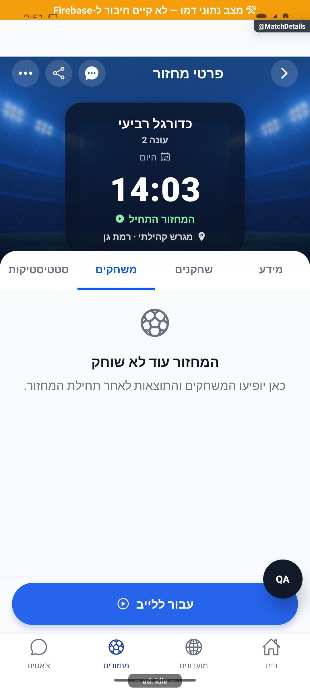
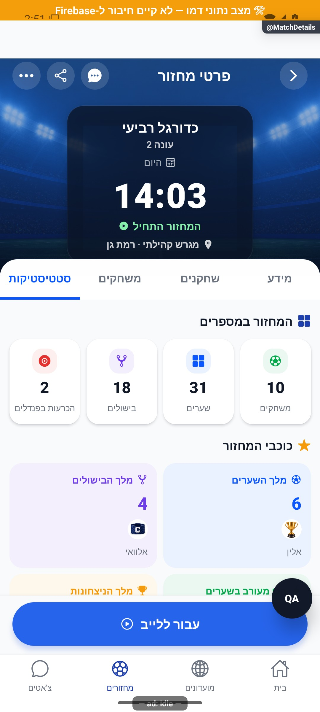
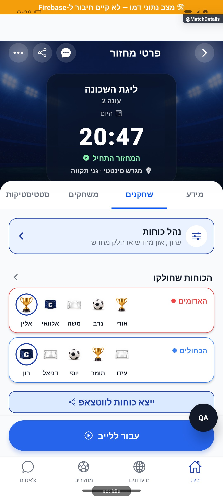
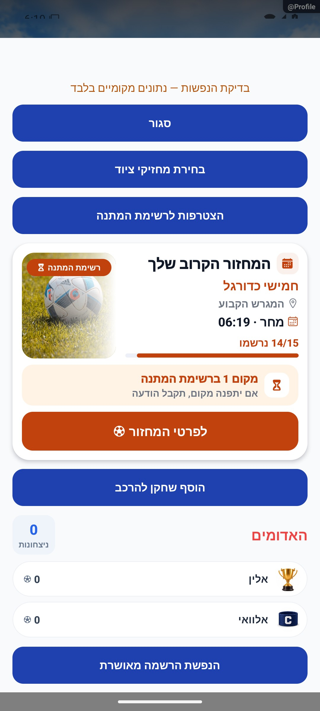
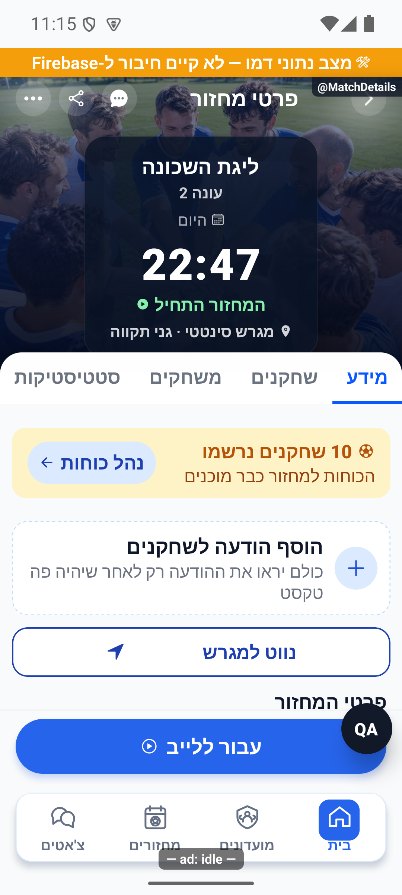
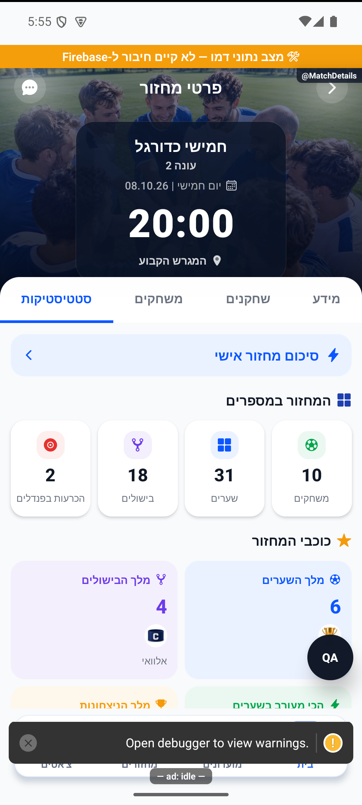

# פרטי מחזור וארבע הלשוניות

עודכן: 7.10.2026. מקור הקוד: `8e8fde5`, גרסה `1.1.35`. מסמך זה מתאר את הקוד; מצב חנות ופריסת שרת דורשים ראיה נפרדת.

## כניסה ותפקידים

בית / מחזורים / מועדון / הודעה → MatchDetails {gameId, initialTab}

אורח, משתמש חיצוני, חבר מועדון, משתתף ומנהל מקבלים פעולות שונות. משחק רגיל אינו חושף את כל נתוני המשחק המתקדם.

## רכיבים ומצבים

| רכיב / מצב | התנהגות וחוזה |
|---|---|
| כותרת | MatchStadiumHero, שם מחזור/עונה/מועד/מיקום; הכותרת גוללת והלשוניות נשארות נעוצות |
| מידע | עובדות מזג אוויר/משך/תפוסה, כתובת וניווט, כללים, הערות, פרטי יצירה וניהול |
| שחקנים | הרשומים וההמתנה כוללים אורחים פעילים ואורחים בהמתנה; MatchPlayersScreen מוטמע ולא תקציר של שלושה |
| משחקים | MatchRoundsScreen מוטמע: תוצאות, מסנן קבוצות, שערים, הרכבים ופנדלים |
| סטטיסטיקה | MatchStatsTab, סיכום אישי, מדדים, כוכבים, מה קרה הערב וטבלת אלופים |
| מצבים | טרם התקיים / התקיים עם נתונים / היסטורי ללא נתוני משחק / רגיל / מתקדם / פעיל / הסתיים / בוטל |
| פעולות | הרשמה, התנגשות, ביטול, הצעת מקום, פתיחה לציבור, עריכת סדרה, פרסום קבוצות ומשוב חלוקה |
| טעינה | useGameEvents משותף; לשוניות נטענות כשנכנסים אליהן ונשמרות לאחר מכן; לא ארבעה מאזינים כפולים |

## מסלול נתונים ומקומות שינוי

[`src/screens/games/MatchDetailsScreen.tsx`](../../../src/screens/games/MatchDetailsScreen.tsx)

gameService ומסלולי gameLifecycle; cancelGameV2, requestJoin, confirmSpotOffer, publishDraft, notifyTeamsReady, setDraftFeedback. gameDocConverter.fromFirestore קורא את שדות המחזור. eveningPlayed הוא המקור למצב התקיים, ולא טיימר/שערים בנפרד.

ממיר המחזור: [`src/firebase/firestore.ts`](../../../src/firebase/firestore.ts), `gameDocConverter.fromFirestore`; סוגים: [`src/types`](../../../src/types). שינוי שדה דורש מעקב כתיבה → ממיר → שירות/חנות → רכיב. ניווט: [`GameStack.tsx`](../../../src/navigation/GameStack.tsx), ובמסכים משותפים גם המחסניות שמארחות אותם.

## בדיקות וראיות

בדיקות homeRoundState, eveningPlayed, eveningStats, guestPromotion, draftTeamsView וניווט משותף; בדיקת כיווניות בצילום לכל לשונית.

צילומי המיפוי מהאמולטור נעשו במצב נתוני דמו, המסומן בפס כתום. הם מוכיחים את הרכיב והמצב המוצגים בלבד, ולא ממירי Firebase, נתוני ייצור או כתיבה. צילומי תיקונים קודמים מסומנים בנפרד. שגיאת מזהה, מצב טעינה או שער הגנה אינם הוכחת הפעולה המלאה.

## גבולות והערות תחזוקה

הסדר הנוכחי: מידע, שחקנים, משחקים, סטטיסטיקה. במסמכים 109/110 הסדר שונה. RoundSummary הישן הוסר מהניווט; כניסה לסיכום מפנה לסטטיסטיקה.

לפני שינוי פתח את הקוד המקושר ואת [כללי הפרויקט](../../../AGENTS.md). לאחר שינוי עדכן במסמך זה את התאריך, נקודת הקוד, המצבים שהתעדכנו, הבדיקות והצילום. אין לטעון שכל מצב/תפקיד נבדק רק משום שקיים צילום אחד.

## פירוט טכני ממוקד: זרימה, חישוב ונקודות שינוי

[הסבר פשוט למשתמש](match-details.simple.md)

העמקה: 07.10.2026, מול קוד המקור שב־`8e8fde5`. בעת הכתיבה HEAD הוא `50d508f`; בדיקת ההפרש בין הנקודות ב־`src` וב־`functions` לא מצאה שינוי קוד. הסעיפים וההסתייגויות הקיימים נשמרו. זו קריאת קוד ותיעוד, בלי הרצת תרחישי כתיבה חדשים.

המסך הוא מתאם בין הרשאות, נתוני מחזור וארבעה משטחי תוכן; אינו מחשב מחדש את כל הסטטיסטיקה. `initialTab` בוחר כניסה, ונתוני אירועים משותפים עוברים דרך `useGameEvents`. לשונית שטרם נפתחה שונה מלשונית שנטענה ונשארת מותקנת; שינוי טעינה צריך לשמר הבחנה זו כדי לא להקים ארבעה מנויים.

תנאי פעולה אינם תחליף זה לזה: חברות במועדון, רישום למחזור, ניהול ומצב `active/finished/cancelled` הם צירים נפרדים. פרסום דרך `publishDraft` ושיגור `notifyTeamsReady` נפרדים משמירת חלוקה; בחירה שנשמרה עם `published:false` אינה הודעה שנשלחה.

למשל מחזור של 15 מקומות עם 12 רשומים, 2 אורחים פעילים ו־3 בהמתנה מציג תפוסה 14/15; מספר השורות הכולל אינו 17/15. קביעת ״התקיים״ נשענת על [eveningPlayed](../../../src/utils/eveningPlayed.ts); לא על סך שערים, זמן או סיום סטטוס שנגזר מחדש במסך.

נקודות שינוי: הממיר לקריאת שדה חדש, רכיב הלשונית לתוכן, השירות לפעולה ומחסניות הניווט לכניסה משותפת. סיכום שהוסר מהניווט אינו מוחזר רק מפני שקיים רכיב ישן. בדוק כניסה מכל הורה, מיקוד וחזרה, חבר לעומת מנהל, נתון חסר ומחזור רגיל לעומת מתקדם.

## עדכון 8.10.2026 — תנועה ותיקוני דיווחים

כרטיסי `DraftTeamCard` עטופים ב־`ChangeMotion` לפי מזהה המחזור, מצב פרסום ורשימת שחקני הקבוצה: 300 אלפיות שנייה, עם השהיה של 50 לפי מספר הקבוצה ועד 150. מוני `MatchPlayersTab` מגיבים לצירוף registered/waiting. הנפשות ההרשמה הקיימות נשארו במסלול שאחרי תוצאת השירות; לא נוסף אישור מוקדם או שינוי קיבולת.

**ראיה ומגבלות:** הסגל והקבוצות המרונדרים נצפו בדמו. פרסום חלוקה והרשמה חדשה לא הורצו בסבב זה; אין צילום שמוכיח כתיבת שרת חדשה.

בדיקת הטיפוסים ו־183 חבילות הבדיקות עברו, 2,752 בדיקות. מצב המקור: `9ec0dfd` עם שינויים מקומיים; אין גרסה חדשה שפורסמה. [יומן השינוי וההקלטות](../../changes/2026-10-08-motion-and-pulse.md).

## תיקוני סבב הבאגים — 8.10.2026

B09: teamsValidity בונה את קבוצת המזהים מרשומים ומאורחים שאינם waitlisted. שיוך של אורח בהמתנה מחזיר invalid. אין שינוי בספירת משחקונים או מחזורים.

[ראיות, בדיקות ומגבלות](../../changes/2026-10-08-audit-fixes.md).

## השלמת הנפשות — 8.10.2026

MatchDetailsScreen מוסיפה HeightReveal באזור המידע כשהסטטוס waitlist. המיקום מחושב ממערך game.waitlist ולא מהקיבולת; מיקום חסר מקבל נוסח ללא מקום. RegistrationSuccessAnimation עודכנה במסלול registered בלבד. אין שינוי בפעולות הרשמה, הצעות, קיבולת, טאבים או תזמון השירות. הוכחת ההמתנה המצורפת היא רכיב הבית עם אותו עיקרון פתיחה; חלונית המידע של MatchDetails בתור לא הורצה בסבב זה. יש להבדיל בין בדיקת רכיב משותף לבין מסך מלא.

[פרטי האימות והמגבלות](../../changes/2026-10-08-motion-completion.md). מקור: `9ec0dfd` עם שינויים מקומיים; טרם פורסמה גרסה.

## עבודת ציור וגלילה — 9.10.2026

מקור: שינויים מקומיים מעל `a348b9f`, טרם פורסמו. תשתית `ScrollSurface` מחוברת לפרטי מועדון, ללשוניות פרטי מחזור, לסטטיסטיקות מועדון ולסיכום האישי. היא מסמנת תחילת/סוף מחווה ותנופה בלבד; אין שינוי נתונים או עדכון מצב בכל פריים. `CountUp` ו־`StatDonut` מתייצבים לערך הסופי במהלך גלילה; שורות ללא שינוי מיקום אינן מתזמנות תנועה. אנימציות `LivingIcon` ו־`Breathing` נעצרות כשמסך המקור מאבד מיקוד, כשהיישום ברקע, בזמן גלילה ובהגדרת צמצום תנועה. תמונות פרופיל ורקע משתמשות ב־`resizeMethod=resize`, לצמצום פענוח באנדרואיד לפי גודל התצוגה.

אין שינוי בחישובים, במכנים, בשדות המסד או בהרשאות. [התנהגות, בדיקות ומגבלות](../shared/menus-and-motion.md) · [מדידות וראיות](../reviews/scroll-performance-2026-10-09.md). הבדיקה בדמו אינה אימות גרסת חנות במכשיר פיזי.

## תיקוני דיווחים — 9.10.2026

MatchDetailsScreen משתמשת קודם ב-myCommunities; למועדון ציבורי שאינו ברשימת החברות היא קוראת groupService.getPublic. התוצאה קשורה ל-ownerId ול-groupId, עם ביטול תוצאה לאחר שינוי זהות או יעד. עד פתרון הקריאה coverLoading מונעת הבזק תמונה חלופית. MatchStadiumHero שומרת קדימות העלאה/גלריה/clubDefaultCoverId ומחליפה העלאה שנכשלה. במחזור יתום אין ירושת תמונת מועדון. טעינת MatchRoundsScreen המשובצת עטופה ב-TabScroll עם header, stickyHeader ו-bottomInset; הכדור מסתובב באזור התוכן בגובה מינימלי 160, ולא במקום כל הכותרת. חישובי המשחקונים לא השתנו.

מקור: שינויים מקומיים מעל a348b9f; טרם נבנתה גרסה. [ראיות ומגבלות](../../changes/2026-10-09-pulse-round2.md).

## הגנת לחיצות אחרי גלילה — 9.10.2026

תיקון opt-in ב-patches/react-native+0.79.6.patch: ScrollSurface מעבירה recoverStaleMomentumAfterMs=250. RN שומרת זמן פריים גלילה אחרון, ורק כש-begin חדש מ-end ולא היו פריימים במשך 250ms היא מסיימת את נעילת responder. תנופה ארוכה עם פריימים טריים עדיין חוסמת לחיצת עצירה כרגיל. scrollEventThrottle מוגבל ל-64ms (ברירת 16), ללא listener נוסף, מצב או חישוב בכל פריים ברכיב היישום. onStaleMomentumRecovered מתעדת stale_momentum_recovered ביומן המקומי ומשחררת מצב moving; momentum_start מתועד גם הוא. MatchRoundsScreen משתמשת ב-ScrollSurface בכל ענפי הגלילה. patch-package מוחל בהתקנה דרך scripts/postinstall.cjs החוצה פלטפורמות; אין שינוי native או הרשאות. tests/scrollStaleMomentum.test.ts מריצה את תנאי RN המותקן עצמו: החמצת end נכשלת לפני התיקון ועוברת אחריו; נבדקים תנופה ארוכה, התחלה, מרווח הסיום הרגיל והיעדר opt-in. אין טענה שהמסלול הזה הוא סיבת השורש המוכחת במכשיר המדווח; שני הדיווחים נותרו פתוחים לאימות.

[בדיקות ומגבלות](../../changes/2026-10-09-pulse-round2.md).

## תיקוני עיצוב ונגישות — 10.10.2026

מקור: `a348b9f235f1e1433497600555303231512a0834` עם שינויים מקומיים. אין בסעיף זה הוכחת גרסת חנות.

`MatchManageSection` מספקת שם מפורש ומצב disabled למתג; שורה נגישה מסתירה את המתג הפנימי כתחנה כפולה. אין שינוי בהרשאות או בכתיבת הגדרת המחזור. נבדק בקוד בלבד.

## התאמת לשוניות לגופן מוגדל — 10.10.2026

מקור: `a348b9f235f1e1433497600555303231512a0834` ושינויים מקומיים. `ClubTabs` הוא הרכיב המשותף למועדון ולמחזור. לכל לשונית `flexBasis: auto` וגדילה/כיווץ לפי המקום הזמין, כך שתווית ארוכה מקבלת את הרוחב שהיא צריכה לפני חלוקת השטח הנוסף. גובה 52 הוחלף בגובה מינימלי 52 ובריווח אנכי; הטקסט יכול לעטוף כשנדרש מקום נוסף. הוסרו מגבלת שורה יחידה והקטנת גופן אוטומטית. סדר ימין־לשמאל, תפקיד לשונית, המצב הנבחר, פעולת החלפה ולשונית נעולה נשמרו. אין שינוי במסלול נתונים או בחישובים.

באמולטור אנדרואיד נצפו ארבע לשוניות מחזור, מעבר ביניהן וגלילה בגופן 130%. בצילום הסופי כל ארבע התוויות מופיעות במלואן בשורה אחת. בדיקת הטיפוסים עברה. סביבת הבדיקה: APK פיתוח מקומי שנבנה מתלויות המערכת הנוכחיות, עם תווית מעטפת `1.1.33/1` ושרת דמו `8083`. אין הוכחה לבינארי החנות, לאייפון או לקורא מסך. הפעלת כל מצבי המועדון בגופן מוגדל טרם הושלמה.

## אימות חסימת לחיצות אחרי גלילה — 10.10.2026

מקור: שינויים מקומיים מעל `a348b9f235f1e1433497600555303231512a0834`; מעטפת פיתוח מקומית `1.1.33/1`, Android/Fabric, RN0.79.6, Screens4.11.1, Metro8083 עם דמו ונתיבי בדיקה. אין הוכחת גרסת חנות/מכשיר פיזי/אייפון.

`ScrollSurface` שומרת את ההגנה הקיימת של250ms בלי שינוי הסף. RN בודקת את זמן begin מול end ואת זמן פריים הגלילה האחרון בזמן בירור responder; רק begin שלא נסגר ויותר250ms ללא פריים משחרר את הנעילה. תנופה עם פריימים טריים נשארת מוגנת, והמקלדת ממשיכה לפעול לפי `keyboardShouldPersistTaps`.

בקרה רגילה: גלילה עמוקה במחזור ואז לחיצה יחידה על סטטיסטיקות הצליחה. בניסוי זמני בדמו בלבד הושמט end: בלי ההגנה שתי לחיצות במחזור ולחיצות לשונית/תפריט במועדון נשארו חסומות; עם ההגנה הלחיצה הראשונה החליפה לשונית. הוכחות כוללות פקודות מגע אמיתיות, XML עם selected, צילום ולוג begin/drop_end/recovered. זה אינו שחזור טבעי או הוכחת סיבת השורש של דיווחי הבעלים. אין לסגור דיווח רק על סמך ניסוי מוזרק.

פער נוסף: `CommunityPlayersScreen` השתמשה ב־FlatList עם ScrollView רגילה ולכן לא קיבלה את ההגנה. `renderRosterScroll` יציבה מחזירה `ScrollSurface` כ־`renderScrollComponent`, עם `keyboardShouldPersistTaps="handled"`. אין ScrollView חיצונית או קינון: VirtualizedList עדיין מנהלת cells, חלון, מדידות ו־ref באמצעות cloneElement. כל props ואירועי הגלילה עוברים דרך המשטח המשותף; השורות, המיון, השאילתות, ההרשאות והפעולות לא השתנו.

`tests/scrollStaleMomentum.test.ts` מפעילה את תנאי RN ואת capture handler המותקנים עצמם. נוספו מקרי גבול250/251ms, פריים חדש, begin חדש, end תקין, opt-in אפס/שלילי, לחיצת ילד ראשונה ושמירת התנהגות המקלדת. [ראיות מלאות, תוצאות ומגבלות](../../../artifacts/pre-release-2026-10-10/scroll-press/README.md).

