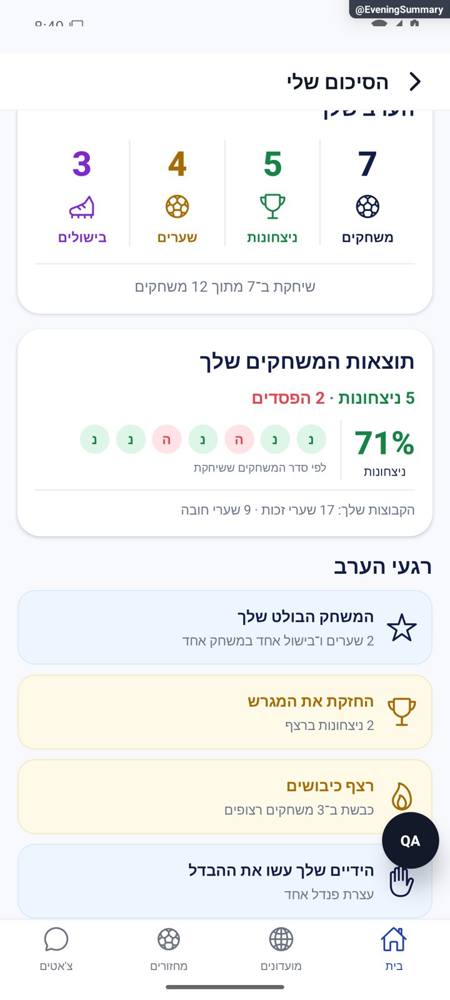
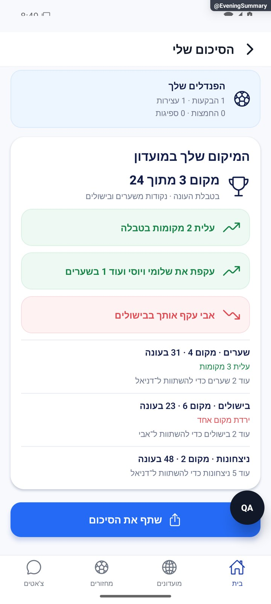
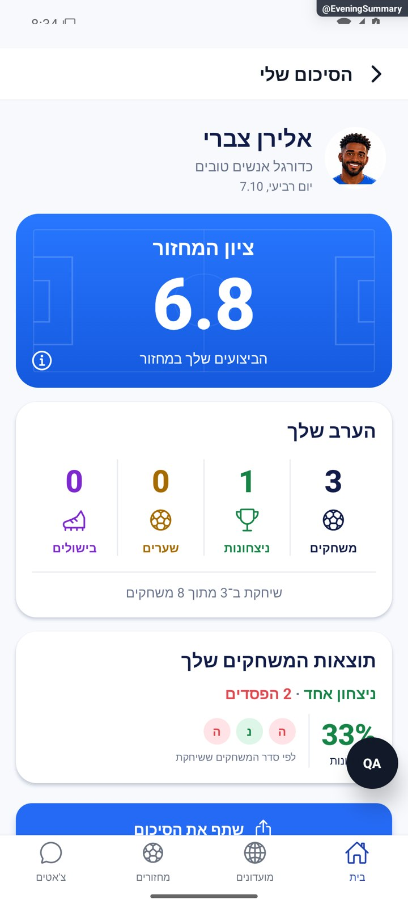
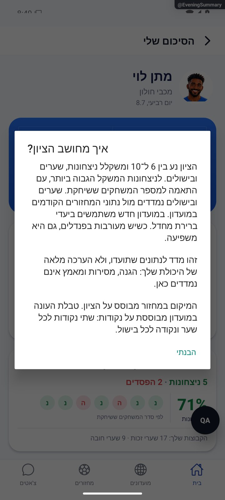

# סטטיסטיקה וסיכום אישי של מחזור

עודכן: 8.10.2026. הסיכום האישי עודכן מול `d57ccd7` עם שינויים מקומיים, על בסיס גרסה `1.1.36`; טרם פורסם. הסעיפים ההיסטוריים מתארים את `8e8fde5`; העדכון שלהלן גובר על תיאור הסיכום האישי הישן.

## כניסה ותפקידים

MatchDetails → סטטיסטיקה; סיכום אישי → EveningSummary {gameId}

משתתף רואה את סיכומו; הרשאת צפייה בנתוני מועדון נשמרת; השלמת שער למנהל במחזור שהסתיים.

## רכיבים ומצבים

| רכיב / מצב | התנהגות וחוזה |
|---|---|
| סיכום כללי | משחקים, שערים, בישולים והכרעות פנדלים לפי יחידותיהם; נתון חסר שונה מאפס |
| כוכבים ואירועים | כוכבי המחזור, מה קרה הערב והישגים; אינם נתונים של כל החיים |
| טבלה | עמודת זהות ודירוג נעוצים, מדדים גוללים ומיון; אורח ושחקן עם אפס נשארים |
| סיכום אישי | getEveningSummary: השתתפות, תוצאות ומדדים; eveningPlayed גובר על ניחוש מטיימר |
| שיתוף | captureRef לקובץ PNG ושיתוף; צילום שיתוף נוצר מהמודל ולא מחדש את החישובים |
| תיקון שער | RetroGoalsSheet: add/removeRetroGoal; clientid לאידמפוטנטיות; אין להוסיף לנתון אמיתי בשביל צילום |
| מצבים | טרם התקיים, היסטורי ללא נתונים, משתתף ללא שערים, רגיל ומתקדם |

## מסלול נתונים ומקומות שינוי

[`src/components/match/tabs/MatchStatsTab.tsx`](../../../src/components/match/tabs/MatchStatsTab.tsx); [`src/screens/games/EveningSummaryScreen.tsx`](../../../src/screens/games/EveningSummaryScreen.tsx); [`src/components/match/RetroGoalsSheet.tsx`](../../../src/components/match/RetroGoalsSheet.tsx)

eveningSummaryService, src/services/gameService.ts, src/utils/eveningPlayed.ts; add/removeRetroGoal בשרת. functions/statBatch ו־eveningRecords; ממיר משחק ורשומות. זמן ונתוני שחקן לא משוחזרים מהקבוצות האחרונות בלבד.

ממיר המחזור: [`src/firebase/firestore.ts`](../../../src/firebase/firestore.ts), `gameDocConverter.fromFirestore`; סוגים: [`src/types`](../../../src/types). שינוי שדה דורש מעקב כתיבה → ממיר → שירות/חנות → רכיב. ניווט: [`GameStack.tsx`](../../../src/navigation/GameStack.tsx), ובמסכים משותפים גם המחסניות שמארחות אותם.

## בדיקות וראיות

eveningSummary/eveningStats/eveningAttendance/eveningMovement/eveningScoreParity/eveningPlayedMirror; שיתוף וכיווניות עם שם ארוך/לטיני ואורח.

צילומי המיפוי מהאמולטור נעשו במצב נתוני דמו, המסומן בפס כתום. הם מוכיחים את הרכיב והמצב המוצגים בלבד, ולא ממירי Firebase, נתוני ייצור או כתיבה. צילומי תיקונים קודמים מסומנים בנפרד. שגיאת מזהה, מצב טעינה או שער הגנה אינם הוכחת הפעולה המלאה.

לסיכום האישי נאספו צילומי דמו עדכניים בסעיף הבא; הם אינם מוכיחים הרשאות או נתוני ייצור.

## העיצוב והנתונים החדשים — 8.10.2026

### רכיבים, ניווט וטעינה

`EveningSummaryScreen` נשאר רשום בכל ארבע המחסניות, עם הכותרת ״הסיכום שלי״. `EveningSummaryCard` מציג `UserAvatar` של המשתמש הנוכחי: תמונה שהעלה, אווטאר שבחר או איור אוטומטי. השם והתאריך מהמודל. ארבעה מדדים קבועים: משחקים ששוחקו, ניצחונות, שערים ובישולים. לוגו וכותרת כפולים הוסרו. הציון בכחול, ללא משפט שיפוטי או השוואת ציון למחזור הקודם. מידע פותח הסבר למדד ולמגבלותיו.

הסיכום הבסיסי נטען לפני השיאים. `getPersonalRecords` נקרא לאחר הצגת המודל, עם `alive` שמונע מתשובה מאוחרת להחליף סיכום אחרי ניווט/שינוי משתמש. מפתח הרכיב כולל מזהה מחזור ומשתמש כדי לאפס מצב הרחבה. כשל בקריאת שיאים אינו מוחק את הסיכום. משתמש שלא שיחק ממשיך לקבל הודעת אי־השתתפות ולא ציון 6; טעינה, כשל בסיסי וכשל שיתוף נשמרו.

### חישובים ומקורות

מקור הציון המועדף הוא `eveningStandings.score`, שהפיק גם את הדירוג. נוסחת הציון לא שונתה. בגיבוי המקומי נקראים גם `penScored/penSaved/penMissed/penConceded` ממסמך `gamePlayerStats` כשיש צבר מחויב; שדה חסר בצבר זה מקבל אפס כפי שעושה השרת. בהיעדרו משתמשים באירועי הפנדלים.

אחוז הניצחונות נשאר `round(100×wins/(wins+losses))`, ללא תיקו; אפס משחקים שהוכרעו מוצג כמקף. תיקו מוצג רק מתוך רצף מתועד מלא, ולצדו הסבר המכנה. מספר המשחקים האישי שונה ממספר משחקי המחזור; המכנה הכולל מוצג רק כש־`totalKnown` אמין.

סימוני ניצחונות/הפסדים/תיקו מוצגים כרצף רק כשמספר רשומות ההשתתפות שווה למונה המשחקים, והמונים של ניצחונות והפסדים תואמים בדיוק. הרשומות ממוינות ב־`at`, ורק משחקים שהמשתמש השתתף בהם נכללים. אחרת מוצג פס מאזן ללא טענת סדר. שערי זכות/חובה מגיעים קודם משני המונים המחויבים במסמך האישי; בגיבוי משתמשים בתוצאות `scoreA/scoreB` של היסטוריה מלאה, כולל שערים עצמיים, ולא ברשימת הכובשים החלקית.

### רגעים מותנים

[`eveningHighlights`](../../../src/utils/eveningHighlights.ts) בונה הדגשות מובנות. המשחק הבולט נבחר באמצעות `reduceRounds` לפי `2×goals+assists`, ומוצג מסף שלוש פעולות שער/בישול. לא מציינים מספר משחק משום שהמצמצם סופר משחקים אישיים ולא את מספר המשחק הכולל במחזור. רצף ניצחונות וכיבושים מוצג מסף שני משחקים; ישיבה בחוץ שוברת את הרצף לפי המצמצם הקיים. מחזור מושלם דורש לפחות שני משחקים שכולם ניצחונות. פנדלים מוצגים בעקבות מעורבות בפועל, כולל הבקעות, עצירות, החמצות וספיגות. מונים מחויבים יכולים לספק פנדלים גם כשההיסטוריה חלקית; רצף ומשחק בולט דורשים היסטוריה מלאה.

שתי הדגשות מוצגות כברירת מחדל והשאר מאחורי ״הצג עוד״. הסדר הוא משחק בולט, מחזור מושלם/רצף ניצחונות, רצף כיבושים ועצירות/הבקעות בפנדלים. אין מחמאת מאמץ גנרית ואין אזור ריק כשאין הדגשות. אפס בשערים ובבישולים נשאר במדדים הקבועים.

### שיאים אישיים

[`eveningRecordService`](../../../src/services/eveningRecordService.ts) משווה שערים, בישולים וניצחונות במחזור הנבחר למקסימום במחזורים קודמים באותו מועדון, בכלל העונות. הסינון הוא לפני `startsAt` של המחזור הנבחר, ללא עתיד/מחזור נוכחי/מועדון אחר, ובאמצעות `eveningPlayState==='happened'`. מחזור מהיר ללא מועדון אינו מקבל שיא מועדון או טבלת מועדון.

מסלול הקריאה משתמש בשאילתת היסטוריית המועדון הקיימת: `games` עם `groupId`, מצב `finished/cancelled`, סדר `startsAt desc`, עמודים של 100 ו־`startAfter`. לכל מחזור קודם קוראים רק שורה של המשתמש ב־`gamePlayerStats`, עם `gameId/userId` וגבול 2, כמו מסלול ההיסטוריה הקיים. שאילתה מאפשרת תשובה ריקה; קריאת מסמך חסר אינה יכולה לאמת כלל המבוסס על `resource.data.gameId`. מזהים מגיעים מהממיר, ללא הקלדה ידנית. אין כתיבה, שינוי כללים או צורך באינדקס חדש.

השוואה נעשית רק אחרי שנקראו כל העמודים. הגבול הוא 20 עמודים, עד 2,000 מסמכי מחזור; הגעה לגבול בלי הוכחת סיום מסתירה שיאים. קריאות סטטיסטיקה מוגבלות לשמונה במקביל. כפילות, מונים חסרים/לא תקינים, מטמון, הרשאה חסרה או שורה חסרה למשתמש שהיה רשום מבטלים טענת שיא. שורה קיימת נכללת גם אם ההרשמה הוסרה. נתונים שנמחקו לחלוטין אינם ניתנים לשחזור; השיא מתייחס להיסטוריה השמורה.

במחזור הראשון אין השוואה. תוצאה חיובית גדולה מהמקסימום הקודם היא שיא חדש, ושוויון למקסימום חיובי הוא השוואת שיא. אפס אינו הישג. הישג חיובי ראשון אחרי מחזורים מתועדים עם אפס יכול להיות שיא שהערך הקודם שלו אפס.

### דירוג ושיתוף

דירוג המחזור הוא לפי ציון בין המשתתפים; דירוג המועדון הוא תמונת הנקודות בעונה אחרי המחזור: `2×goals+assists`, ולא נתון לכל החיים. תנועה, עקיפות ותארים שומרים את הגנות האיפוס והשוויון של `eveningProgress`. לכל מדד מוצגים מקום וסכום עונתי; פער חיובי לשחקן שמעליך מתואר כהשתוות, לא כהבטחה לעקיפה. שמות מבודדים דו־כיוונית. השוואת ציון למחזור הקודם נשארת מוסתרת לפי ההחלטה הקודמת.

השיתוף ממשיך דרך `captureRef` ו־`expo-sharing`, ללא שמירת סטטיסטיקה. `captureMode` מציג את כל ההדגשות ומסתיר מידע וכפתור הרחבה בתמונה. שני פריימים מאפשרים לפריסה להתעדכן לפני הצילום. השיאים שכבר נטענו נכללים, ללא הבטחה להמתין לקריאה עתידית. כפתור השיתוף מחוץ לכרטיס. תמונת השיתוף נבדקת בלי לבחור יעד או לשלוח לאיש; אחרי סגירת החלון מצב ההרחבה הקודם נשמר.

### אימות ומגבלות

בדיקות חדשות: `eveningHighlights.test.ts`, `eveningRecordService.test.ts`, `eveningSummaryData.test.ts`. מכסות שיא חדש/שוויון/אפס/מחזור ראשון/היסטוריה חלקית, עימוד מעבר ל־100, מטמון והרשאות, כפילות ומונים חסרים, ציון השרת, שערים עצמיים, מונים מול תיעוד חלקי, סדר תוצאות ומחזור מהיר. תשובות מסד בבדיקות אלו מדומות; לא בוצעה בדיקת הרשאות חדשה מול הייצור.

אימות סופי: 188 חבילות ו־2,787 בדיקות עברו, ובדיקת טיפוסים נקייה. בדיקת זמן השעון של חלוקת הכוחות חרגה מעט כשהאמולטור היה פעיל; לאחר השהייתו עברה גם לבדה וגם בריצה מלאה. הסף והאלגוריתם לא שונו. פרטים ולוגים ב־[יומן השינוי](../../changes/2026-10-08-personal-summary.md).

הצילומים הם רכיבי האפליקציה באמולטור Android עם נתוני דמו. השיא הוא נתון דמו מפורש. הם מוכיחים נראות וכיווניות, ולא קריאת היסטוריית ייצור. `EveningSummaryQuiet` הוא קיצור פיתוח מאחורי שערי הבדיקה הקיימים. לא נוצר חשבון או מועדון בדיקה.

[כרטיס השיתוף המלא שנוצר באמולטור](../screenshots/personal-summary-share.jpg) — כל ההדגשות, בלי כפתורי מידע והרחבה; לא נשלח לאיש.

## גבולות והערות תחזוקה

הכלל ההיסטורי ״משחק רגיל מאפשר רק פרס אחד״ הוחלף: השלמת שערים יכולה להשפיע על פרסים נוספים. אין להחיל ממצא ארכיון בלי בדיקת הקוד.

לפני שינוי פתח את הקוד המקושר ואת [כללי הפרויקט](../../../AGENTS.md). לאחר שינוי עדכן במסמך זה את התאריך, נקודת הקוד, המצבים שהתעדכנו, הבדיקות והצילום. אין לטעון שכל מצב/תפקיד נבדק רק משום שקיים צילום אחד.

## פירוט טכני ממוקד: זרימה, חישוב ונקודות שינוי

[הסבר פשוט למשתמש](match-stats.simple.md)

העמקה: 07.10.2026, מול קוד המקור שב־`8e8fde5`. בעת הכתיבה HEAD הוא `50d508f`; בדיקת ההפרש בין הנקודות ב־`src` וב־`functions` לא מצאה שינוי קוד. הסעיפים וההסתייגויות הקיימים נשמרו. זו קריאת קוד ותיעוד, בלי הרצת תרחישי כתיבה חדשים.

[eveningScore](../../../src/utils/eveningScore.ts) מחזיר 6 אם `gamesPlayed<=0`. אחרת ציון ניצחונות הוא `10×(wins+1)/(gamesPlayed+2)`, מוגבל 0–10; שני המשחקונים הנוספים הם קירוב למדגם קטן, לא משחקונים שנרשמים בהיסטוריה. גולים ובישולים הם סכומי ערב חלקי יעד היסטורי של מלך השערים/הבישולים לערב, ולא חלקי מספר המשחקונים. יעד חסר משתמש 4 ו־2 בהתאמה, ורצפה 1.

ללא פנדלים: `weighted=0.5×winsScore+0.3×goalsScore+0.2×assistsScore`. ציון תצוגה `round1(6+0.4×weighted)`. לדוגמה 4 ניצחונות מתוך 5, 2 גולים מול יעד 4 ובישול מול יעד 2: 7.1429,5,5 → משוקלל 6.0714 → ציון 8.4. 1 מתוך 1 נותן 6.6667 בציר ניצחונות, לא 10.

מעורבות בפנדלים מוגדרת סכום חיובי של כבש/עצר/החמיץ/ספג. אז המשקלים 0.45/0.30/0.20/0.05, וציר פנדלים `clamp(5+2×scored+3×saved-2×missed-conceded,0,10)`. גול אחד והחמצה אחת נותנים 5 בציר הזה; זו אינה תוספת שני שערי שדה. יש לשמור התאמה עם חישובי השרת ומבחני `eveningScoreParity`.

זקיפה מפרידה `gamePlayerStats`, `communityPlayerStats`, מוני משתמש/מועדון וזוגות; ערך לכל החיים אינו מאופס בגלל בחירת עונה במסך. `getEveningSummary` משחזר מי השתתף מהתיעוד, לא מסגל הקבוצות האחרון. `RetroGoalsSheet` משתמש במזהה תיקון; אין להניח שאותו טאפ חדש לאחר כשל הוא תמיד אותו מזהה עסקי. שיתוף מצלם תצוגה קיימת ולא שומר מחדש סטטיסטיקה.

נקודות שינוי: נוסחה בקובץ הטהור ומראה השרת, מכנים בשירותי הסיכום, תיעוד ב־statBatch והממיר. בדוק אפס משחקונים, מדגם קטן, יעד חסר/נמוך, פנדלים, תיקון חוזר והבדל אפס מול שורה חסרה.
