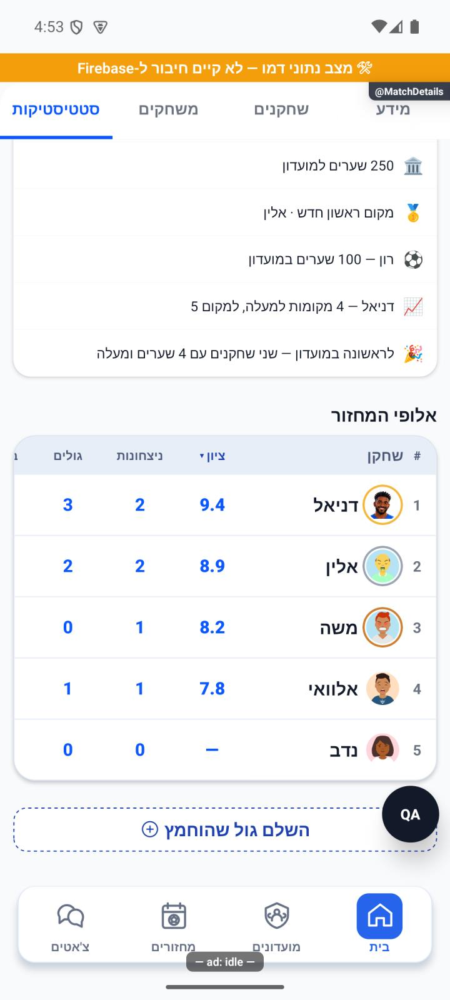
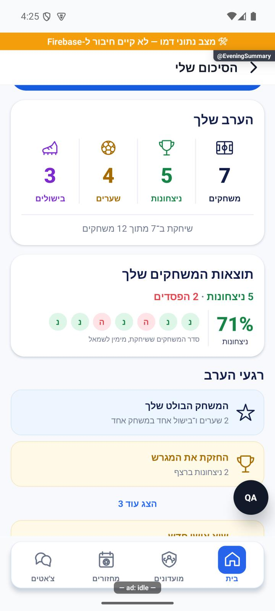
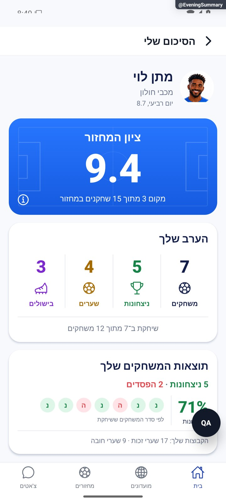
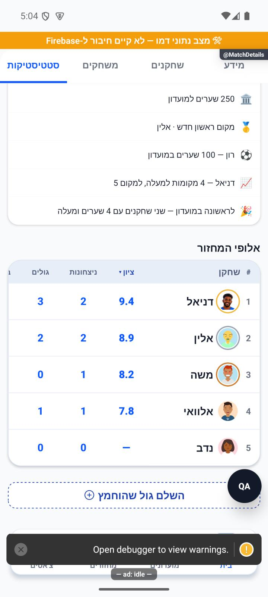
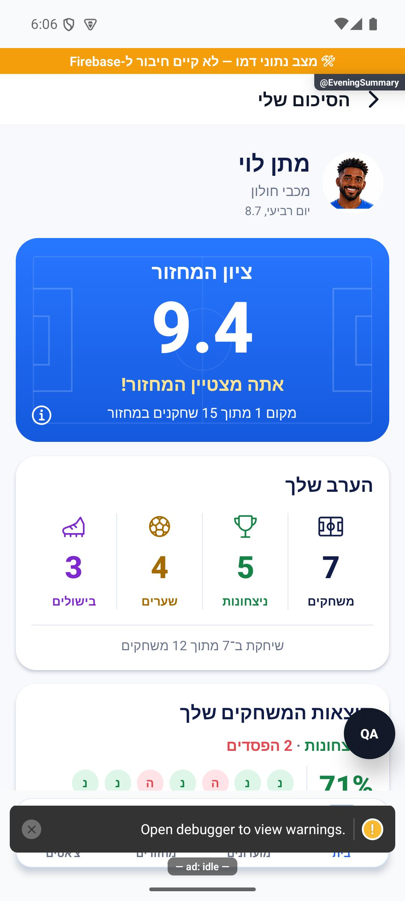
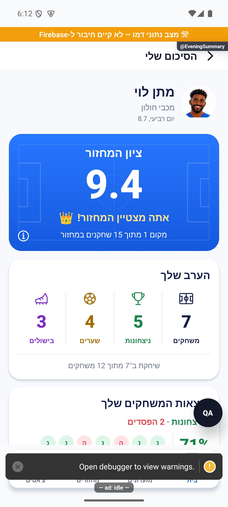
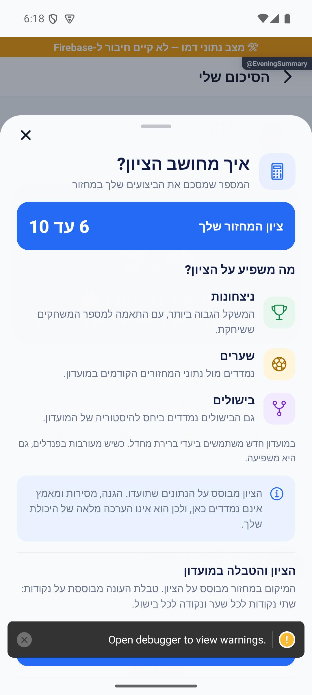

# סטטיסטיקה וסיכום אישי של מחזור — הסבר פשוט

עדכון הפצה, 9.10.2026: השינויים נכללו בגרסה `1.1.38 / 272`, שנקלטה במסלול הייצור והפנימי בגוגל. פונקציית הציונים נפרסה בהצלחה. קריאה ללא התחברות נחסמה כצפוי; טעינת ציונים אמיתיים במכשיר והורדה ציבורית מהחנות עדיין לא אומתו. הערות הפריסה בהמשך מתארות את מועד הבדיקות המקורי. [יומן השחרור](../../changes/2026-10-09-production-1.1.38.md).

לחיצה על סמל המידע של הציון פותחת חלון בעיצוב האפליקציה, עם הסבר קצר ונפרד לכל גורם בציון. אפשר לגלול ולסגור ב״הבנתי״ או לגרור את הידית למטה. חישוב הציון נשאר ללא שינוי.

מי שסיים במקום הראשון בדירוג הציון של המחזור יראה מתחת לציון את ״אתה מצטיין המחזור!״. המשפט יופיע גם בתמונת הסיכום שמשתפים. כשאין דירוג שמור הוא לא מוצג.

כתר מופיע משמאל למשפט המצטיין כדי להבליט את ההישג.

8.10.2026: בטבלת אלופי המחזור עמודת „ציון” היא עמודת הנתונים הראשונה אחרי שם השחקן, מימין לניצחונות. הטבלה נפתחת ממיונת לפי הציון מהגבוה לנמוך. כשאין ציון שמור מופיע קו. אפשר למיין לפי נתון אחר בלחיצה על כותרתו; אם הטעינה נכשלה אפשר לנסות שוב. מי שרואה את המחזור יוכל לראות את הציונים בלבד; יתר הנתונים האישיים נשארים פרטיים. נבדק בדמו; קריאת השרת ממתינה לפריסה מאושרת.

תיקוני דיווחים, 8.10.2026: האייקון נמצא מעל המספר, ולמשחקים יש אייקון מגרש. התוצאות מסודרות מימין לשמאל ויש לכך הסבר. שורת שערי הקבוצות הוסרה; אייקון השיתוף נמצא משמאל לכיתוב.

אחרי המחזור רואים את התוצאות והנתונים של הערב. הסיכום האישי מציג את מה שהמשתמש עשה באותו מחזור. אפשר לשתף את הסיכום, ונתון שלא קיים מוצג אחרת מאפס.

עדכון מקומי 10.10.2026: אם עיבוד סיכום המחזור נעצר, השרת יכול להמשיך מהשלב החסר בלי להוסיף שוב הופעות, ציונים וצמדים. ציון שכבר נשמר נשאר הציון המקורי. עונה שנסגרה לא מקבלת בטעות נתונים לעונה החדשה. אלו בדיקות קוד מבודדות, והשינוי מחייב פריסה; נתונים חלקיים היסטוריים דורשים טיפול נפרד.

עודכן ב־8.10.2026: הסיכום מציג את תמונת הפרופיל, ציון בכחול וארבעה נתונים: משחקים, ניצחונות, שערים ובישולים. ניצחונות בירוק והפסדים באדום. אפשר לפתוח הסבר לציון ולשתף את הכרטיס כתמונה.

רגעים בולטים, רצפים ופנדלים מופיעים רק כשיש נתונים מתאימים. שיא חדש או השוואת שיא נבדקים מול המחזורים הקודמים שלך במועדון, גם מעונות קודמות. במחזור הראשון או כשחסרה היסטוריה לא מציגים טענת שיא. אזור המועדון מציג בנפרד את דירוג העונה, שינויי מיקום, עקיפות והפער לשחקן שמעליך.

זהו צילום של רכיב האפליקציה עם נתוני דמו, ולא נתונים של משתמש אמיתי. השינוי מקומי וטרם פורסם בחנות.

[להסבר המעמיק ולמפת הקוד](match-stats.md)

## צילום והיקף ההוכחה

הצילומים מציגים רק את המצבים המתועדים במסמך המעמיק. חלקם נתוני דמו, חלקם הוכחות מתיקון קודם, ובכמה מהם טעינה או הודעת הגנה; הם אינם אישור שכל התהליך או השרת נבדקו.

8.10.2026: בפתיחה חדשה באימולטור, ללא לחיצה על כותרת עמודה, נצפה מיון הציונים 9.4, 8.9, 8.2, 7.8 ולבסוף ציון חסר. הציון מופיע מימין לניצחונות. זהו דמו באנדרואיד; אין כאן אימות שרת חי או אייפון. כל 2,820 הבדיקות ובדיקת הטיפוסים עברו.

התצוגה במקום הראשון נצפתה באמולטור. בדיקת הטיפוסים וכל 2,820 הבדיקות ב־191 חבילות עברו. לא נבדק באייפון, לא נשלחה תמונת שיתוף ולא פורסמה גרסה.

מיקום הכתר נבדק בפועל באמולטור. בדיקת הטיפוסים וכל 2,820 הבדיקות עברו; אייפון ושיתוף חיצוני לא נבדקו.

החלון נפתח ונצפה בפועל באמולטור; התוכן והאייקונים מיושרים לימין. אזהרת פיתוח מכסה את כפתור הבנתי בצילום. בדיקת הטיפוסים וכל 2,821 הבדיקות ב־191 חבילות עברו. לא נבדק באייפון, בהגדלת גופן או במכשיר קטן.

## שיפור תגובה בגלילה — 9.10.2026

צומצמה עבודה מיותרת של אנימציות ותמונות. מספרים מתייצבים בזמן גלילה, ואנימציות רקע מחזוריות נעצרות כשעוברים למסך אחר. הנתונים, סדר התוכן והניווט נשארים כפי שהיו. הבדיקה בוצעה באימולטור אנדרואיד עם נתוני דמו; טלפון פיזי ואייפון לא נבדקו.
