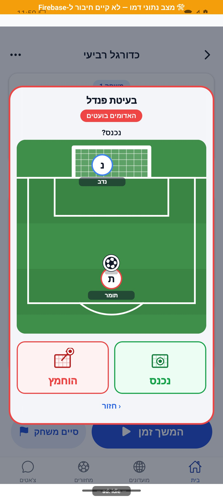
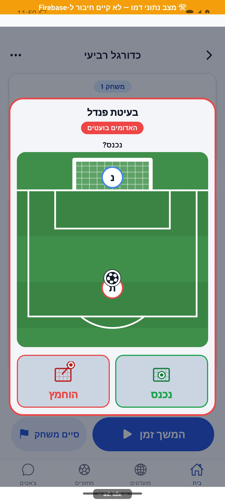
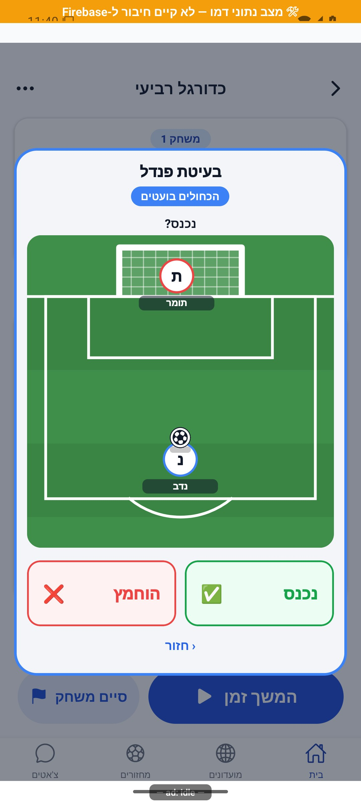
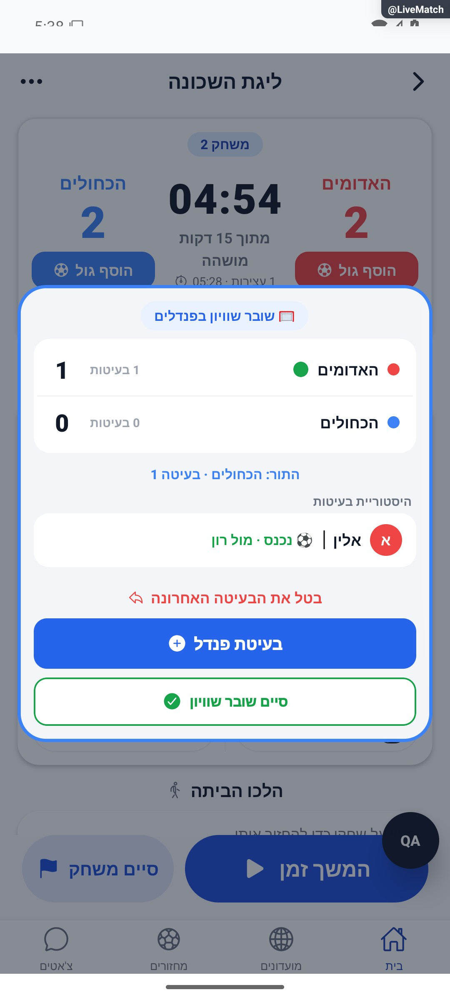

# הכרעת תיקו ופנדלים

עודכן: 7.10.2026. מקור הקוד: `8e8fde5`, גרסה `1.1.35`. מסמך זה מתאר את הקוד; מצב חנות ופריסת שרת דורשים ראיה נפרדת.

## כניסה ותפקידים

לייב מתקדם → סיום משחק בתיקו → TieDecisionModal → פנדלים

מנהל בוחר שוער ובועט ומדווח תוצאה; ההנפשה היא המחשה ולא פיזיקת חיזוי.

## רכיבים ומצבים

| רכיב / מצב | התנהגות וחוזה |
|---|---|
| ראשון | בחירת קבוצה בועטת ראשונה: צד א, צד ב או אקראי |
| לוח | תוצאות צדדים, תור, יומן בעיטות נפרד והוספה/סיום |
| בחירת שחקנים | שוער בקבוצה המתגוננת ובועט מהבועטת; בחירת זהות מתוך ההרכב |
| בעיטה | המגרש נשאר; כפתורי נכנס/הוחמץ עם אייקון שער וכדור; חסימת לחיצה בזמן תנועה |
| אנימציה | נשימה במחזור 2.1 שניות, כניסה בקפיץ, בעיטה כ־980 אלפיות שנייה, ניעור רשת בגול |
| נגישות | useReducedMotion מבטל תנועה; עדיין שומרים אותה תוצאה ואותם נתונים |
| ביטול וסיום | undoLastShootoutKick רק האחרונה ובאישור; סיום ללא בעיטה חסום; תיקו חוזר להכרעה ידנית |
| יציאה | clearShootout מנקה מצב; אין לבצע בחשבון אמיתי בשביל בדיקה |

## מסלול נתונים ומקומות שינוי

[`src/components/match/Shootout.tsx`](../../../src/components/match/Shootout.tsx); [`src/components/match/PenaltyPitch.tsx`](../../../src/components/match/PenaltyPitch.tsx); [`src/components/match/WinnerPickerModal.tsx`](../../../src/components/match/WinnerPickerModal.tsx)

מצב מתמיד liveMatch.shootout דרך startShootout/setShootoutKeeper/recordShootoutKick/undoLastShootoutKick. onDecided(side) ו־onTie חוזרים לפרוטוקול תוצאת המשחק; שערי פנדלים אינם שערי שדה.

ממיר המחזור: [`src/firebase/firestore.ts`](../../../src/firebase/firestore.ts), `gameDocConverter.fromFirestore`; סוגים: [`src/types`](../../../src/types). שינוי שדה דורש מעקב כתיבה → ממיר → שירות/חנות → רכיב. ניווט: [`GameStack.tsx`](../../../src/navigation/GameStack.tsx), ובמסכים משותפים גם המחסניות שמארחות אותם.

## בדיקות וראיות

tests/shootoutPersistence.test.ts, tests/logic/penaltyStats.test.ts ו־eveningScorePen/eveningScoreParity; תרחישי תיקו, גול, החמצה, ביטול, חזרה ומצב תנועה מופחתת.

צילומי המיפוי מהאמולטור נעשו במצב נתוני דמו, המסומן בפס כתום. הם מוכיחים את הרכיב והמצב המוצגים בלבד, ולא ממירי Firebase, נתוני ייצור או כתיבה. צילומי תיקונים קודמים מסומנים בנפרד. שגיאת מזהה, מצב טעינה או שער הגנה אינם הוכחת הפעולה המלאה.

## גבולות והערות תחזוקה

אלה צילומי ההוכחה מהתיקון המקורי, ולא שחזור טרי של כל מסלול הפנדלים בגרסה הפנימית. צילום שער ההגנה בלייב נמצא במסמך הלייב ואינו הוכחה למסך בעיטה. אין ליצור תוצאה אמיתית לצילום.

לפני שינוי פתח את הקוד המקושר ואת [כללי הפרויקט](../../../AGENTS.md). לאחר שינוי עדכן במסמך זה את התאריך, נקודת הקוד, המצבים שהתעדכנו, הבדיקות והצילום. אין לטעון שכל מצב/תפקיד נבדק רק משום שקיים צילום אחד.

## פירוט טכני ממוקד: זרימה, חישוב ונקודות שינוי

[הסבר פשוט למשתמש](penalties.simple.md)

העמקה: 07.10.2026, מול קוד המקור שב־`8e8fde5`. בעת הכתיבה HEAD הוא `50d508f`; בדיקת ההפרש בין הנקודות ב־`src` וב־`functions` לא מצאה שינוי קוד. הסעיפים וההסתייגויות הקיימים נשמרו. זו קריאת קוד ותיעוד, בלי הרצת תרחישי כתיבה חדשים.

מצבי `Shootout` הם `first/board/entry`; מצב מתמיד הוא `liveMatch.shootout`. התור מתחלף לפי זוגיות `kicks.length` והקבוצה הראשונה; השוער נלקח תמיד מהקבוצה המתגוננת. `scoredOf` סופר רק בעיטות עם `scored:true`, ו־`takenOf` את כל בעיטות אותו צד. לדוגמה א: שתי בעיטות עם גול אחד, ב: שתי בעיטות עם שני גולים → תוצאה 1:2, לא 2:2.

`finish` משווה סכומי שערי הפנדלים; שוויון מפנה ל־`onTie`, ואחרת אישור פנימי מוביל ל־`onDecided` ולזקיפת משחקון. אין כאן הכרעה אוטומטית לפי חוקי סדרה של חמש או ״מוות פתאומי״; המשתמש מסיים. האישור בתוך החלונית נמנע מחלונית מערכת נוספת מעל חלונית iOS.

הנפשה: 180 מילישניות הכנה ו־800 מעוף; השוער מתחיל אחרי 350, תנועה 450 והחזקה 700, ואז הקריאה לשמירה. לכן 980 מילישניות מתארות מעוף הכדור, לא בהכרח כל משך עד כתיבה. `useReducedMotion` עובר ישירות לשמירה; תוצאה בוליאנית לא משתנה בגלל מיקום אקראי של ציור הכדור.

**תיאור היסטורי שהוחלף בתיקון 8.10.2026:** `recordShootoutKick` יוצר מזהה חדש ו־`arrayUnion`; אותה קריאה שמופעלת מחדש מייצרת מזהה חדש ולכן אינה אידמפוטנטית עסקית רק בזכות `arrayUnion`. `flying` חוסם לחיצה בעת תנועה, אך קריאת השירות נעשית ב־`void` ומצב התצוגה חוזר ללוח בלי להמתין לכתיבה. `undoLastShootoutKick` קורא ומחליף את המערך ללא טרנזקציה; בדיקת מנהלים מקבילים נשארת חשובה. האידמפוטנטיות של זקיפת המשחקון היא שכבה נפרדת.

נקודות שינוי: `PenaltyPitch` להמחשה, `Shootout` לבחירה והכרעה, שירות המחזור להתמדה ופרוטוקול הזקיפה למונים. אין להסיק מן ההחמצה אם הייתה עצירה או החוצה בשדה חדש שלא נאסף. בדוק שוויון, ביטול האחרונה, היעדר שחקן, כשל כתיבה ויציאה באמצע.

## תיקוני סבב הבאגים — 8.10.2026

B06, B15, R04: Shootout.record מתחילה שמירה יחד עם תנועה וממתינה גם לאישור וגם לחלון התצוגה, 1500 אלפיות שנייה או אפס בתנועה מופחתת. attempt שומרת מזהה ותוצאה לניסיון חוזר. gameService.recordShootoutKick מוסיפה בטרנזקציה רק מזהה שאינו קיים. undoLastShootoutKick בודקת expectedId מול האחרונה בטרנזקציה, ובשינוי מחזירה SHOOTOUT_CHANGED. כתיבה חוסמת סיום וחזרה; כשל נשאר במסך הבעיטה. uiEpoch מונעת מתשובה ישנה לשנות חלונית שנפתחה מחדש. ביטול התנועה אינו גורם לכתיבה נוספת. בדיקות כוללות שמירה ממתינה, כשל וניסיון חוזר באותו מזהה, וביטול מול הוספה מקבילה.

[ראיות, בדיקות ומגבלות](../../changes/2026-10-08-audit-fixes.md).

בדמו: 2:2, פתיחת פנדלים, אלין בועט מול רון, סימון נכנס; הלוח חזר עם בעיטה אחת ושער אחד לאדומים. כשל שרת וניסיון חוזר נבדקו מבודד בלבד. לא סוים מחזור אמיתי.
