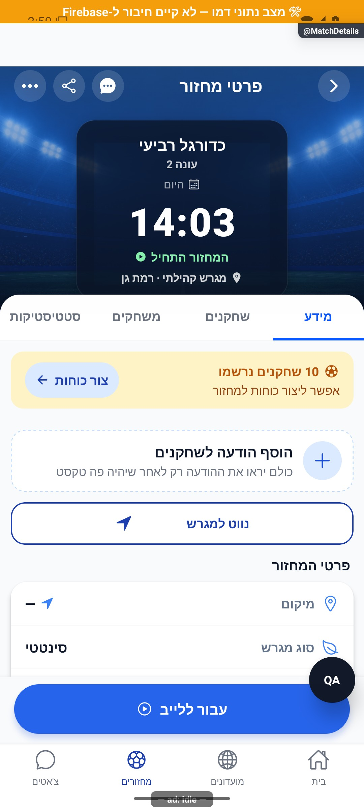
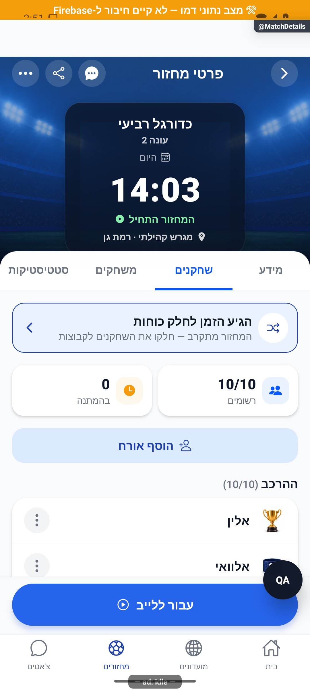
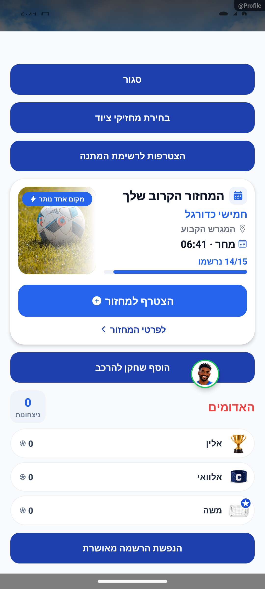

# הרשמה, המתנה ואישור מקום — הסבר פשוט

נרשמים למחזור ומקבלים מקום בהרכב, מקום בהמתנה או בקשה לאישור המנהל. אם מקום מתפנה, אפשר לקבל הצעה ולאשר אותה בזמן שהוגדר. עצם ההרשמה אינה אומרת שהמשתמש השתתף בפועל.

חסימת הרשמה חדשה משאירה את הרשומים ואת הממתינים במקומם. מי שכבר ממתין וקיבל הצעת מקום תקפה יכול לאשר אותה גם כשההרשמה חסומה; אי אפשר לאשר הצעה בשם אדם אחר. השרת בודק שהמקום עדיין פנוי ואישור חוזר אינו רושם פעמיים.

עדכון 10.10.2026: התנאים נבדקו בקוד מבודד; הפונקציה החדשה צריכה להיפרס לפני הפצת הלקוח. לא אושר מקום אמיתי ממכשיר בסבב זה.

[להסבר המעמיק ולמפת הקוד](registration.md)

## צילום והיקף ההוכחה

הצילומים מציגים רק את המצבים המתועדים במסמך המעמיק. חלקם נתוני דמו, חלקם הוכחות מתיקון קודם, ובכמה מהם טעינה או הודעת הגנה; הם אינם אישור שכל התהליך או השרת נבדקו.

## השלמת הנפשות — 8.10.2026

אחרי הרשמה מאושרת תמונת המשתמש נעה בקצרה על המסך. ההמתנה מציגה את המיקום בתור בהרחבה עדינה; היא אינה אישור למקום בהרכב.

[פרטי האימות והמגבלות](../../changes/2026-10-08-motion-completion.md). מקור: `9ec0dfd` עם שינויים מקומיים; טרם פורסמה גרסה.
