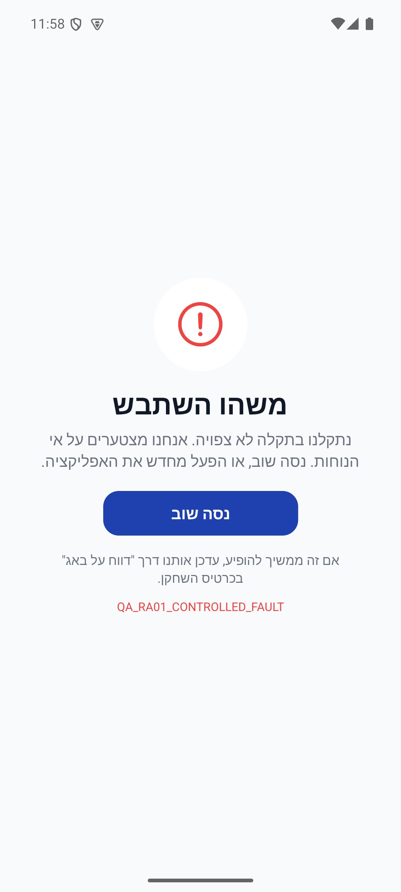

# הודעות מערכת ועדכונים — הסבר פשוט

לפעמים מוצגת הודעת עדכון, תחזוקה או הסבר על מה חדש. עדכון חובה עוצר את השימוש עד לעדכון; הודעות אחרות מאפשרות להמשיך בהתאם למה שמוצג.

[איך זה עובד מאחורי הקלעים](global-gates.md)

## התאמה למסך — 8.10.2026

נוספה התאמה שמרחיקה תוכן משורות המערכת של הטלפון. [פירוט ומגבלות הבדיקה](../shared/menus-and-motion.md#התאמה-לשטח-הבטוח--8102026).

## שחזור תקלות — 09.10.2026

לשגיאה מצורף רצף הפעולות שהיה במכשיר ברגע הכשל. שגיאה שלא נשלחה יכולה להישלח בהפעלה הבאה באותו חשבון בלבד. סגירה פתאומית של התהליך עלולה למנוע שמירה. [פירוט](diagnostic-journal.simple.md).

## חזרה אחרי שגיאה — 10.10.2026

אם מתרחשת שגיאה במסך, מוצג הסבר עם כפתור ״נסה שוב״. תוקן באנדרואיד מצב שבו תקלה נוספת מנעה את הופעת המסך הזה; בבדיקה מקומית הכפתור החזיר לבית בלי להפעיל מחדש את האפליקציה. סמלי שורת המצב במסך השגיאה כהים וקריאים על הרקע הבהיר. זו בדיקת דמו, ולא בדיקת אייפון או מכשיר משתמש.

