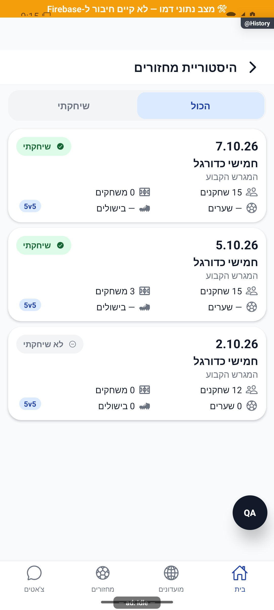
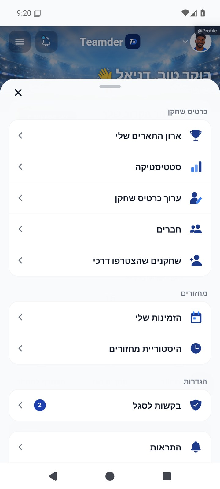
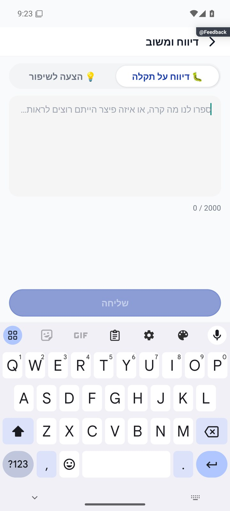

# תפריטים, חלונות ותנועה משותפת

[הסבר פשוט](menus-and-motion.simple.md) · מסמך טכני מעמיק

עודכן 7.10.2026; מקור `8e8fde5`. התפריטים שעוצבו מחדש משתמשים בשפה של חלון תחתון, אייקונים ורשימות פעולות, עם סגירה בגרירה מהידית. אין להניח שכל חלון באפליקציה כבר משתמש באותו רכיב.

מקורות: רכיבי התפריט תחת [`src/components`](../../../src/components), ובפרט DraggableMenuSheet. בעת שינוי בדוק איזה רכיב המסך באמת משתמש בו; SpringSheet הוא רכיב אחר, ואין להסיק מהידית בלבד שהוא תומך באותה מחווה.

מצבים לבדיקה: פתיחה, גרירה קצרה שחוזרת, גרירה ארוכה שסוגרת, הקשה על רקע, כפתור חזרה, רשימה ארוכה עם גלילה ופעולה מושבתת. הגרירה אינה צריכה לגנוב גלילה רגילה או לחסום נגישות. יש לצלם כיווניות לאחר שינוי סדר אייקון וטקסט.

תנועה קיימת כוללת קרוסלת הידעת, ספירת מספרי סטטיסטיקה, תנועת פנדלים ופתיחת חלונות. השערים העסקיים נשארים מקור האמת; אנימציה לא משנה זהות, הרשמה, תוצאה או טיימר. [רעיונות נוספים](../reviews/animations.md) הם הצעות בלבד.

הדמות הניסיונית נשארת מוסתרת ואינה מסלול מוצר פעיל. אין לייבא אותה למסך הבית כחלק מעדכון תיעוד או להפעילה בטעות בשחרור.

בחלון הצמד נבדקה גרירה ארוכה מהידית בסביבת הדמו: החלון נשאר פתוח, וכפתור חזרה סגר אותו. [ראיית הבדיקה](../screenshots/CommunityStats-pair-after-drag.jpg). חלון PairCard ממומש באמצעות Modal עצמאי; הבדיקה שלו אינה הוכחה להתנהגות SpringSheet.

## מאחורי הקלעים — זרימה וחישובים

### מנגנון הגרירה בפועל

[`DraggableMenuSheet.tsx`](../../../src/components/DraggableMenuSheet.tsx) מקבלת `visible`, `onClose` וילדים. היא מחזיקה `Animated.Value` למיקום אנכי, סימון `closing` למניעת סגירה כפולה והפניה מעודכנת לפונקציית הסגירה. שינוי `visible` עוצר תנועה ומאפס את המיקום והסימון; פירוק הרכיב עוצר תנועה.

`PanResponder` מחובר לידית בלבד, כדי שגלילת רשימת פעולות לא תסגור חלון. התזוזה היא `max(0, dy)` ולכן אין גרירה כלפי מעלה. בשחרור נסגר אם `dy > 70`, או אם `dy > 18` וגם `vy > 0.65`. לדוגמה: גרירה 40 ללא מהירות מספקת חוזרת למקום; גרירה 80 נסגרת. שוויון ל־70 לבדו אינו מספיק. אלו יחידות המחווה של המערכת ולא פיקסלים שנמדדו בתמונה.

סגירה מניעה את החלון עד גובה המסך במשך 190 אלפיות שנייה ורק בסיום מוצלח קוראת `onClose`. גרירה קצרה חוזרת בקפיץ עם `tension=100`, `friction=16`. במצב תנועה מופחתת מסלול הסגירה קורא מייד לפונקציה והחלון משתמש בדהייה; הקפיץ של החזרה הקצרה עדיין מופעל לפי הקוד הקיים. הקשה ברקע, כפתור סגירה וחזרה מערכתית עוברים באותה פונקציה.

### גבול הרכיב

לחלון גובה מרבי 88% ופינות עליונות 28; הרכיב המארח אחראי לפעולות ולגלילה. האנימציה משנה מיקום בלבד, לא נתוני מסד. חלון הצמד משתמש ב־`Modal` נפרד, והידית שלו אינה מקבלת את חוזה הגרירה הזה. לפני שינוי מצא את הייבוא במסך ולא רק שם דומה. בדיקות הגרירה המצרפיות המצולמות נשארות במסמך, אך בדיקה חזותית חדשה נדרשת כשמשנים ספים או נגישות.

## עדכון 8.10.2026 — תנועה ותיקוני דיווחים

`ChangeMotion` אינו מחזיק תוצאה עסקית: שינוי `triggerKey` מפעיל דהייה 0.78–1 והיסט אנכי עד 5, או פעימה חד־פעמית עד 1.06. פירוק או שינוי טריגר מבטלים תנועה קודמת. `ReorderMotion` מזיז שורות בלבד. שני הרכיבים, `AppearItem` ו־`PulseOnChange` מכבדים `useReducedMotion`. `EmptyState` מנפיש את האיור בלבד בכניסה במשך 550; אין הזזת כפתור הפעולה. מסלולי הבדיקה עברו ממזהה דמו שלא קיים למזהה `gv2-live`.

**ראיה ומגבלות:** ההקלטות הן סרטוני `adb screenrecord` אמיתיים, ולא מצגת פריימים. נבדקו היסטוריה, זמינות, דראפט, שעון ואישור בקשה בדמו. רשימה ריקה ותנועה מופחתת עדיין דורשות אימות חזותי ממוקד.

בדיקת הטיפוסים ו־183 חבילות הבדיקות עברו, 2,752 בדיקות. מצב המקור: `9ec0dfd` עם שינויים מקומיים; אין גרסה חדשה שפורסמה. [יומן השינוי וההקלטות](../../changes/2026-10-08-motion-and-pulse.md).

## השלמת הנפשות — 8.10.2026

נוספו useArrivalTracker, ArrivalMotion, HeightReveal ו־TransferIcon. המעקב מקבל מזהים מאושרים, יוצר בסיס ראשון, מגביל גל לחמישה, שומר חותמת זמן ומנקה אחרי 500. שינוי תחום/פירוק מונעים שימוש בתשובה ישנה. ArrivalMotion מנפישה רק חותמת צעירה מ־400, במשך 300: opacity 0.35→1, translateX 22→0, scale 0.94→1. במצב reduced או חותמת ישנה הערך מיד סופי. HeightReveal מודדת גובה תוכן פנימי מוחלט, ומנפישה את גובה המעטפת בלי לשנות נתונים; ביטול נראות מכבה מגע וקורא מסך. TransferIcon משתמשת במידות פיזיות של אותה שורה ולכן לא גוזרת כיוון מ־RTL. כל רכיב מבטל הנפשה קודמת בפירוק/שינוי. MotionPreview ו־footy://qa/_motion נגישים רק עם שלושת השערים __DEV__, QA_ROUTES=1 ו־FORCE_MOCK=1. כל הכפתורים בה נוגעים ב־state מקומי; שירותי אישור ממלאים/צאט הוחלפו זמנית רק בזמן צילומי הבדיקה והוחזרו במדויק. אין ניווט חדש במוצר. בדיקת מחזור חיים כוללת פתיחה, מזהה חדש, סידור מחדש, ניקוי, מעבר שיחה, גבול גל ופירוק; אין הדמיית מכשיר חלש.

[פרטי האימות והמגבלות](../../changes/2026-10-08-motion-completion.md). מקור: `9ec0dfd` עם שינויים מקומיים; טרם פורסמה גרסה.

## התאמה לשטח הבטוח — 8.10.2026

מקור `d57ccd7` עם שינויים מקומיים. `App.tsx` מציבה `SystemSafeArea` סביב הניווט והשכבות הגלובליות. גבול השטח נמדד לכל מכשיר, כולל מגרעת, שורת מצב, מחוון בית ושורת ניווט. יש גבול נפרד בחלונות מקוריים: 58 ייבואי Modal הופנו ל־`SafeModal`; סמנטיקת חזרה, סגירה ונגישות נשארת של החלון המקורי.

`SystemSafeArea` משתמשת ב־SafeAreaView עם כל ארבעת הקצוות, ובתוכו SafeAreaProvider שמודד מחדש את השטח שכבר הוגן. לכן המסכים הקיימים וסרגל הלשוניות מקבלים רק מרווח שנותר, ולא מוסיפים שוב את אותו מרווח. `safeContentMetrics` מכינה מדידה התחלתית: רוחב פחות שמאל וימין, גובה פחות עליון ותחתון, מקור מוזז בשמאל ובעליון, ויתרת המרווחים אפס; ממד שלילי נחתך לאפס. המדידה המקורית מתעדכנת בעקבות שינוי פריסה. הרקע בשטח המערכת משתמש בצבע הרקע; לא מוסיפים גובה קבוע של מכשיר מסוים.

`SafeModal` פותחת חלון עם שורות מערכת שקופות, מאפסת הקשר מדידה שהגיע מהמסך שמתחת וממתינה למדידת החלון החדש לפני הצגת ילדים. לאחר מכן היא משתמשת באותו גבול משותף ובמדידה פנימית. כך אין פריים ראשון שנסמך על מרווחי אפס מהמסך שמתחת לחלון. אין להשתמש בחלון המקורי ישירות ברכיבי המוצר; בדיקת רגרסיה סורקת את הייבואים.

מיקומי תפריט שחקן, תפריט הודעה ובועת הסבר עוברים מקואורדינטות החלון לקואורדינטות השטח הבטוח באמצעות חיסור x/y של `useSafeAreaFrame`. תמונת הפתיחה משתמשת בממדי השטח הזמין. `SafeKeyboardAvoidingView` מוסיפה את מקור y של השטח הבטוח להיסט שהקורא ביקש; כאשר התנהגות המקלדת אינה מוגדרת באנדרואיד 35 ומעלה היא בוחרת padding. התנהגות מפורשת קיימת ומדיניות אנדרואיד ישן נשמרות. עשרה משטחים הועברו למעטפת המקלדת.

אין שינוי בנתונים, מכנים, הרשאות, ניווט מוצר או כתיבות למסד. אימות מספרי: באמולטור 1080×2400 תוכן מוגן מתחיל ב־128 ומסתיים ב־2337 עם מחוות, או ב־2274 עם שלושה כפתורים. הרשימה בתפריט נגללת; שורות מחוץ לאזור הגלילה אינן כפתורים שיש להפעיל מאחורי שורת המערכת.

ראיות: מסך בית, סיכום אישי, סגל, תפריט בית בשני מצבי ניווט, חלון התחברות וטופס דיווח. נבדקו כיווניות וכפתור השליחה מעל מקלדת. לא נשלחו דיווחים או הודעות, ולא נעשתה התחברות. מעבר לשיחה דרך כלי הבדיקה נתקל בכשל המקורי addViewAt; צ׳אט עם מקלדת לא אומת. אייפון, טאבלט, רוחב והגדלת גופן לא הורצו; מדידות אייפון ורוחב נבדקו ביחידה בלבד. אין להסיק מהבדיקות שכל דגם נבדק פיזית.

בדיקה: `tests/logic/safeContentMetrics.test.ts` — שני מצבי ניווט אנדרואיד, מגרעת/מחוון אייפון, שוליים לרוחב, מניעת מרווח כפול, שטח קטן ואיסור עקיפת חלון בטוח. [יומן השינוי](../../changes/2026-10-08-safe-area.md).

