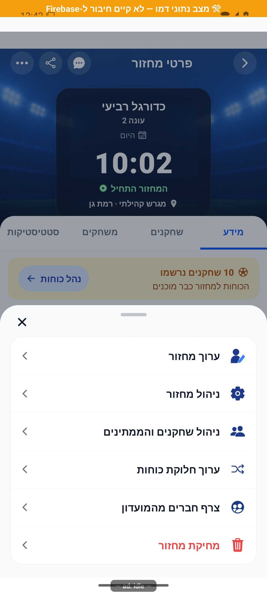
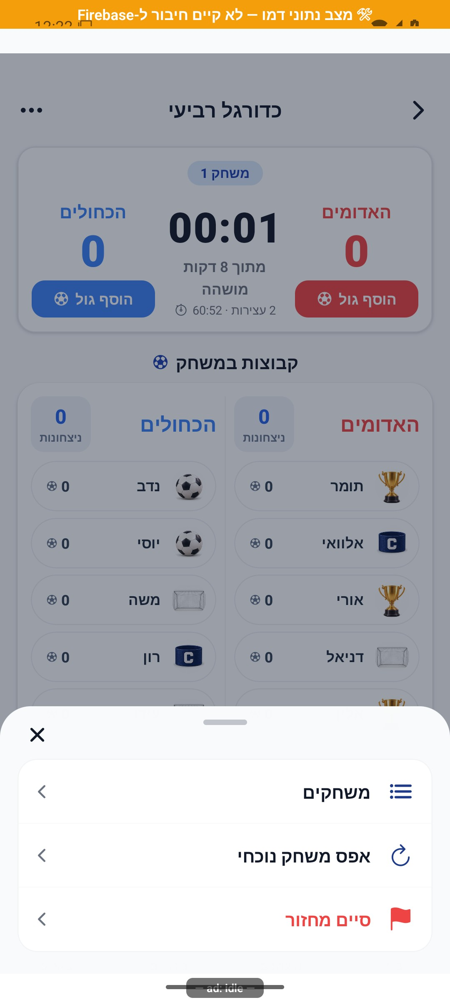

# תפריטים, חלונות ותנועה משותפת

[הסבר פשוט](menus-and-motion.simple.md) · מסמך טכני מעמיק

עודכן 7.10.2026; מקור `8e8fde5`. התפריטים שעוצבו מחדש משתמשים בשפה של חלון תחתון, אייקונים ורשימות פעולות, עם סגירה בגרירה מהידית. אין להניח שכל חלון באפליקציה כבר משתמש באותו רכיב.

מקורות: רכיבי התפריט תחת [`src/components`](../../../src/components), ובפרט DraggableMenuSheet. בעת שינוי בדוק איזה רכיב המסך באמת משתמש בו; SpringSheet הוא רכיב אחר, ואין להסיק מהידית בלבד שהוא תומך באותה מחווה.

מצבים לבדיקה: פתיחה, גרירה קצרה שחוזרת, גרירה ארוכה שסוגרת, הקשה על רקע, כפתור חזרה, רשימה ארוכה עם גלילה ופעולה מושבתת. הגרירה אינה צריכה לגנוב גלילה רגילה או לחסום נגישות. יש לצלם כיווניות לאחר שינוי סדר אייקון וטקסט.

תנועה קיימת כוללת קרוסלת הידעת, ספירת מספרי סטטיסטיקה, תנועת פנדלים ופתיחת חלונות. השערים העסקיים נשארים מקור האמת; אנימציה לא משנה זהות, הרשמה, תוצאה או טיימר. [רעיונות נוספים](../reviews/animations.md) הם הצעות בלבד.

הדמות הניסיונית נשארת מוסתרת ואינה מסלול מוצר פעיל. אין לייבא אותה למסך הבית כחלק מעדכון תיעוד או להפעילה בטעות בשחרור.

בחלון הצמד נבדקה גרירה ארוכה מהידית בסביבת הדמו: החלון נשאר פתוח, וכפתור חזרה סגר אותו. [ראיית הבדיקה](../screenshots/CommunityStats-pair-after-drag.jpg). חלון PairCard ממומש באמצעות Modal עצמאי; הבדיקה שלו אינה הוכחה להתנהגות SpringSheet.

## מאחורי הקלעים — זרימה וחישובים

### מנגנון הגרירה בפועל

[`DraggableMenuSheet.tsx`](../../../src/components/DraggableMenuSheet.tsx) מקבלת `visible`, `onClose` וילדים. היא מחזיקה `Animated.Value` למיקום אנכי, סימון `closing` למניעת סגירה כפולה והפניה מעודכנת לפונקציית הסגירה. שינוי `visible` עוצר תנועה ומאפס את המיקום והסימון; פירוק הרכיב עוצר תנועה.

`PanResponder` מחובר לידית בלבד, כדי שגלילת רשימת פעולות לא תסגור חלון. התזוזה היא `max(0, dy)` ולכן אין גרירה כלפי מעלה. בשחרור נסגר אם `dy > 70`, או אם `dy > 18` וגם `vy > 0.65`. לדוגמה: גרירה 40 ללא מהירות מספקת חוזרת למקום; גרירה 80 נסגרת. שוויון ל־70 לבדו אינו מספיק. אלו יחידות המחווה של המערכת ולא פיקסלים שנמדדו בתמונה.

סגירה מניעה את החלון עד גובה המסך במשך 190 אלפיות שנייה ורק בסיום מוצלח קוראת `onClose`. גרירה קצרה חוזרת בקפיץ עם `tension=100`, `friction=16`. במצב תנועה מופחתת מסלול הסגירה קורא מייד לפונקציה והחלון משתמש בדהייה; הקפיץ של החזרה הקצרה עדיין מופעל לפי הקוד הקיים. הקשה ברקע, כפתור סגירה וחזרה מערכתית עוברים באותה פונקציה.

### גבול הרכיב

לחלון גובה מרבי 88% ופינות עליונות 28; הרכיב המארח אחראי לפעולות ולגלילה. האנימציה משנה מיקום בלבד, לא נתוני מסד. חלון הצמד משתמש ב־`Modal` נפרד, והידית שלו אינה מקבלת את חוזה הגרירה הזה. לפני שינוי מצא את הייבוא במסך ולא רק שם דומה. בדיקות הגרירה המצרפיות המצולמות נשארות במסמך, אך בדיקה חזותית חדשה נדרשת כשמשנים ספים או נגישות.
