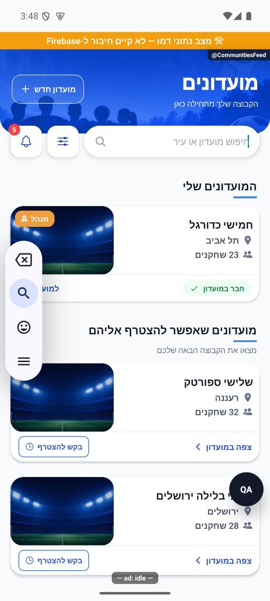

# שורת הניווט הראשית

[הסבר פשוט](navigation-dock.simple.md)

עודכן 10.10.2026 עם שינויים מקומיים; אין הפצת חנות במשימה זו.

## מראה ומיקום

שורת ניווט לבנה בתוך האזור הבטוח, עם מרווח צד16, מרווח עליון8 ותחתון10, רדיוס16, מסגרת בהירה וצל עדין. גובה השורה70 נקודות. ארבע הלשוניות נשארות לפי סדר המקור: בית, מועדונים, מחזורים וצ׳אטים; forceRTL מציב את הראשונה מימין. שורת הניווט נמצאת בזרימת הפריסה ולא מכסה את תוכן המסך. SystemSafeArea מקצה את שולי המערכת פעם אחת; insets הנותרים מועברים לריווח המעטפת ו־BottomTabBar מקבל insets מאופסים כדי לא לספור אותם פעמיים. מודעות נשארות מעל המעטפת, ללא שינוי במקור הנתונים או תנאי ההצגה בלייב.

## אייקונים והנפשה

src/components/NavigationDock.tsx מצייר אייקוני SVG בקו אחיד: בית, מגן עם אנשים, לוח עם כדור ובועות שיחה. האייקון הפעיל לבן, השאר אפורים; תוויות תמיד מתחת לאייקון. ההדגשה הכחולה42×42 עם רדיוס11 נעה במשך280 מילישניות בעקומת inOut cubic.

DockIndexContext מקבל ישירות את state.index ואת מספר המסלולים מ־TabBarWithBanner. DockHighlight מודד את רוחב השורה; רוחב תא הוא רוחב השורה חלקי מספר הלשוניות. מיקום פיזי תחת RTL הוא count−1−index, וב־LTR הוא index. מיקום הרקע הוא מיקום כפול רוחב תא ועוד חצי ההפרש בין רוחב התא לרוחב42. הרקע מוגדר עם direction לטר כדי שמיקום left לא יתהפך פעם נוספת. המדידה מתעדכנת בשינוי רוחב; בהופעה הראשונה אין גלישה מהקצה. עם useReducedMotion ההדגשה ממוקמת מיד ביעד. הלחיצה אינה מניעה את הרקע לפני ניווט: רק מצב הניווט המאושר קובע את היעד, ולכן חסימת יציאה מעריכה אינה מסמנת לשונית שלא נפתחה.

## ניווט, מקלדת והתראות

BottomTabBar המקורי נשמר: אירועי tabPress ו־tabLongPress, נגישות ומצב selected. resetTabToRoot, planTabPress, inFlightSettled ו־maybeInterceptTabLeave לא שונו. לחיצה חוזרת מחזירה לשורש לפי החוזה הקיים; מעבר מהיר כפול נשאר תחת ההגנה הקיימת. מנוי unread של הצ׳אט נשמר, כולל ספירת הודעות ו־99+ מעל99; לא הוחלף בנקודה בלבד.

TabBarWithBanner מאזין לאירועי מקלדת, will ב־iOS ו־did באנדרואיד. בזמן מקלדת כל המעטפת, כולל הפרסומת, מוסתרת בלי להשאיר רצועה ריקה. הסגירה מחזירה את השורה ואת ההדגשה למצב הניווט הנוכחי. אין כתיבה למסד כחלק משורת הניווט.

## ראיות ובדיקות

### יציבות מסך בזמן התאוששות משגיאה

הדגשת הלשוניות אינה מנהלת את עץ המסכים המקורי. במחסנית המקורית נמצאה בעיה נפרדת: ב־`@react-navigation/native-stack@6.11.0`, מעטפת `styles.scene` הייתה ניתנת למיזוג עם תוכנה בזמן מיקוד, ואז התממשה מחדש כשהמאפיין `importantForAccessibility` השתנה ל־`no-hide-descendants`. כאשר `ErrorBoundary` החיצוני הסיר את מחסנית הניווט בעקבות שגיאה בזמן מעבר, העברת התוכן למעטפת החדשה התנגשה בהורה שהמעבר המקורי עדיין החזיק.

התיקון ב־`patches/@react-navigation+native-stack+6.11.0.patch` מציב `collapsable={false}` **רק** במעטפת הסצנה הזו. אין שינוי בסדר הלשוניות, הפניות, סמנטיקת נגישות, זמני מעבר או מנגנון הניסיון החוזר. לא שונו קוד מקורי או גרסאות תלות. `scripts/postinstall.cjs` מחיל את הטלאים עם `--error-on-fail`, ואז `scripts/verify-native-stack-scene.cjs` בודק את הגרסה, נקודת הכניסה שמטרו קורא ואת מאפיין המעטפת בעץ התחביר. שינוי תלות מחייב אימות מחדש; אין לדלג על הבדיקה כדי לאפשר בנייה.

באותה בניית פיתוח מקומית של אנדרואיד עם מנוע התצוגה החדש הושווה כשל מכוון באפקט של מסך צ׳אט: לפני התיקון שוחזרה חריגת הורות; מועמד מוקדם של מעטפת הקשר לא פתר אותה והוסר; אחרי תיקון הסצנה הופיע מסך ההתאוששות, ולאחר הסתרת הודעות הפיתוח הכפתור ״נסה שוב״ החזיר לבית באותו תהליך. אומת בקובץ החבילה הטרי שמטרו כלל את שורת התיקון. ההזרקה הוגבלה לפיתוח ולדמה. שש בדיקות שומר עברו, ובדיקת התקנה הסירה את הטלאי, הוכיחה כשל על המקור המקורי והחילה אותו מחדש בהצלחה. [הראיות והגבולות](../../../artifacts/pre-release-2026-10-10/native-ra01/source-investigation.md).

הטריגר הראשוני של הצ׳אט היה גישה לשירות אמיתי במצב דמה ותוקן בנפרד. אין כאן הוכחה לקריסת צ׳אט בייצור, לכל סוג שגיאה או לאייפון. מסך ההתאוששות משתמש ב־`StatusBar` של `react-native` עם `barStyle="dark-content"` ו־`backgroundColor={colors.bg}`, ללא שינוי שקיפות או שטח החלון. `fallback-rn-statusbar-visible.png` בתיקיית הראיות מאמת שעה וסמלי מצב כהים על הרקע הבהיר. לאחר הצילום ההזרקה הוסרה לגמרי ושש בדיקות השומר הורצו שוב ועברו (`native-scene-guard-tests-rn-final.log`). אין קוד בדיקה מכוון שממתין להפצה.

בסבב רגיל נוסף עם הטלאי וללא הזרקה נבדקו צ׳אט וחזרה, מיקוד כלי הקלט ללא הקלדה, מחזור, משחקים, סטטיסטיקות וגלילה. `final-patched-navigation-logcat.txt` נקי מחריגת הורות ומסימון הכשל. אין זו בדיקת שליחת הודעה או אימות התנהגות אייפון.

בדיקת טיפוסים וכל2,802 הבדיקות ב־190 חבילות עברו. יומנים artifacts/navigation-dock-tsc.log ו־artifacts/navigation-dock-jest.log. נלחצו ארבע הלשוניות בנתוני דמו באימולטור אנדרואיד. המעברים הוקלטו דרך screenrecord של האימולטור ב־artifacts/navigation-dock.mp4. נבדק רצף פריימים מההקלטה ב־artifacts/navigation-dock-motion.jpg, כולל מיקומי ביניים של הרקע הכחול. נתוני המסכים בזמן המעבר יכולים עדיין להיות בטעינה; אין זו תקלה שנמצאה בשורת הניווט.

נפתח חיפוש עם מקלדת כתב היד של האימולטור, והשורה נעלמה; לאחר סגירה היא חזרה. זה אינו אימות מקלדת iOS או מקלדת צ׳אט. מצב הפחתת תנועה, קורא מסך, גופן מוגדל, מסך רחב והודעות שלא נקראו נבדקו בקוד בלבד ולא הורצו. סימוני הדמו והפרסומת בפיתוח אינם חלק מהשורה. לא בוצעו יצירה, הצטרפות או כתיבה למסד במהלך בדיקות המסכים.

