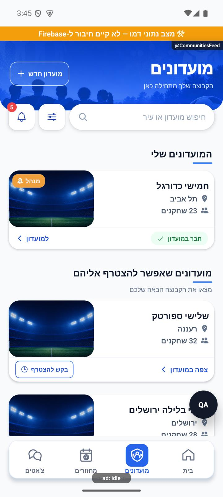

# שורת הניווט — הסבר קצר

בתחתית האפליקציה עוברים בין בית, מועדונים, מחזורים וצ׳אטים. הלשונית הפעילה מודגשת בכחול, והרקע הכחול גולש אל הלשונית שבחרתם. השורה מרוחקת מעט מקצוות המסך, ונעלמת בזמן פתיחת מקלדת. אם במכשיר מופעלת הפחתת תנועה, ההדגשה מתחלפת ללא גלישה.

[לפירוט המעמיק](navigation-dock.md)

באנדרואיד תוקנה גם תקלה בהתאוששות משגיאה בזמן מעבר בין מסכים: במקום קריסה נוספת, מסך ״משהו השתבש״ מאפשר ללחוץ על ״נסה שוב״ ולחזור לאפליקציה. בבדיקה מקומית עם תקלה מכוונת הכפתור החזיר לבית בלי להפעיל מחדש את האפליקציה. הבדיקה הייתה בנתוני דמו; אייפון לא נבדק בתרחיש הזה.

הצילום מתוך אימולטור אנדרואיד בנתוני דמו. סימוני הפיתוח אינם חלק מהגרסה המופצת; אייפון לא נבדק במשימה זו.
