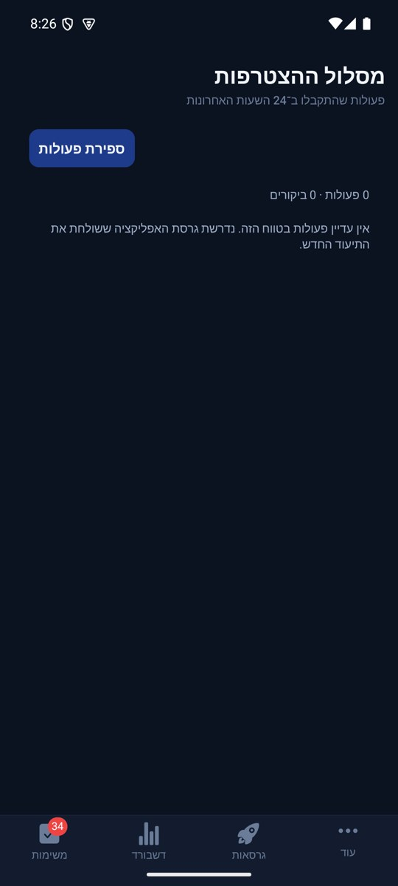

# מסלול ההצטרפות בפולס — תיעוד טכני

[הסבר פשוט](onboarding-activity.simple.md)

עודכן 10.10.2026; בסיס `a97ccca3` ושינויים מקומיים. המימוש נפרד מיומן השחזור המקומי; הוא אינו מעלה את כלל פעולות המשתמש.

## ניווט והרשאות

פולס → עוד → מסלול ההצטרפות (`OnboardingActivityScreen`). לחיצה על התראה פותחת את הביקור המזוהה ב־`sessionId`, גם בפתיחה קרה. הממשק משתמש בחיבור המנהלי הקיים; לא שונו כללי מסד או הרשאות. לקוח טימדר משתמש בפונקציה מאומתת, לרבות חשבון אורח אנונימי שכבר נוצר בתהליך הרגיל; התיעוד אינו יוצר חשבון.

## זרימת הנתונים

`analyticsService.logEvent` → סינון בקטלוג `src/utils/onboardingActivity.ts` → `onboardingActivity.recordOnboardingActivity` → תור `AsyncStorage` → `recordOnboardingActivity` → אוסף `onboardingActivity` → `onOnboardingActivity` → סינון אבני דרך → התראה מנהלית. פולס קורא עם `runQuery`, ולא עם רשימת המסמכים שעלולה להיות לא עדכנית.

הקטלוג מועתק ל־`functions/src/onboardingActivityCatalog.ts` ול־`pulse/src/services/onboardingActivityCatalog.ts`. בדיקת זהות מלאה מונעת התפצלות; אחרי שינוי יש לסנכרן את שלושת העותקים. כותרות הפעולות והפירוט נגזרים מ־`activityLabel`.

כל אירוע מכיל UUID של ביקור, מזהה אירוע יציב, מספר סידורי, `occurredAt` משעון המכשיר, שם פעולה ופרמטרים מותרים. השרת מוסיף UID מתוך האימות, שם שחקן מהפרופיל, מצב אנונימי ו־`createdAt` משעון השרת. מספר סידורי מסדר את הביקור גם אם השעון השתנה. זמן המכשיר אינו הוכחה לזמן שרת; התור יכול להישלח באיחור.

## כיסוי תהליך פעיל

| מסלול | פעולות |
|---|---|
| פתיחה ומקור | התחלת אורח, מקור כניסה, פתיחה רגילה, מסך פתיחה והמשך |
| בחירת דרך | צפייה, כל שלוש הבחירות, ההזמנה הנוספת כשהיא קיימת, חשבון קיים |
| הזמנה | מקור נדחה, הזמנה אישית, פתיחת מועדון או מחזור מההזמנה, חקירה, הזמנה לא זמינה |
| התחברות | פתיחת חלון, ספק, ביטול ספק, כשל והצלחה; סגירה מכפתור, רקע וגב מערכת; מייל, החלפת מצב, איפוס, הצגה/הסתרה של סיסמה, יציאה |
| פרופיל | צפייה, מיקוד וסיום עריכת שם ללא תוכן, עיר נבחרת ללא תוכן, פתיחת בוחר תמונה, ביטול/כשל/הצלחה, אוואטר, לחיצת שמירה, הצלחה/כשל |
| המשכיות | שמירת פעולה ממתינה, חזרה או כשל, שלבי הקמת מועדון ומחזור, יצירה או כשל |
| הרשאות התראה | הסבר, בחירה, תוצאת הרשאה, מעבר להגדרות |

מסך השקופיות `OnboardingScreen` הוא מסך היסטורי שאינו רשום במסלול הפעיל. אין לטעון שהמעבר בין שקופיות בו כוסה או הורץ. חלון מערכת וספקי התחברות חיצוניים נמדדים בתוצאה שחוזרת לאפליקציה; אין גישה ללחיצות בתוכם. הקלדה לפי תו אינה נשלחת.

## כמויות, מכנים ומצבים

ספירה היא מספר הרשומות לפי הפעולה והבחירה/שלב, כולל לחיצות חוזרות; אינה מספר אנשים או התקנות. ביקורים שונים נספרים לפי `sessionId` ולא לפי UID, משום שהזהות יכולה להשתנות מהאורח לחשבון בתוך אותו ביקור. ברירת המחדל מציגה פעולות שהתקבלו בשרת ב־24 שעות; ביקור שנבחר נשלף בפני עצמו ומסודר לפי `sequence`. תקרה של 2,000 רשומות מוצגת במפורש כספירה חלקית. אין אחוזי המרה או מכנה שהוסק בטעות מתוך חלק מהרשומות.

| מצב | התנהגות |
|---|---|
| אין עדיין אימות | תור מקומי; האימות הקיים מעיר את השליחה |
| רשת מנותקת/כשל | האירועים נשארים עד אישור מפורש; ניסיון חוזר 2–60 שניות |
| אישור שרת | מוסרות רק הרשומות שאושרו; עד 20 בכל בקשה |
| שליחה חוזרת | אותו מזהה אירוע מניב אותה רשומת מסד; אין פעולה נוספת |
| עומס חריג | עד 600 אירועים לשעה ל־UID; חריגה מוחזרת ככשל והתור ממתין |
| התראות כבויות | היסטוריה נשמרת; `pushStatus=muted` |
| אין מכשירים רשומים | ההיסטוריה נשמרת עם `no_devices` |
| כשל מסירה זמני | מצב `retrying`; פונקציית האירוע מבקשת ניסיון חוזר |
| טעינת פולס נכשלה | הודעת כשל ואפשרות ניסיון חוזר, לא אפס מדומה |

לא משתמשים במגבלת 20 השניות הכללית של `pushToAdmins`; היא הייתה מפילה לחיצות שונות. התראה ממוספרת במזהה האירוע באנדרואיד כדי לא להחליף התראה אחרת. `sent` הוא אישור שירות ההתראות ולא הוכחה שהאדם ראה אותה. ניסיונות מסירה חוזרים עלולים לייצר התראה חוזרת במכשיר שכבר קיבל אותה אם הייתה הצלחה חלקית או שהפונקציה נעצרה לאחר שליחה ולפני עדכון המסמך. ההיסטוריה עצמה אינה כפולה. תיעוד מקומי תלוי באחסון זמין; קריסה מיד לפני השלמת כתיבה יכולה לאבד את הפעולה האחרונה.

## בדיקות וראיות

`tests/logic/onboardingActivity.test.ts`: זהות הקטלוגים, הסרת שדות פרטיים, אימות, דחיית מזהים כפולים ואירוע לא מוכר, אישור חוזר ללא ספירה כפולה, שתי התראות סמוכות וכיבוי ללא מחיקת היסטוריה. `onboardingActivityQueue.test.ts`: לחיצות לפני אימות, כשל רשת, מזהים יציבים, לחיצות חוזרות וסינון פעולה שאינה שייכת לתהליך.

נדרש אימות חי לאחר אישור פריסה והפצת לקוח חדש. לא נוצרו חשבונות או מועדונים לבדיקה, ולא הופעלו פעולות יצירה בחשבון הבעלים. צילום הממשק ומצב הפריסה יתועדו ביומן המשימה; בדיקת קוד אינה הוכחה לקבלת התראה במכשיר אמיתי.

## צילום בפועל

הצילום מפולס 1.0.90 / 97 באמולטור. מצב עם רשומות והתראה חיה עדיין לא אומתו מול שרת פרוס.

## הבהרת התראות בטלפון — 10.10.2026

כל הפעולות ממשיכות להישמר בהיסטוריה. פוש חדש נשלח רק ל־`entry_source_resolved` כאשר `is_guest=true`, ול־`entry_intent_selected` כאשר `is_guest=true` והבחירה היא אחת מארבע הבחירות המותרות. אין פוש על צפייה בשלב, ספק התחברות, עריכת פרופיל, כפתור שמירה או לחיצה רגילה. הרשמה לאפליקציה, יצירת מועדון, יצירת מחזור ועדכון זמינות נשארים בהתראות הקיימות; הערוץ החדש אינו שולח עליהם פוש נוסף.

`onboardingPushPolicy.onboardingPushMilestone` קובעת את המדיניות בשרת, בלי לצמצם את התיעוד. מזהה סמן מחושב מ־sessionId וסוג אבן הדרך; בחירה כוללת גם את סוג הבחירה. טרנזקציה באוסף `onboardingMilestonePushes` שומרת את מזהה האירוע הראשון. כניסה חוזרת שנמדדה באותו ביקור או אותה בחירה שוב נשמרות עם `milestone_duplicate` בלי פוש נוסף. בחירה אחרת יכולה לשלוח פוש אחד נוסף; ביקור חדש מקבל סמן חדש. יתר הפעולות מקבלות `history_only`. אין תלות בהגבלת 20 השניות של ההתראות הקודמות.

פולס 1.0.91 / 98 מעדכן את כותרת ההגדרה ואת מצבי המסירה. לא בוצעה פריסה; קובץ 1.0.90 הקודם אינו מפעיל בעצמו שליחה של כל הלחיצות. מסירת התראות חיה נשארת לא מאומתת עד לפריסה ולעדכון לקוח טימדר.

## אימות חי — 10.10.2026

שתי הפונקציות `recordOnboardingActivity` ו־`onOnboardingActivity` נפרסו באישור מפורש, כולל ניסיונות חוזרים. באמולטור בדיקות נפרד מול הייצור נשמר רצף פתיחה ובחירת הקמת מועדון. שירות ההתראות אישר שליחה לחמישה מכשירים בכל אחת משתי אבני הדרך; זו קבלת בקשת השליחה, לא אישור צפייה בטלפון. פעולות הצפייה וההמשך נשמרו כהיסטוריה בלבד.

נמצא ותוקן מקומית מרוץ: אירוע מקור הכניסה נשלח לפני שחזור זהות המשתמש, ולכן אורח סומן כחבר ולא קיבל התראת כניסה. מעתה מקור הכניסה מתפרסם לניווט מיד, אך האירוע ממתין לזהות משוחזרת דרך `entryGuestAfterHydration`. אחרי התיקון נצפה `is_guest: true` ושליחה מוצלחת. נוספו שתי בדיקות נסיגה; בדיקת הטיפוסים נקייה וכל 3,258 הבדיקות ב־231 חבילות עברו.

האימות בוצע עם קוד מקומי עדכני בתוך מעטפת פיתוח, ולא עם גרסה שהועלתה לחנות. בדיקות הזמנה למועדון ולמחזור, מעבר מחנות להתקנה והתחברות באפל טרם הושלמו בסבב החי הזה.

## המשך הבדיקה החיה — 10.10.2026

נבדקו בפועל הזמנת מועדון והזמנת מחזור דרך Chrome באמולטור נפרד: דף נחיתה, לחיצה על הכפתור הראשי, פתיחת האפליקציה במצב נקי והצגת אפשרות עם שם המזמין. במועדון נפתח היעד הנכון ונדרשה התחברות לבקשת הצטרפות. במחזור סגור נשמר היעד אך אורח נחסם לסגל בלבד. נבדקה גם הזמנה כללית בעת שהאפליקציה פעילה. מקור הכניסה נשמר עם היעד ועם זיהוי אורח; שירות השליחה אישר מסירה לחמישה מכשירים, בלי אישור הצגה בטלפון.

הבדיקה השתמשה בקוד מקומי במעטפת פיתוח ואינה הוכחת התקנה מהחנות. התחברות באפל ובגוגל, מעבר מהחנות לאחר התקנה והשלמת הצטרפות אחרי אישור מנהל לא אומתו. הממצאים, הצילומים וגבולות הכיסוי מפורטים ב־[דוח הבדיקה החיה](../../changes/2026-10-10-onboarding-live-qa.md).

## הקשחת זהות ותור — סקירת שחרור 10.10.2026

אירוע מקומי כולל כעת `ownerUid` שנקבע מתוך Firebase בצד הלקוח. הוא משמש רק לסינון מקומי. בקשת השליחה כוללת `expectedUid`; השרת משווה אותו ל־`request.auth.uid` ודוחה מעבר זהות שקרה בזמן הקריאה. מקור הזהות לכתיבה נשאר אסימון האימות בלבד. לקוח ישן שאין בו `expectedUid` נשאר נתמך.

המסע מתחיל לפני האימות אם צריך, ואירועי אותו מסע נקשרים לזהות הראשונה באותו תהליך. שדרוג אורח באמצעות `linkWithCredential` ששומר אותו UID משמר תור ומסע. כניסה לחשבון קיים עם UID אחר מפרידה מסע ואינה מייחסת לו את פעולות האורח הקודם: הן ממתינות רק לבעליהן. אין העברת בעלות בלתי מוכחת. יציאה מוצלחת מפעילה גם `resetOnboardingJourney` ב־`userService.signOut`, בנוסף להאזנה לשינוי האימות, כדי לכסות callbacks מאוחרים. אם הקריאה ליציאה נכשלת, הגבול המפורש לא מופעל.

תור ישן ללא שדה בעלים אינו משויך בדיעבד לחשבון הנוכחי. רשומה בעלת מבנה לא תקין, JSON פגום או זמן מתקדם ביותר מיום מבודדים מקומית. האבחון ב־`teamder:onboarding-activity:quarantine` מכיל רק זמן ומספר רשומות, ללא התוכן. במקרה דחייה סופית `invalid-argument` מבודדות הרשומות באמצעות משלוח יחידני; כשל רשת נשאר בר־ניסיון חוזר. בכך רשומה פסולה אינה חוסמת את האירועים התקינים שאחריה. שמירת מונה אבחון אינה מבטיחה שחזור התוכן שנדחה.

במסירה חלקית של פוש נשמרות טביעות SHA-256 של היעדים שהצליחו ושל אסימונים לא תקינים. ניסיון חוזר שולח רק ליעדים שלא קיבלו ושלא נכשלו לצמיתות. מוני המסירה מצטברים בין הניסיונות. עדיין קיימת אפשרות לכפילות אם התהליך נעצר אחרי משלוח ולפני שמירת התוצאה, או אם שתי הפעלות רצות במקביל; אין הבטחת בדיוק־פעם־אחת של שירות רשת.

נוספו בדיקות להחלפת חשבון עם תור ממתין, שדרוג אותו אורח, גבול יציאה מפורש, JSON/רשומה/זמן פסולים, דחייה סופית לצד אירוע תקין, בדיקת הזהות בשרת ומסירה חלקית עם ניסיון חוזר ליעד שנכשל בלבד. לא שונה ממשק ולכן אין צילום חדש. השינויים מקומיים: לא נפרסו פונקציות ולא אומתה מסירה חיה לאחר ההקשחה.

### השלמת בידוד מסע שנקטע לפני אימות

אירוע עם `ownerUid=null` נשמר רק אם הוא מהמסע הנוכחי או שמסעו נקשר לזהות בתהליך הנוכחי. לאחר הפעלה מחדש, מסע לא מאומת מהתהליך הקודם מבודד ואינו ממתין בדיסק ללא הגבלה. נשמר רק מונה אבחון מקומי; לא מנסים לנחש שזה אותו אדם. נוספה בדיקה של עצירה לפני אימות, הפעלה מחדש וחשבון אחר.

הודעות APNS כוללות כעת `apns-collapse-id` שהוא SHA-256 של מזהה האירוע — 64 תווי ASCII, בתוך מגבלת 64 הבתים. הוא עשוי לאחד הודעות ממתינות חוזרות לאותו אירוע באייפון, אך אינו מבטל התראה שכבר נמסרה ואינו מבטיח מסירה פעם אחת. חלון הכפילות בין שליחה לשמירת התוצאה נשאר מתועד. 37 בדיקות ממוקדות עברו בשלוש חבילות. אין שינוי במדיניות ניסיונות חוזרים, הרשאות או פריסה.
