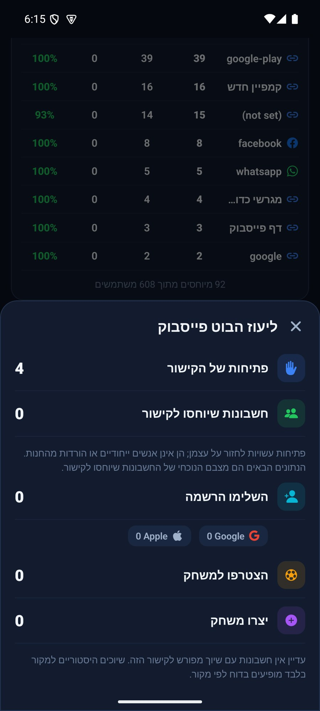

# מדידת קישורים בפולס

[הסבר טכני](pulse-links.md)

בפולס, תחת ״מקורות״, יוצרים קישור נפרד לכל פרסום. בחלון הקישור רואים כמה פעמים פתחו אותו וכמה חשבונות יוחסו במפורש לקישור הזה. פתיחות יכולות לחזור על עצמן; הן אינן מספר אנשים שונים או הורדות מהחנות.

מתוך החשבונות האלה רואים כמה השלימו הרשמה, השתתפו במחזור או יצרו מחזור, לפי מצבם הנוכחי. חשבונות ישנים שיש להם רק מקור, למשל פייסבוק, נשארים בדוח המקור ולא נזקפים לקישור מסוים. כשאין חשבונות מיוחסים מוצג אפס ללא אחוז המרה. בכשל טעינה מוצגת שגיאה עם אפשרות לנסות שוב.

התיקון מוכן במקור הפולס הנפרד. בניית עדכון מקומי ואימות חזותי מתועדים במסמך הטכני; אין מכאן אישור לפריסה או לגרסת חנות.

העדכון `Pulse-1.0.89-v96.apk` הותקן באימולטור מעל הפולס הקיים ללא מחיקת נתונים. בקישור שנבדק רואים ארבע פתיחות ואפס חשבונות שיוחסו לו; שמונת החשבונות הישנים נשארים בדוח פייסבוק. הקובץ נמצא גם על שולחן העבודה. טרם נבדקה התקנה בטלפון שלך.
