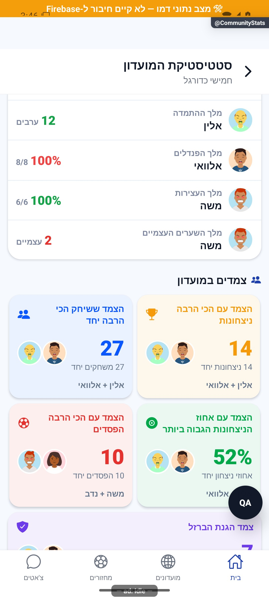
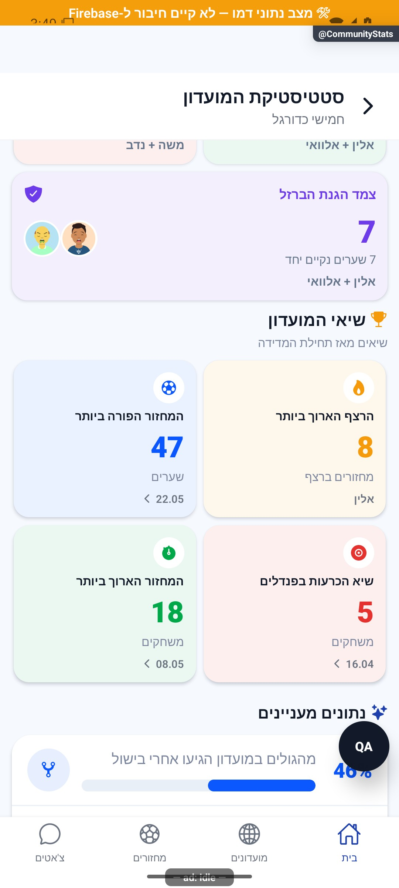
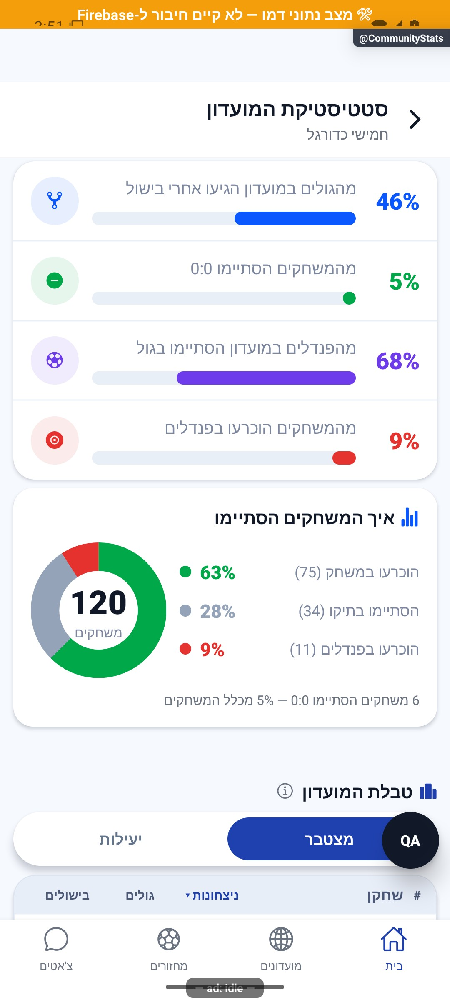

# כימיה, שיאים ונתונים מעניינים

[להסבר הקצר והפשוט](chemistry-and-records.simple.md)

עודכן: 07.10.2026; מקור: `8e8fde5`. אזורים בתוך `CommunityStats`; חלון צמד `src/components/chemistry/PairCard.tsx`.

## כימיה

הרשת מציגה חמש קטגוריות לפי סדר: צמד מנצח, משחקים יחד, אחוז ניצחון יחד, הפסדים יחד ושערים נקיים יחד. זוגות בשוויון נשמרים; קטגוריה ללא מדגם מספק אינה מוצגת. שתי עמודות; כרטיס אחרון אי־זוגי הופך לרצועה ברוחב מלא. יש שמונה סוגי תואר בחישוב ובחלון הצמד, ולכן הערות ״שישה״ בקוד אינן מקור למספר הכרטיסים.

| סוג חישוב | סף נוכחי | יחידה |
|---|---|---|
| ניצחונות יחד | 5 | משחקונים |
| משחקונים יחד | 10 | משחקונים באותה קבוצה |
| בישולים הדדיים | 3 | בישולים כיווניים בין השניים |
| שער נקי יחד | 5 | משחקונים ללא ספיגה |
| יריבות/יריבות מאוזנת | 10 | משחקונים בקבוצות מנוגדות |
| אחוז ניצחון יחד | 50% ומדגם של 10 | היחס הנבחר בקוד |
| הפסדים יחד | 5 | משחקונים |

אין ״ציון כימיה״ מאוחד. נתוני צמד במועדון מגיעים מ־`communityPairStats`, לא מ־`pairStats` הגלובלי. סדר מזהים קנוני קובע למי שייכים `winsA` ו־`assistsAToB`. חלון הצמד מציג מידע כיווני, נתוני יחד ומול, ואת התארים שהוא מחזיק; השמות נטענים באצווה.

`pairs === undefined` פירושו לקרוא נתונים חיים. `pairs === null` פירושו שהטווח הנבחר עוד לא הגיע, ואסור ליפול לקריאה של העונה הנוכחית תחת כותרת עונה סגורה. איחוד ארכיונים מחבר אותם מדדים. תאריך תחילת כיסוי מוצג כשאין טווח עונה שמסביר אותו. מספר בישולים היסטורי ללא כיוון אינו משולב בפירוט כיווני כאילו הוא סכומו.

## שיאים ומדגם

השיאים הפעילים מגיעים מ־`buildClubRecords`: רצף **נוכחות** במחזורים, המחזור עם הכי הרבה שערים, המחזור עם הכי הרבה הכרעות פנדלים והמחזור עם הכי הרבה משחקים. הרצף אינו רצף ניצחונות, ו״המחזור הארוך״ נמדד במספר משחקים ולא בדקות. אין כאן שיא בישולים או שיא שערים נקיים למחזור. נתוני מחזור מגיעים מסיכומים ומכיסוי ידוע; אין לשחזר מתוך מוני חיים בלבד. כרטיסים עם מזהה מחזור פותחים את המחזור; רצף עם מחזיק יכול לפתוח כרטיס שחקן. ערך חסר/לא חיובי אינו יוצר שיא, ושם מחזיק חסר מסיר את הרצף. רצף החיים אינו מוצג כאילו הוא שיא עונה נבחרת.

שלושה נתונים מעניינים כוללים יחסי שערים/בישולים, משחקונים ללא שערים והבקעת פנדלים מתוך ניסיונות. הכרעות פנדלים מוצגות בתרשים התוצאות בלבד. המכנה `countedRounds` נשמר בחישוב; אין שימוש עיוור ב־`totalRounds` כמכנה לכל המדדים. מדדי מועדון אינם מציגים עוגת ניצחונות מול הפסדים של כל הקבוצות כאילו היא הישג אחד.

## קבצים ובדיקות

`src/utils/clubChemistry.ts`, `pairOrientation.ts`, `eveningRecords.ts`, `clubRecords.ts`; `src/services/clubChemistryService.ts`, `roundSummaryService.ts`; `src/components/chemistry/ChemistrySection.tsx`, `PairCard.tsx`, `src/components/club/ClubRecords.tsx`; `src/screens/communities/CommunityStatsScreen.tsx`. בדיקות `clubChemistry`, `clubChemistryReal`, `clubChemistryParity`, `shoshiChemistryScopes`, `seasonArchivePairs`, `pairOrientation`, `seasonCoverage` ב־`tests/logic`.

## ראיות ופערים

הקוד נקרא ובהשלמת המיפוי צולמו גם הכימיה, חלון הצמד והשיאים בדמו. אין צילום נוכחי של צמד שוויון או אורח. `clubChemistryService.get` מחזיר מצב ריק בכשל; לכן הודעת ״אין מספיק נתונים״ אינה הוכחה שאין נתונים. יש לשחזר כשל רשת ולהפרידו מריקנות לפני תיקון.

בדמו הצמד מציג 27 משחקים יחד, 14 ניצחונות, 9 הפסדים, 7 שערים נקיים ו־9 בישולים בכיוונים 6 ו־3. בשיאים נראים רצף נוכחות 8, מחזור עם 47 שערים, 5 משחקים שהוכרעו בפנדלים ו־18 משחקים במחזור. אלה מדדי דמו ולא נתוני ייצור.

גרירה ארוכה מהידית בחלון הצמד לא סגרה אותו בצילום הבדיקה; כפתור חזרה סגר. [צילום אחרי גרירה](../screenshots/CommunityStats-pair-after-drag.jpg) מתעד את חלון PairCard, שממומש באמצעות Modal ולא באמצעות SpringSheet. אין בכך בדיקת כל החלונות המשותפים או קביעה לגבי גרירה בתוך התוכן.

מקורות 084/085 הם אפיון, כולל רעיונות שלא מומשו. אין להציג ״שערים יחד״ כמקור נתונים קיים רק מפני שהופיע בסקיצה. מקור 083 כלל שיאים מצומצמים, והוחלף בתוספות 082; סדר המספרים של הארכיון אינו סדר תאריכי ההחלטות.

## הצעות בלבד

לצרף הגדרת מדגם ומדד בלחיצה, במקום טקסט ארוך בכל כרטיס; להנפיש פסים ומדדים רק עם מידע סופי; להוסיף הדגשה קצרה לשיא חדש מאומת. לא להכתיר צמד אחרי משחקון יחיד ולא להמציא דירוג כימיה מספרי.

בדמו תרשים התוצאות מחלק 120 משחקונים מתועדים לשלוש קבוצות נפרדות: 75 הוכרעו במשחק, 34 בתיקו ו־11 בפנדלים. ששת משחקוני 0:0 נכללים בקבוצות הללו ואינם פלח נוסף. הרצף בטווח עונה מגיע מנתוני אותה עונה; בכל השנים מגיע רצף החיים.

## פירוט טכני נוסף — זרימה, חישוב ונקודות שינוי

`pairsFromRounds` בונה צמדים מכל קבוצה במשחקון; `pairKey` ממיין את המזהים, ו־`mergePairs` מחבר מונים בלי לאבד כיוון בישול. שער עצמי אינו בישול ושחקן אינו מבשל לעצמו. שער נקי נגזר מאפס שערי יריבה; גם תיקו 0:0 שהוכרע בפנדלים יכול להיחשב נקי.

ספי `CHEMISTRY_MIN`: צמד מנצח 5 ניצחונות יחד, קבועים 10 הופעות יחד, קטלני 3 בישולים, חומה 5 נקיים, יריבות 10 מפגשים. אחוז הצמד בקטגוריית היעילות מחייב לפחות 10 יחד ומשתמש ב־`winsTogether/sameTeam`; 11 ניצחונות מתוך 20 יחד הם 55%, בעוד 9 מתוך 9 אינם מדגם מספיק. אין להעתיק לכאן את מכנה ההשוואה שמוציא תיקו.

`pickChemistry` מונע מאותו צמד להיבחר גם כצמד מנצח וגם כמפסיד; שוויון יכול להחזיר כמה צמדים. יריבות מאוזנת מצמצמת הפרש ניצחונות ומעדיפה מדגם גדול. `undefined` במקור הצמדים מפעיל קריאה חיה, ואילו `null` מסמן טעינה; שינוי ההבחנה יכול לגרום קריאה מיותרת או נתונים מהטווח הלא נכון. בדיקות `clubChemistry`, `pairOrientation` ו־`seasonArchivePairs` מנויות לעיל.

הפירוט מתאר את הקוד שנקרא, ולא בדיקת כתיבה או הרשאות בסביבת הייצור. יש לקרוא את הקוד הממוקד וההפרש מאז מקור המיפוי לפני תיקון; בדיקות המוזכרות כאן לא הורצו מחדש לצורך עריכת התיעוד.

## עדכון 8.10.2026 — תנועה ותיקוני דיווחים

הוסרה רק שורת `shootout` מרשימת הנתונים המעניינים ב־`CommunityStatsScreen`, וגם התנאי שלה מ־`funRowCount`. `ResultsBreakdown`, `shootoutRounds`, `countedRounds` וחישוב אחוז ההבקעה נשארו ללא שינוי. בדמו: 75 הכרעות במשחק, 34 תיקו ו־11 בפנדלים מתוך 120; 68% הבקעת פנדלים הם מדד אחר.

**ראיה ומגבלות:** האזור הורץ ונצפה בדמו. התרשים נשמר והכפילות הוסרה; אין אימות מספרי מול חשבון הייצור.

בדיקת הטיפוסים ו־183 חבילות הבדיקות עברו, 2,752 בדיקות. מצב המקור: `9ec0dfd` עם שינויים מקומיים; אין גרסה חדשה שפורסמה. [יומן השינוי וההקלטות](../../changes/2026-10-08-motion-and-pulse.md).

### קריאה מחמירה לסכום היסטורי — 10.10.2026

נוסף פרמטר `strict=false` ל־`clubChemistryService.get`. במצב מחמיר כל כשל נזרק במקום להפוך לתוצאה ריקה. סטטיסטיקת כל הזמנים משתמשת ב־`true` כדי לא לסכם ארכיונים בלי הזוגות של העונה החיה. שאר הצרכנים שומרים את ההתנהגות הקיימת. בדיקות שירות מכסות כשל מול תוצאה ריקה אמיתית: `tests/logic/clubChemistryStrict.test.ts`.
