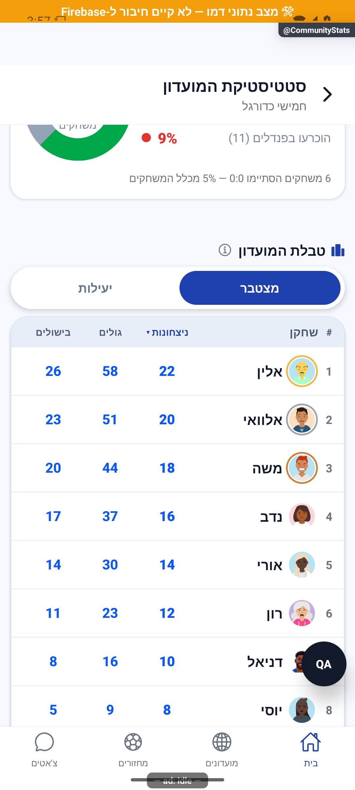
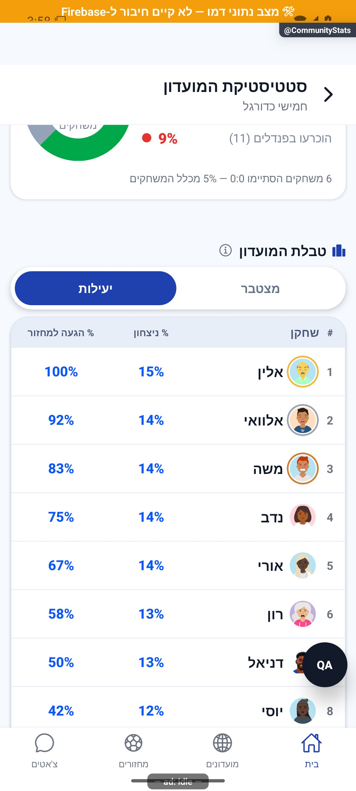
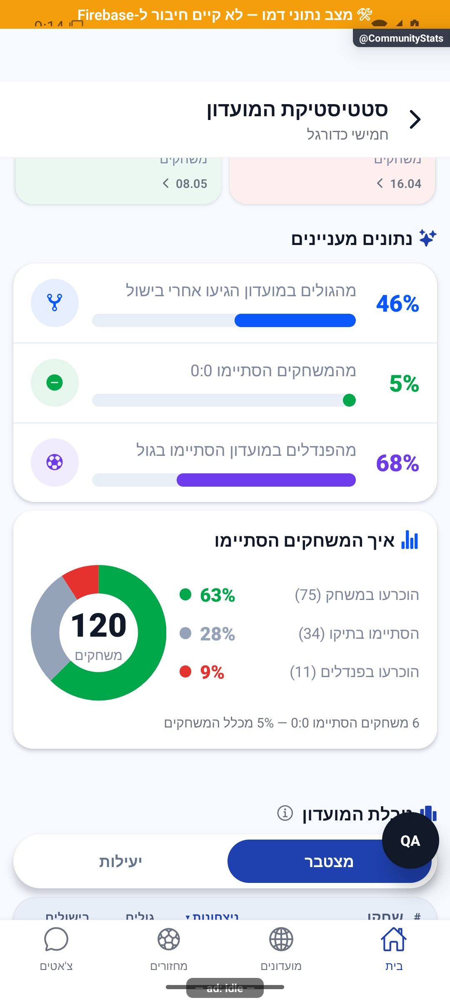

# סטטיסטיקת מועדון — מונים, מובילים ואליפות

[להסבר הקצר והפשוט](club-leaders-and-table.simple.md)

עודכן: 07.10.2026; מקור: `8e8fde5`. מסך `src/screens/communities/CommunityStatsScreen.tsx`, מסלול `CommunityStats` עם `groupId`, וכן לשונית סטטיסטיקה בפרטי מועדון.

## אזורי המסך

בחירת עונה/כל השנים; ארבעה מונים: שערים, בישולים, משחקונים ומחזורים; שמונה קטגוריות מובילים, כאשר שלוש הראשונות בכרטיסים שווי מעמד והיתר בשורות; טבלת האליפות; כימיה, שיאים ונתונים מעניינים. רכיבי הפרטים המקוצרים אינם מציגים תמיד את כל המסך המפורט.

שלושת הכרטיסים הראשיים הם מלך שערים, מלך בישולים ומלך ניצחונות. שאר קטגוריות המובילים נבנות בקוד מן הנתונים הזמינים, לרבות שער נקי והתמדה. אין פודיום שבו כרטיס אמצעי גבוה יותר. צבע קטגוריה אינו דרגת שחקן.

| פעולה | מקור/תנאי | התנהגות |
|---|---|---|
| החלפת טווח | `SeasonScopeBar` | מונים, מובילים וטבלה חייבים לשנות אותו חלון |
| לחיצה על שחקן | מזהה חשבון אמיתי | כרטיס שחקן; אורח/זהות חסרה אינם פרופיל מלא |
| מצב מצטבר | נתוני שחקן במועדון | סך מדדים בטבלה |
| מצב יעילות | אותם נתונים ומכנה השתתפות | אין להציג אחוז כשמכנה אינו ידוע |
| מיון טבלה | עמודה והקשר | סדר יציב, כולל שוויון; לא מיון אקראי בכל רענון |

טבלת האליפות משתמשת בניצחונות, שערים, בישולים ואז מזהה יציב לשוויון, לפי מודל הדירוג. מוני שחקן במועדון אינם הנתונים הגלובליים שלו. טבלת השתתפות יכולה לקבל תיקון מהחלון המתאים; מכנה חסר אינו ניחוש מכמות משחקונים.

## פריסה ותלות

`src/components/community/CommunityStatsTable.tsx` שומר עמודת שם רחבה ועמודות נתונים בגודל עקבי; מדדי יעילות צריכים יותר רוחב ממונים. `CommunityChampionship.tsx`, `CommunityStatsGrid.tsx`; `src/utils/championship.ts`, `efficiencyStats.ts`; `src/services/gameService.ts`; `src/data/clubAchievements.ts`; הממירים ב־`src/firebase/firestore.ts`.

אנימציית מונים קיימת באמצעות רכיבי `CountUp`. צילום מיד אחרי ניווט הציג אפסים; צילום אחרי המתנה הציג 268 שערים, 124 בישולים, 210 משחקונים, 12 מחזורים ומובילים 58/26/22. אלה נתוני דמה. האפס הראשוני אינו ראיה לעונה ריקה או למחיקת נתונים.

## בדיקות ומצבים שלא צולמו

`tests/logic/championshipPenalty.test.ts`, `efficiencyStats.test.ts`, `seasonArchiveTable.test.ts`, `seasonScopedStats.test.ts`, `seasonPersonal.test.ts`. לא הורצו בדיקות חדשות לתיעוד. דרושים צילום טבלה בגלילה אופקית, שוויון, סגל עם אורחים, ריק, ארכיון, יעילות ללא מכנה, טעינה ושגיאה. הצילום הראשי אינו מכסה את כל חלקי המסך הארוך.

## היסטוריה והצעות בלבד

מקור 088 תיאר פודיום; 080 עבר לכרטיסים לבנים ו־081 החזיר גוון קטגוריה עדין. הקוד הנוכחי משתמש בגוון אטום ובהצללה; אין ליישם שוב שינוי ישן בלי לבדוק התוצאה. הצעה: הסבר בלחיצה על כותרת מדד, מיון עם חיווי ברור, הופעת שורות קצרה. מומלץ לאפשר הפחתת תנועה ולמנוע הצגת אפס נתפס כנתון בעת טעינה.

## השלמת צילומי הטבלה

החלפת מצב מצטבר ליעילות אומתה בדמו. השורה הראשונה מציגה 22 ניצחונות, 58 שערים ו־26 בישולים; במצב יעילות 15% ניצחון ו־100% הגעה. אלו נתוני דמו, ולא בדיקת הנתונים האמיתיים או כלל מצבי הארכיון.

## פירוט טכני נוסף — זרימה, חישוב ונקודות שינוי

`championshipScore` נותן שתי נקודות לכל שער ונקודה לכל בישול: 3 שערים ו־2 בישולים נותנים 8. `perGameScore` מחלק ב־`rounds` של משחקונים; בארבעה משחקונים התוצאה 2, ובאפס משחקונים התוצאה 0. אין לבלבל זאת עם סדר טבלת הניצחונות: `comparePoints` ממיין לפי ניצחונות, שערים, בישולים ולבסוף מזהה.

`toEfficiencyRow` מחשב אחוז ניצחון כ־`100*wins/rounds`, כולל תיקו במכנה; שערים למשחקון `goals/rounds`; בישולים `assists/asRounds`; מעורבות `(goals+assists)/asRounds`; שער נקי `100*cleanSheets/csRounds`. מכנה אפס נותן `null`. לדוגמה 40 משחקונים, 18 ניצחונות, 10 שערים, 6 בישולים בכיסוי 30 ו־8 נקיים בכיסוי 20 נותנים 45%, 0.25, 0.20, 0.53 ו־40%.

הגעה היא `min(100,100*games/clubEvenings)` רק כששני המונים חיוביים; 8 מתוך 12 מוצג 67%, ואפס אינו טענה ל־0% במסלול זה. סף דירוג הוא `ceil(0.1*clubRounds)`: מועדון עם 210 משחקונים דורש 21. אם איש אינו עומד בסף, `eligibleForRanking` מחזיר את כל השורות. מיון יעילות שם ערכים חסרים בסוף, ואז מדגם גדול ומזהה. שינוי נוסחה דורש בדיקת המכנה והכיסוי, לא רק עיצוב עמודה.

הפירוט מתאר את הקוד שנקרא, ולא בדיקת כתיבה או הרשאות בסביבת הייצור. יש לקרוא את הקוד הממוקד וההפרש מאז מקור המיפוי לפני תיקון; בדיקות המוזכרות כאן לא הורצו מחדש לצורך עריכת התיעוד.

## עדכון 8.10.2026 — תנועה ותיקוני דיווחים

`ReorderMotion` מקבל את אותו אינדקס ואותו `ROW_H=56` בשני חצאי השורה, עם מפתח מזהה משתמש יציב. היסט התחלתי הוא (אינדקס קודם פחות חדש) כפול גובה השורה, מוגבל לשש שורות, ומגיע לאפס תוך 260 אלפיות שנייה. לא מתאפסים מונים ולא משתנים מיון, מכנים או יעילות.

**ראיה ומגבלות:** המסך הורץ והטבלה נצפתה לאחר הגלילה. צילום זה מציג את האזור שמעליה; שינוי המיון עצמו עדיין אינו מאומת בהקלטה.

בדיקת הטיפוסים ו־183 חבילות הבדיקות עברו, 2,752 בדיקות. מצב המקור: `9ec0dfd` עם שינויים מקומיים; אין גרסה חדשה שפורסמה. [יומן השינוי וההקלטות](../../changes/2026-10-08-motion-and-pulse.md).

## עבודת ציור וגלילה — 9.10.2026

מקור: שינויים מקומיים מעל `a348b9f`, טרם פורסמו. תשתית `ScrollSurface` מחוברת לפרטי מועדון, ללשוניות פרטי מחזור, לסטטיסטיקות מועדון ולסיכום האישי. היא מסמנת תחילת/סוף מחווה ותנופה בלבד; אין שינוי נתונים או עדכון מצב בכל פריים. `CountUp` ו־`StatDonut` מתייצבים לערך הסופי במהלך גלילה; שורות ללא שינוי מיקום אינן מתזמנות תנועה. אנימציות `LivingIcon` ו־`Breathing` נעצרות כשמסך המקור מאבד מיקוד, כשהיישום ברקע, בזמן גלילה ובהגדרת צמצום תנועה. תמונות פרופיל ורקע משתמשות ב־`resizeMethod=resize`, לצמצום פענוח באנדרואיד לפי גודל התצוגה.

אין שינוי בחישובים, במכנים, בשדות המסד או בהרשאות. [התנהגות, בדיקות ומגבלות](../shared/menus-and-motion.md) · [מדידות וראיות](../reviews/scroll-performance-2026-10-09.md). הבדיקה בדמו אינה אימות גרסת חנות במכשיר פיזי.

## מצב פתיחה מעוצב — 10.10.2026

`CommunityStatsWelcome` מחליף את ההודעה הריקה בתוך `CommunityStatsScreen`. רכיב האיור מצויר באמצעות `react-native-svg`; האייקונים משתמשים בחבילות הקיימות. אין תלות בתמונה מרוחקת. המספרים 3 משחקים, 8 שערים ו־2 בישולים הם קבועי המחשה מקומיים, מסומנים כדוגמה ואינם מוזנים לחישובים או למסד.

התנאי `isEmpty` דורש טעינה מוצלחת של `champ` ו־`stats`, טווח נוכחי, ללא עונות בארכיון, ללא משחקונים ושערים בנתונים הנגזרים, ללא מחזורים שהסתיימו בנתונים הנוכחיים ובנתוני כל הזמנים וללא שורות שחקנים. מחזור שהסתיים ללא שערים אינו הופך אוטומטית למועדון חדש. כאשר יש ארכיון, התצוגה הרגילה ובורר העונות נשארים זמינים.

`viewerId` מגיע מ־`useUserStore`; `adminIds` נשמר מתוצאת `groupService.get` הקיימת, ללא שאילתה נוספת. רק מנהל מקבל `onCreate`, המנווט אל `GameCreate` עם `groupId`. אין כתיבה בלחיצה על הכרטיס עצמו; היצירה מתבצעת במסך היצירה הרגיל. חבר רגיל אינו מקבל כפתור יצירה. שלוש שורות ההסבר התחתונות אינן כפתורים.

תצוגת הבדיקה `footy://qa/_stats_welcome` מוגבלת לפיתוח, להפעלה מפורשת של כלי הבדיקה ולנתוני דמו. היא מציגה את הרכיב האמיתי בנפרד, ואינה הוכחה לנתוני מועדון בייצור או להרשאותיו. צילום ובדיקות מפורטים ברשומת התמונות; אין שינוי בנוסחאות הסטטיסטיקה או בהרשאות המסד.

אימות 10.10.2026: 231 חבילות, 3,259 בדיקות עברו; בדיקת טיפוסים נקייה. כיווניות נבדקה בצילום אנדרואיד של הרכיב בפיתוח. לא נבדקו אייפון או מועדון ריק מול הייצור.

## הגנת טעינה וסיכום היסטורי — 10.10.2026

`CommunityStatsScreen` קורא ל־`getCommunityChampionship(groupId, undefined, true)` ול־`getCommunityStats(groupId, season, true)`. כשל מהותי מציג ניסיון חוזר; רענון שנכשל משמר נתונים קודמים עם חיווי. מעבר למועדון אחר מאפס את המידע כדי לא להציג מועדון קודם. עונת ארכיון שנכשלת נשארת נבחרת עם הודעת כשל ואפשרות חזרה מפורשת לעונה הנוכחית.

סכום כל הזמנים מותר רק כאשר `completeSeasonHistory` מאמת שכל כרטיסי העונות הצפויים וכל טבלאות הארכיון קיימים. הכימיה החיה נקראת עם `clubChemistryService.get(groupId, true)`; כשל אינו מוחלף במפת זוגות ריקה. גבול שיאי העונה אינו מחושב מהיסטוריה חסרה; רשומות המחזור הקודם מתאפסות בהחלפת חלון הנתונים. בדיקות: `completeSeasonHistory.test.ts`, `clubChemistryStrict.test.ts`. טבלאות אפס שנקראו בהצלחה הן מידע תקין. אין השלמת מספרים ממידע חלקי.

צילומי תצפית: `screenshots/release-ui-club-stats-2026-10-10.png` מציג נתוני דמו. מקור החבילה הפעילה אינו מאומת מול כל השינויים המקומיים; אין זו הוכחת הרצה למצבי הכשל והארכיון המחמירים. מצבים אלו נבדקו בבדיקות השירות והחישוב.

### בעלות נתונים במעבר מועדון
`ownsClubData` משווה את `loadedGroup.current` ל־`groupId` ברינדור. לפני שה־effect מאפס את הנתונים, נתוני המועדון הקודם מוסתרים באמצעות `bootLoading`; גם הודעת כשל קודמת אינה שייכת למועדון החדש. בדיקה סמנטית בביטויי המסך בפועל: `tests/logic/summaryOwnership.test.ts`, כולל מעבר עם נתונים קודמים וכשל קודם. מצב מעבר זה לא צולם; אין להסיק מהצילום הקיים שנבדק מעבר בין מועדונים.
