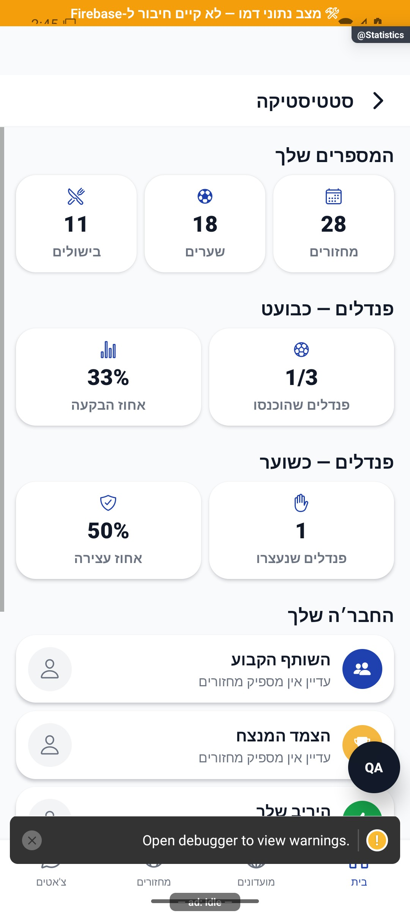

# סטטיסטיקה אישית

עודכן: 07.10.2026; מקור: `8e8fde5`. מסך `src/screens/profile/StatisticsScreen.tsx`; מסלול `Statistics` מהבית/פרופיל לפי רישום הניווט.

## אזורים

״המספרים שלך״: מחזורים שבהם השתתפת, שערים ובישולים. שערים עצמיים מוצגים כשיש נתון מתאים. פנדלים כבועט: שהובקעו מתוך ניסיונות ואחוז הבקעה; פנדלים כשוער: עצירות ואחוז עצירה. ״החבר׳ה שלך״ כולל שש קטגוריות חברתיות המבוססות על צמדים גלובליים, עם מצב שאין מספיק מחזורים. אין במסך הראשי הנוכחי אריח עצמאי של ניצחונות/הפסדים או אריח שערים למחזור שהוסר.

| נתון/פעולה | מקור | תנאי |
|---|---|---|
| מונים אישיים | נתוני המשתמש | חיים אישיים; אינם מוני העונה במועדון שנבחר |
| השתתפות אישית | `playerStats` לפי `participantIds` | מחזור שנחשב כהשתתפות בפועל |
| חברים וצמדים | `pairStats` בשני כיווני מזהה | יכול לכלול פעילות ביותר ממועדון אחד |
| כרטיס אדם | זהות חשבון קיימת | קישור לפרופיל; היעדר נתונים הוא מצב ריק |
| שיעורי פנדלים | ניסיונות/עצירות | אין לחלק באפס או לייחס היעדר מדגם להצלחה/כישלון |

## תלות ומצבים

`src/services/gameService.ts`, השירותים הייעודיים לנתונים אישיים וצמדים, `src/utils/penaltyStats.ts`, `src/utils/eveningPlayed.ts`, `src/components/UserAvatar.tsx`, `src/firebase/firestore.ts`. בדיקות `tests/logic/personalHistory.test.ts`, `penaltyStats.test.ts`, `pairOrientation.test.ts` רלוונטיות להגדרות, אך אינן בדיקת מסך מלאה.

טעינה, אדם בלי פעילות, פנדלים ללא ניסיון, מידע חלקי, זוג בלי סף נתונים וכשל קריאה. במסלולי הכשל הנוכחיים חלק מהמידע מתכנס למצב ריק וללא ניסיון חוזר בולט; יש לשחזר כדי להבחין בבעיה אמיתית ולא להציג ״אין לך״ כשהמידע לא הגיע.

## ראיות

צילום נתוני דמה: 28 מחזורים, 18 שערים, 11 בישולים, 1 מתוך 3 פנדלים ואחוז 33, עצירה אחת ואחוז 50. ההתראה התחתונה וכלי הבדיקה מסתירים חלק מרשימת החבר׳ה; לכן הצילום אינו ראיה לכל שש הקטגוריות. לא אומתו מספרים מול מסד, שתי שאילתות צמד, מצב ריק אמיתי או כשל רשת.

## הצעות בלבד

להגדיר ״מחזורים״ במגע על האייקון; להוסיף מסגרת תקופתית אם רוצים השוואת מגמה בעתיד, רק אחרי אפיון מקור נתונים; להציג כשל מידע בנפרד מחוסר פעילות. הופעת כרטיסי חברים יכולה להיות קצרה ומדורגת, בלי להאריך טעינה.
