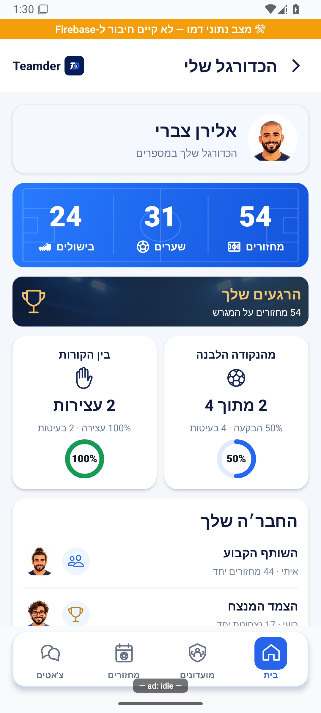
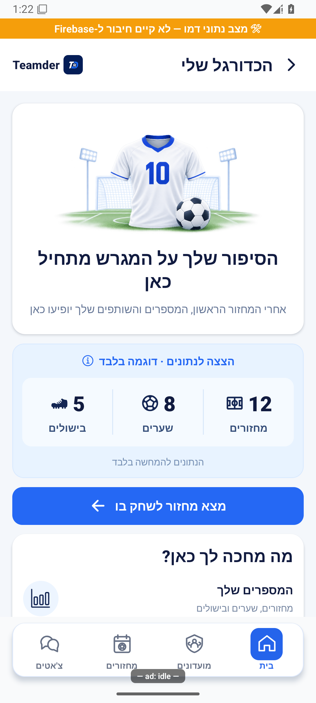
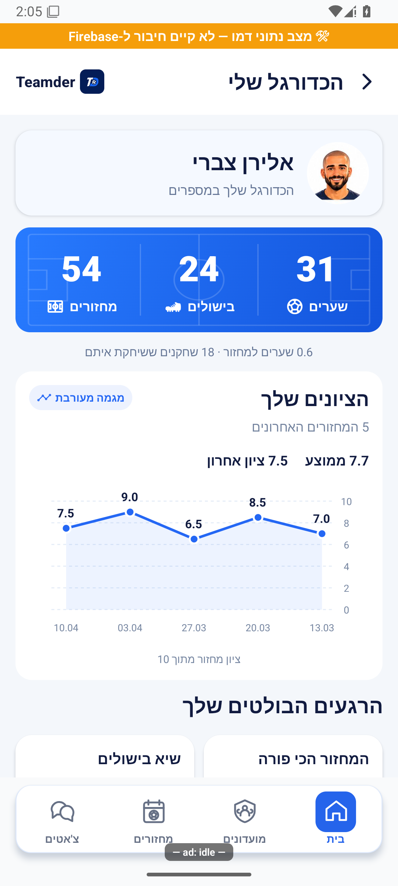

# הסטטיסטיקה שלכם

## עדכון מקומי — 10.10.2026

אם הנתונים לא נטענים תופיע אפשרות לנסות שוב, בלי להפוך את הפעילות שלכם לאפס. נתונים שכבר נטענו נשארים מוצגים לצד הודעת התקלה.

התנהגות הכשל נבדקה בקוד מבודד; לא הורצה במכשיר מול הנתונים האמיתיים.

המסך מציג את המחזורים, השערים והבישולים שלכם ואת הביצועים בפנדלים. בהמשך אפשר לגלות עם אילו חברים שיחקתם והצלחתם יחד.

[לפירוט המעמיק](personal-statistics.md)

## העיצוב האישי החדש — 10.10.2026

״הכדורגל שלי״ מציג תמונת שחקן, מחזורים, שערים ובישולים בכרטיס כחול. אזור הפנדלים מפריד בין בעיטות לעצירות ומראה גם כמה בעיטות עומדות מאחורי האחוז. כל שש קטגוריות החברים נשמרו בעיצוב קומפקטי. כפתור השיתוף מכין תמונה של הכרטיס ללא סרגלי הניווט והכפתורים.

כשאין פעילות, מוצגים איור חולצה וכדור, הסבר על הנתונים שיופיעו ודוגמה המסומנת במפורש כהמחשה בלבד. ״מצא מחזור לשחק בו״ פותח את מסך המחזורים. נתוני הדוגמה אינם הנתונים שלכם ואינם נשמרים בחשבון.

הנתונים הם של כל הזמנים בכל המועדונים. אין בורר מועדון, עונה או תווית ״כל הזמנים״. באזור ״הרגעים שלך״ מוצג מספר המחזורים האמיתי; אין טענה לשיא אישי ללא מקור מתאים.

הצילומים מאמולטור עם נתוני דמו; אייפון טרם נבדק.

## העיצוב המעודכן — ציונים וסטטיסטיקה בלבד

שערים, בישולים ומחזורים מופיעים ראשונים. גרף מציג את ציוני חמשת המחזורים האחרונים, עם ממוצע ומגמה. עליות וירידות מוצגות כ״מגמה מעורבת״. ציון חסר אינו אפס, ומצוין כשיש ציונים רק לחלק מהמחזורים.

בהמשך מוצגים שיאי שערים ובישולים במחזורים המתועדים, ממוצעים, ניצחונות/הפסדים/תיקו במשחקים מתועדים וכל שש ההשוואות עם שחקנים. הפנדלים נשמרו בשתי עמודות קטנות, עם כמויות ואחוזי הבקעה ועצירה. הנתונים תמיד אישיים ומצטברים; אין רשימת מועדונים, מחזורים קרובים או בחירת עונה.

שיאים והצלחות אינם מומצאים כשהתיעוד חסר. ליד תוצאות חלקיות מוצג מספר המחזורים שעליהם הן מבוססות.

[שיאים, ממוצעים ותוצאות](../screenshots/personal-statistics-trend-middle-2026-10-10.png) · [השוואות עם שחקנים](../screenshots/personal-statistics-trend-people-2026-10-10.png) · [פנדלים ושיתוף](../screenshots/personal-statistics-trend-bottom-2026-10-10.png).

בדיקת הטיפוסים נקייה. בסבב המלא 3,268 בדיקות עברו ובדיקת זמן אחת בחלוקת הכוחות נכשלה תחת עומס; כל 16 הבדיקות בקובץ שלה עברו בהרצה נפרדת ללא שינוי הסף.

### עידון העיצוב — 10.10.2026
המסך משתמש בכרטיסים לבנים, רקעים עדינים לשיאים ואיורי גביע, נעל, כדור וכפפה קטנים. האיורים נבנים ברכיב `StatisticsIllustration` באמצעות נתיבים וקטוריים. גרף הציונים הונמך מ־185 ל־128 נקודות גובה. פס תוצאות מציג את היחס בין ניצחונות, הפסדים ותיקו. כל הנתונים האישיים, שש השוואות השחקנים ונתוני הפנדלים נשמרו.

[ראש המסך](../screenshots/personal-statistics-refined-top-2026-10-10.png) · [שיאים וממוצעים](../screenshots/personal-statistics-refined-middle-2026-10-10.png) · [קשרי שחקנים ופנדלים](../screenshots/personal-statistics-refined-bottom-2026-10-10.png).

התצוגה והכיווניות נבדקו באמולטור אנדרואיד עם נתוני דמו בלבד; אייפון וקריאות נתוני ייצור לא נבדקו בסבב זה. בדיקת הטיפוסים נקייה וכל 3,270 הבדיקות ב־232 חבילות עברו.

הגרף הורחב לרוחב הזמין בכרטיס בלי להגדיל את גובהו (128). הרכיב משתמש כעת ב־`preserveAspectRatio="none"` כדי למנוע שוליים שנבעו משמירת יחס הממדים. [צילום בדמו באנדרואיד](../screenshots/personal-chart-wide-2026-10-10.png).

לא מחכים לכל ההיסטוריה כדי לראות את המספרים שלך. נתוני המחזורים מתווספים בהמשך, ובכשל אפשר לנסות שוב מתוך המסך. מחזור שלא התקיים אינו פוגע באחוז ההשתתפות. הגרף נשאר רחב ונמוך, בלי למתוח את האותיות והנקודות.

## טקסט גדול בגרף

הציונים והתאריכים מתאימים להגדלת הטקסט בטלפון. כשהטקסט גדול מאוד או שאין מספיק מקום, מוצגת רשימה קריאה של התאריכים והציונים במקום גרף צפוף. כל הנתונים נשמרים. ההגדלה נבדקה בבדיקות אוטומטיות; נדרש עדיין אימות חזותי במכשיר.
