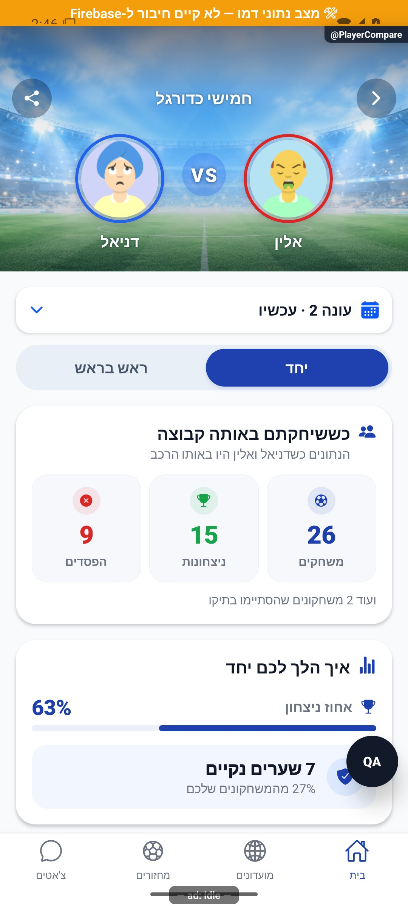
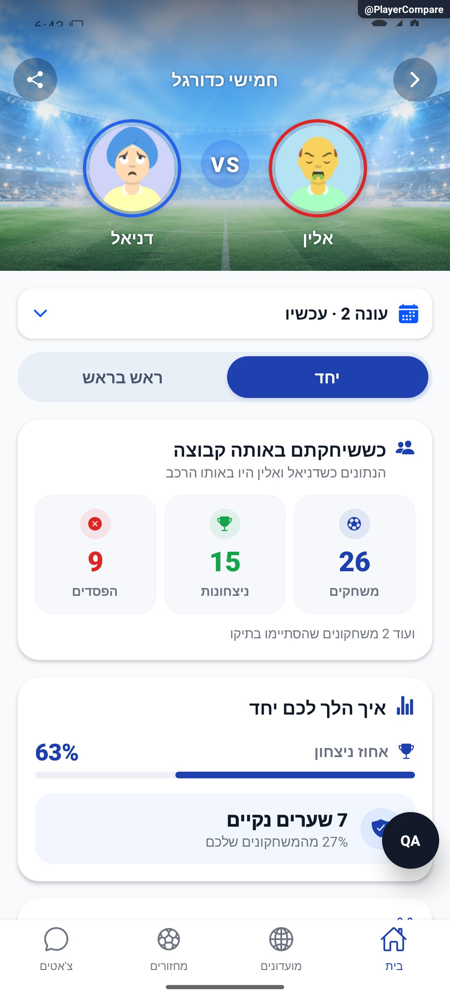

# משווים ביניכם לבין חבר

אפשר להשוות את הנתונים שלכם לאלו של חבר באותו מועדון ובאותה תקופה. המסך מציג גם איך הצלחתם יחד ואיך הסתיימו המשחקים שבהם שיחקתם זה מול זה.

[לפירוט המעמיק](player-compare.md)

## תיקוני סבב הבאגים — 8.10.2026

פחות הפסדים נחשבים ליתרון. כשל בטעינת נתונים אינו מוצג כאילו לא שיחקתם.

## השלמת הנפשות — 8.10.2026

גם במסך השוואת שחקנים, החלפת התקופה מקבלת מעבר עדין. מצב טעינה או נתון חסר נשארים גלויים לפי הנתונים הזמינים.

[פרטי האימות והמגבלות](../../changes/2026-10-08-motion-completion.md). מקור: `9ec0dfd` עם שינויים מקומיים; טרם פורסמה גרסה.
