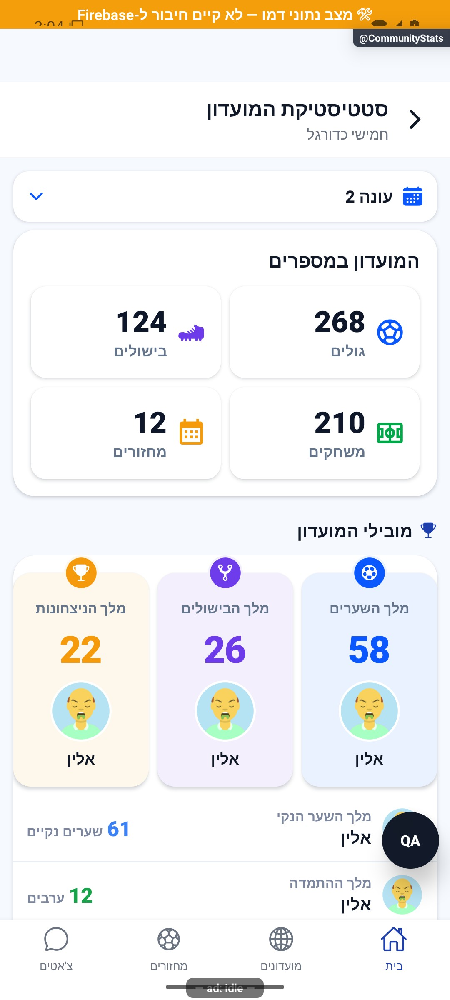
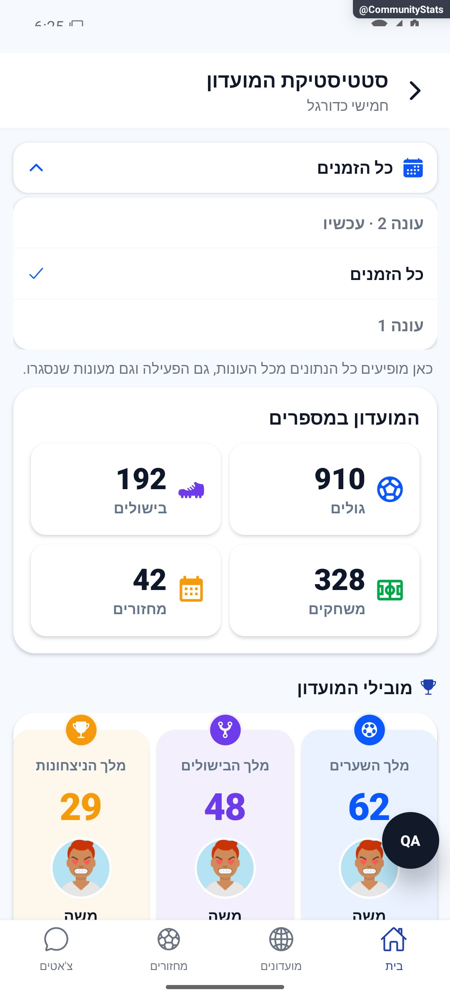

# בוחרים אילו נתונים לראות

אפשר לראות את העונה הנוכחית, עונה קודמת או את הפעילות המצטברת של המועדון. הבחירה קובעת לאיזו תקופה שייכים כל המספרים שמופיעים יחד.

[לפירוט המעמיק](scopes-and-data.md)

## השלמת הנפשות — 8.10.2026

בחירת עונה פותחת רשימה בתנועה עדינה. לאחר הבחירה הסמל מקבל הדגשה קצרה והנתונים מתחלפים יחד.

[פרטי האימות והמגבלות](../../changes/2026-10-08-motion-completion.md). מקור: `9ec0dfd` עם שינויים מקומיים; טרם פורסמה גרסה.
