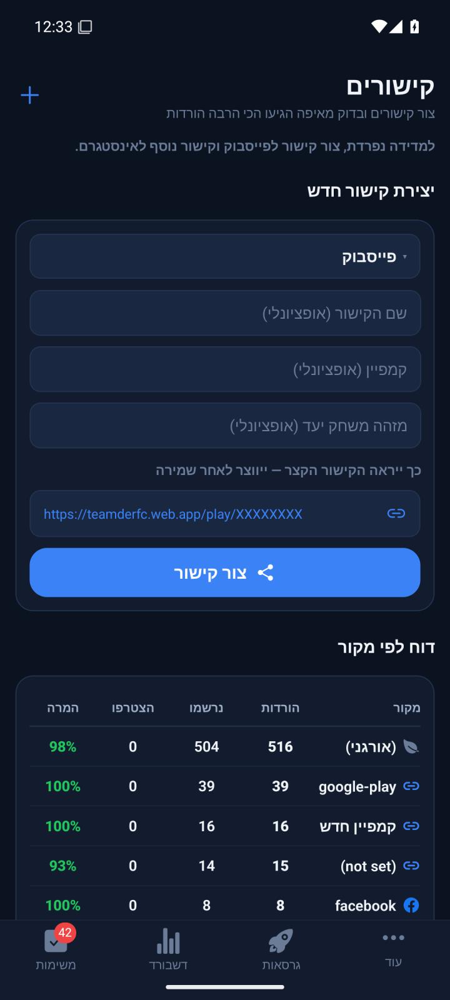

# קישורי פרסום קצרים בפולס

[הסבר פשוט](short-links.simple.md)

עודכן: 8.10.2026. בסיס הקוד: `0c67078`, שינויים מקומיים. גרסת פולס: `1.0.87`, קוד גרסה `94`.

## כניסה והתנהגות

תפריט פולס → מקורות וקישורים → בחירת מקור → יצירת קישור. מקור אינו נבחר מראש. פייסבוק ואינסטגרם מקבלים קישורים נפרדים. אפשר להזין שם, קמפיין ומזהה מחזור. כתובת לדוגמה מוצגת לפני השמירה; רק כתובת שנשמרה ניתנת לשיתוף. אין שינוי למסכי טימדר או להרשאות.

## מסלול הנתונים

`SourcesScreen.onCreate` → `adLinks.createAdLink` → `shortAdLinks.createShortAdLink` → `firestoreRest.createDocOnly`. מזהה אקראי בן שמונה תווים הוא גם מזהה המסמך ב־`adLinks` וגם סיומת הכתובת `/play/{code}`. המזהה ציבורי ואינו אסימון הרשאה. נשמרים `name`, `source`, `campaign?`, `gameId?`, `shortCode`, `url`, `clicks:0`, `createdAt`.

הכתיבה משתמשת ב־`currentDocument.exists=false`: התנגשות אינה דורסת קישור קיים. עד חמישה ניסיונות; כשל שמירה מחזיר כתובת ריקה, בלי קישור מת שניתן לשיתוף. מקור ריק או מעל 200 תווים נדחה לפני כתיבה. כשל תקשורת מוצג בחלון הודעה והכפתור חוזר למצב זמין.

## פתיחה ומעקב

הפניית האתר `/play/**` מגיעה ל־`serveAdLink` באזור `us-central1`. נקרא מסמך יחיד בלבד; מזהה לא תקין, מסמך חסר או אי התאמה בין `shortCode` למסמך מחזירים 404. כשל מסד מחזיר 503. מותרות רק GET ו־HEAD. התגובה אינה נשמרת במטמון.

`shortAdLinkPage` מטמיע בתבנית את מקור הפרסום, הקמפיין, יעד המחזור ומזהה הקישור. תווי HTML ומפרידי שורות מיוחדים מקודדים כדי למנוע הזרקת סקריפט דרך מקור מותאם. נתוני המסמך גוברים על פרמטרים שהוספו ידנית לכתובת.

הדף הקיים שולח את אירוע הלחיצה דרך `trackLinkClick`, ומעביר את `l` גם לפתיחת `footy://go`, גם למפנה ההתקנה באנדרואיד וגם ללוח ההעתקה באפל. פונקציית ההגשה אינה מגדילה מונה נוסף. זה אינו מבטל ביקורי זחלנים שמפעילים JavaScript או לחיצות חוזרות של אדם. במימוש הראשוני החישובים במסך המקורות נשארו כבעבר; תיקון מדידת החשבונות מ־10.10.2026 המתועד להלן מחליף את fallback הייחוס הישן ואת הכיתוב המטעה של הורדות.

כתובות `/go?b=...&l=...` נשארות נתמכות; אין העברת מסמכים או איפוס מונים. מחיקת קישור חדש גורמת ל־404, וייחוס שכבר נשמר למשתמשים נשאר כבעבר. הנתיב החדש נפתח בדפדפן, ואינו דורש שינוי ברשימת נתיבי הקישור המאומת של טימדר.

## אימות ומגבלות

13 בדיקות ממוקדות עברו: שמירה והתנגשות, כשל, מסמכים חסרים, נתיבים לא תקינים, שמירת הייחוס לפייסבוק ולאינסטגרם בכל יעדי הפתיחה, וקידוד תוכן מסוכן. בדיקות טיפוסים של פולס וטימדר ובניית שרת עברו. לאחר איחוד סופי השורות המקומיים ללא שינוי תוכן, הסבב המלא עבר: 183 חבילות ו־2,762 בדיקות. הכישלונות הראשוניים היו בבדיקות רגישות לסופי שורות. אין שינוי בספי ביצועים או בבדיקות כדי להסתיר כשל.

הפריסה החיה בוצעה באישור הבעלים: `functions:serveAdLink,hosting:teamderfc`. נתיב חסר החזיר 404 עם ההודעה המתאימה, וקישור ישן החזיר 200. הפולס הותקן ונפתח באימולטור, נתוני המסד נטענו ונבדקה תצוגה מקדימה לפייסבוק ללא יצירת מסמך. בדיקת התקנה בטלפון הבעלים, התאמת חתימה להתקנה קיימת וייחוס בפועל לאחר התקנה בחנות טרם אומתו. מפתח המקור סופק בהמשך בארכיון מקומי, והחתימה אומתה כזהה לחתימת הבנייה הראשונה. הבעיה שנמצאה במטא־נתוני הבנייה הייתה קוד גרסה 90 לעומת 93 במקור שסופק. אין להסיר התקנה קיימת כדי לעקוף אי התאמת חתימה.

## צילום ובנייה מקומית

הצילום הוא מהיישום המרונדר, לאחר סיום מעבר התפריט. הדוגמה אינה קישור פעיל. קובץ ההתקנה הוא ל־`arm64-v8a` ול־`x86_64`, וגודלו כ־55 מגה־בתים. נבדקו הגרסה 1.0.86 וקוד גרסה 90 מתוך הקובץ עצמו. עקב מגבלת אורך נתיבים בחלונות נבנה דרך כינוי זמני `P:` לתיקיית השורש, וב־`android/app/build.gradle` המקומי נוספה הגדרת `CMAKE_OBJECT_PATH_MAX=240`. תיקיית אנדרואיד שנוצרה אינה נכללת בגיט; יש לשחזר הגדרה זו בבנייה מקומית חדשה. קבלת הבנייה המקומית כוללת חותמות הקבצים והקובץ הסופי; הבנייה אינה מקומיט נקי.

## תיקון עדכון ההתקנה — 8.10.2026

הבעלים דיווח על הודעת ״האפליקציה לא הותקנה״ בעדכון מעל פולס קיים. בארכיון החתימה שסופק, שני קובצי המפתח זהים; גם המפתח בבנייה הראשונה זהה להם בינארית ובחותמת התעודה. לכן החשד הראשוני לחתימה אחרת לא נתמך במפתח המקור. המסמך בארכיון מציין קוד גרסה 93 במקור, לעומת 90 בקובץ שנמסר. ארכיון החתימה הוא מקור נתונים, לא הנחיית פריסה.

עודכנו `pulse/app.json` וקובץ הבנייה המקומי שנוצר: גרסה 1.0.87 וקוד גרסה 94. הקוד והשרת לא השתנו, ואין פריסה נוספת. הבנייה משתמשת במפתח המקור שסופק; החתימה המקורית אינה מועתקת לגיט. גרסה וחתימה נבדקו מתוך הקובץ הסופי. התקנת `adb install -r` מעל פולס 90 באימולטור הצליחה ללא הסרה, ולאחר מכן אומתו קוד 94 וגרסה 1.0.87 מתוך החבילה המותקנת. אין מכאן הוכחה לבדיקת מכשיר הבעלים או לקריאת קוד הגרסה שלו בפועל.

בדיקות טיפוסים של פולס וטימדר נקיות וכל 2,762 בדיקות המאגר בבסיס העבודה עברו. בדיקות המראה קיבלו זמנית סופי שורה אחידים; הקבצים הוחזרו בדיוק לתוכנם המקורי אחריהן. הקובץ החדש על שולחן העבודה הוא `Pulse-1.0.87-v94.apk`; יש להשתמש בו במקום קובץ קוד 90. קבלת הבנייה כוללת חותמות מקור וקובץ, וגם את גבולות אימות ההתקנה.

## מדידת חשבונות לכל קישור — 10.10.2026

בסיס התיקון: `0c67078164b8f0995c37ebef8b271fbafe21ef85` ושינויים מקומיים קיימים שנשמרו. נבנה עדכון מקומי חתום `1.0.89/96` באישור הבעלים, עם חתימה תואמת להתקנה הקודמת. אין פריסה, שינוי נתוני מסד או תיקון שיוכים היסטוריים.

נמצא ש־`fetchLinkStats` השתמש בכל חשבונות המקור כאשר לא נמצא חשבון עם מזהה הקישור. זו לא הוכחה לייחוס: בקישור `U5tUXbaG` היו ארבע פתיחות, אפס חשבונות תואמים ושמונה חשבונות פייסבוק ישנים מקמפיין אחר, שנוצרו ארבעה חודשים לפני הקישור. הם הוצגו בטעות בחלון הקישור. ראיית הקריאה בלבד נשמרה במאגר העבודה הראשי ב־`artifacts/pre-release-2026-10-10/ad-link-funnel-investigation.json`.

### מסלול וחישוב

`SourcesScreen.openDetail` → `fetchLinkStats` → קריאת `fetchUsersWithAuth` ומזהי יוצרי מחזורים במקביל → `calculateLinkStats`. נספרים רק חשבונות שהממיר הקיים סימן כלא־בדיקה ולא־מחוקים, ועם `acquisition.linkId === link.id` שאינו ריק. `isTest` מחושב ב־`firebase.mapUser` לפי `isTestAccount(email)`; `deleted` לפי השם האנונימי `משתמש שהוסר`. הסינון הקיים נשמר. אין fallback לפי מקור או קמפיין, גם כאשר אין תוצאה מתאימה וגם כאשר קישור חדש חולק מקור עם קישורים אחרים.

`attributedAccounts` הוא גודל הקבוצה הזאת; `signups` מתוכה עם `onboardingCompleted`; `google`/`apple` לפי ספק ההתחברות; `joined` עם `attended > 0`; `created` עם מזהה ברשימת יוצרי מחזורים. אלה מצבי החשבונות הנוכחיים, לא הוכחה שהפעולות התרחשו אחרי הלחיצה או במחזור היעד. אין סינון מחדש לפי תאריך יצירת חשבון: שיוך מפורש לקישור הוא מקור האמת.

`clicks` נשאר מונה פתיחות המסמך, כולל פתיחות חוזרות; אינו מספר אנשים ייחודיים. מוצג בנפרד, ללא יחס בין חשבונות לפתיחות. התווית היא ״חשבונות שיוחסו לקישור״; אין טענה להורדות בחנות. אחוזים מוצגים רק כתת־קבוצה מתוך אותם חשבונות. כאשר המכנה אפס אין אחוז. אין הגבלה מלאכותית ל־100%; מספר חריג אינו מוסתר. דוח המקור משתמש בשדה `accounts`, וממשיך לכלול גם חשבונות היסטוריים ללא `linkId`, תחת המקור בלבד. הכותרת ״השלמה״ היא השלמת הרשמה מתוך חשבונות המקור, לא המרת קליקים.

### טעינה, כשל וניווט

קריאת חשבונות או מחזורים שנכשלה אינה מוחלפת ב־`[]`: מוצגת הודעת כשל וכפתור ניסיון חוזר. מונה בקשות מקומי מונע מתשובה לקישור קודם להחליף את חלון הקישור הנוכחי; סגירת החלון מבטלת את קבלת התוצאה הישנה. החלון מוגבל ל־85% מגובה המסך ותוכנו נגלל, כדי שההסברים והכותרת הארוכה יהיו נגישים במסך נמוך. אין שינוי להליכי יצירת קישור, מחיקה, שיתוף או הרשאות.

### אימות ומגבלות

חמש בדיקות נסיגה ב־`tests/logic/adLinkStats.test.ts` עברו: התקרית ארבע פתיחות/שמונה היסטוריים; הפרדת מזהה וקמפיין עם בדיקה/מחיקה; השלמת הרשמה וספקים/השתתפות/יצירה; שגיאות קריאה; מכנה חסר ואחוז חריג ללא הסתרה. בדיקת הטיפוסים של פולס נקייה. תוצאות הסבב המלא ותיעוד המקור בדוח `artifacts/pre-release-2026-10-10/pulse-link-counts/report.md` במאגר העבודה הראשי.

הצילום הישן לעיל מציג את טופס יצירת הקישור בלבד, ואינו מוכיח את המדידה המתוקנת. נבנה APK מקומי חתום `1.0.89/96` באישור הבעלים, ללא שירות בנייה בתשלום. גרסה, חתימה ותכולת המודולים אומתו מהחבילה. הקובץ שמור במאגר העבודה הראשי ועל שולחן העבודה בשם `Pulse-1.0.89-v96.apk`. התקנת `adb install -r` מעל `1.0.88/95` הצליחה; גרסה `1.0.89/96` אומתה ומועד ההתקנה הראשון נשמר. החשבון והנתונים הקיימים נגישים ללא הסרה או ניקוי. נצפה צילום אמיתי עם ארבע פתיחות ואפס חשבונות מיוחסים, ללא אחוז המרה; שמונת חשבונות פייסבוק הישנים נשארו בדוח המקור בלבד. הטקסטים מיושרים לימין והחלון מלא באימולטור1080×2400 בגופן1.0. אין בצילום הוכחה למצב כשל, קבוצה לא ריקה, מסך נמוך או גופן מוגדל. אין בדיקת מכשיר פיזי או אייפון. קבלה: `artifacts/pre-release-2026-10-10/pulse-link-counts/apk-build-receipt.json` במאגר העבודה הראשי.

